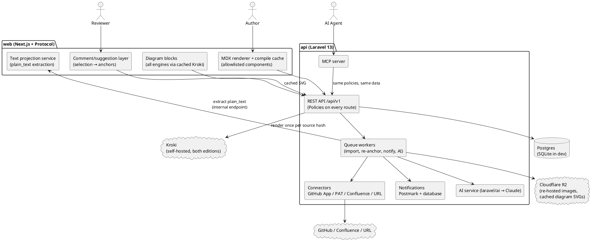
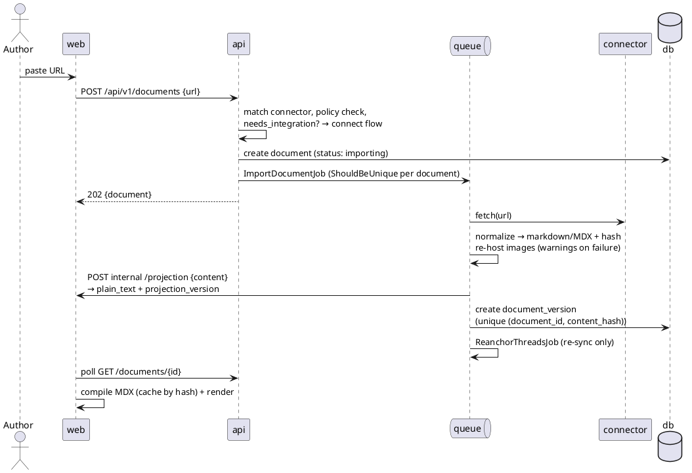

# Kedge — Spec Review Platform

> **Kedge** /kɛdʒ/ — a kedge is the anchor a crew carries ahead of the ship, drops, and winches toward;
> *kedging* is moving forward by repeatedly re-anchoring. Exactly what review comments do here.
> Named **2026-07-09**. Domains: **kedge.review** (product), **kedge.ink** (docs), kedge.md (candidate).
> GitHub org: **kedgehq**.
> **Rev 2 — 2026-07-01**: amended after CEO plan review. Scope = B′ baseline + 7 approved expansions
> (MCP server, approvals lite, suggested edits, digest post-back, instant demo mode, version diff view,
> review queue). Review checklist lives in `docs/TODOS.md`.
> **Rev 3 — 2026-07-01**: **self-hostable distribution** — AGPL-3.0 public repo, full feature parity
> (demo mode SaaS-only), Docker Compose reference deployment. Self-hosting replaces the enterprise-SaaS
> trust roadmap (SSO/SCIM/compliance), not application security. Consequence: rendering shell switched
> from Tailwind Plus Protocol (license forbids its code in an open-source repo) to **Fumadocs** (MIT),
> with Protocol kept as design reference only. PAT connector is now permanent (self-host primary path).

A web application for reviewing RFC/spec documents that live in different places (GitHub, git, Confluence) and different formats (`.md`, `.mdx`, `.html`). Kedge ingests a document from a pasted link, renders it beautifully, and layers first-class commenting, approvals, notifications, and AI review tooling on top. Humans **and AI agents** are both first-class review participants.

## 1. Problem

Spec documents have no single good home:

| Where specs live | Good at | Bad at |
|---|---|---|
| `.md` in git | Agent/AI consumption, versioning, PR workflow | Long-form rendering, commenting, sharing with non-git people |
| `.mdx` in git | Same as md + rich components | Same as md; only renders inside a React app |
| `.html` | Readability | Token-heavy for agents, no comments, awkward in git |
| Confluence | Comments, discovery | No git/filesystem integration, bad for agents |

Commenting is table stakes Kedge must match (Confluence, Google Docs, Notion all have it). **The moat is the git-versioned review loop with AI/agent participation**: comments → AI digest → improve-prompt → agent revises the source → re-sync → comments survive the new version. No existing tool closes that loop.

## 2. Goals & non-goals

**Goals (v1):**

- Paste a link (public/private GitHub file, Confluence page, raw URL) or upload/paste content → get a rendered, shareable review page. **Demo mode:** rendering a public URL requires no signup.
- Support `.md` and `.mdx` sources; ingest `.html` and Confluence storage format by converting to markdown.
- Beautiful long-form rendering (TOC, dark mode, search, code highlighting) via **Fumadocs** (MIT), styled to the Tailwind Plus Protocol aesthetic — Protocol is a design reference only; its licensed code cannot ship in a public AGPL repo.
- **Self-hostable**: AGPL-3.0 public repo, full feature parity with the SaaS (demo mode excepted), one `docker compose up` reference deployment. Companies with private RFCs run it inside their own network.
- Render diagrams from fenced code blocks as live SVG — **PlantUML, Mermaid, Excalidraw, GraphViz, D2, and ~20 more engines via Kroki** — never attached images.
- Private share links; anchored comment threads; thread forking from any comment; **suggested edits** (propose replacement text).
- **Versioned re-sync** with comment re-anchoring (or an "orphaned" tray) across versions; **version diff view** with comment overlay.
- **Approvals lite:** document lifecycle status + version-pinned reviewer sign-offs.
- **Review queue:** a home dashboard of docs needing your attention.
- Notifications (in-app inbox + email via Postmark): replies, mentions, resolutions, approvals, new versions.
- AI (Claude): comment digest, improve-the-doc prompt generation, reply drafts, splitting a comment into threads, thread summaries; **one-click digest post-back** to the source (PR/Confluence comment).
- **MCP server:** agents read docs + threads, post comments, and fetch the improve-prompt through the same API humans use.

**Non-goals (v1):**

- Editing documents in-app (Kedge is a review surface; revisions flow through the source). Suggested edits are *proposals*, not writes.
- Raw comment sync-back to GitHub/Confluence (digest post-back only; full sync is a later phase).
- Real-time collaborative cursors/presence (polling v1; Reverb later).
- Cross-document full-text search, wikis, folders beyond the review queue.
- Billing, team workspace management UI.
- Enterprise SSO/SAML/SCIM — **self-hosting is the v1 answer to enterprise trust**; generic OIDC login is a later add for both editions.

## 3. Personas & core flows

**Author** (has an RFC in a repo or Confluence):
1. Signs in (GitHub OAuth or email). Pastes the doc link. Kedge imports + renders it.
2. Shares the private link; sets lifecycle status to *in review*.
3. Triages comments and suggestions: replies, resolves, forks off-topic replies into new threads, accepts/declines suggestions.
4. Runs the AI digest → themes + action items → **generate improve-prompt** (includes accepted suggestions) → pastes into their coding agent to revise the source.
5. Pushes the revision → re-sync → new version; comments re-anchor; diff view shows reviewers what changed; approvals older than the current version show as stale.
6. Optionally posts the digest back to the source PR/Confluence page. Collects version-pinned approvals.

**Reviewer** (may have no account):
1. Opens the share link. Reads a rendered spec with TOC and diagrams.
2. Selects text → comments or proposes a suggested edit. Identifies via magic-link email verification.
3. Gets notified on replies; sees what changed via the diff view when a new version lands; clicks ✓ Approve when satisfied.

**Agent** (v1, via MCP):
1. Connects to Kedge's MCP server with a workspace-scoped token.
2. Reads the doc + threads; posts review comments (badged as agent-authored) alongside humans.
3. Fetches the improve-prompt and revises the source doc in its own environment; the author pushes and re-syncs.

**Anonymous visitor** (demo mode, SaaS only): pastes a public URL → rendered doc in seconds, no signup. Signing up **claims** the doc into their workspace; unclaimed demos expire after 48h.

**Self-hoster** (ops persona): `docker compose up` on their own infra, sets SMTP + their own `ANTHROPIC_API_KEY`, connects GitHub via PAT (or registers their own GitHub App). Specs, comments, and diagram sources never leave their network.

## 4. Architecture

Two deployables, one monorepo:

```
kedge/                # public repo, AGPL-3.0
├── api/               # Laravel 13 — auth, ingestion, versions, comments, approvals, notifications, AI, MCP
├── web/               # Next.js — Fumadocs MDX shell, rendering, text projection, comment UI
├── deploy/            # docker-compose.yml, Caddyfile, per-service Dockerfiles
├── docs/              # this spec, TODOS.md, ADRs, self-hosting guide
└── LICENSE            # AGPL-3.0
```



**Why Laravel API + Next.js frontend** (decision record):

- The app is dominated by background work — imports, re-syncs, re-anchoring, notification fan-out, AI jobs. Laravel's queues, scheduler, and Notifications are batteries-included.
- API-first backend: the web app, the MCP server, and any future CLI are peers consuming the same API and the same Policies.
- Enterprise auth runway: Sanctum + Socialite now, WorkOS SSO/SAML/SCIM later, without touching the rendering layer.
- Untrusted content (fetched HTML/MDX) is compiled and rendered only in the web layer; secrets (GitHub/Confluence tokens) live only in the API.
- Nova admin, Postmark, R2, Forge — established patterns, zero research cost.
- **Self-host constraint (Rev 3)**: no hard SaaS dependencies. The stack was already 12-factor — database queues (no Redis), SQLite-capable, `MEDIA_DISK` local/R2, Laravel mail abstracts Postmark→SMTP. Self-hosting formalizes this: every external service is env-pluggable, every SaaS-only surface sits behind a `SELF_HOSTED` flag. Nova (paid license) is SaaS-ops only — **never a runtime dependency of the open-source app** (it ships in the repo behind a composer suggest / separate install so self-hosters run without it).
- Accepted costs: two deployables; cross-app auth (pinned below); API types duplicated in TS (OpenAPI codegen later).

**Auth pattern (pinned):** `app.kedge.review` + `api.kedge.review`, `SESSION_DOMAIN=.kedge.review`, `SANCTUM_STATEFUL_DOMAINS=app.kedge.review`. Client components call the API with credentials + XSRF token. Server components go through **BFF route handlers** that forward the incoming cookies to the API. **Deploy order: api before web; API changes are additive within `/v1`** — the two deployables are never atomic.

### 4.1 Stack

**api/ — Laravel 13** (standard scaffold recipe):
- PHP 8.5, PHPUnit (never Pest), Pint, `app/Services/` + `app/Enums/` + `app/Actions/`.
- SQLite dev / Postgres prod. `QUEUE_CONNECTION=database`, `SESSION_DRIVER=database`, `CACHE_STORE=database`.
- Auth: **Sanctum** (SPA cookies for web; tokens for MCP/agents) + **Socialite** (GitHub login). **Every resource route is guarded by a Policy** — no inline ownership checks. Sessions are persistent: every sign-in path (password, registration, GitHub, reviewer magic link) sets Laravel's long-lived remember-me cookie, so the short server session (`SESSION_LIFETIME`, 120 min) is silently re-established after idle — a review tool must not demand daily sign-in (decided 2026-08-10).
- Backed enums for all fixed-value columns: `DocumentStatus`, `SyncStatus`, `LifecycleStatus`, `ThreadStatus`, `AnchorState`, `CommentType`, `SuggestionStatus`, `AiRunType`, `AiRunStatus`.
- `laravel/nova`, `laravel/nightwatch`, `laravel/boost` (dev), `symfony/postmark-mailer`, `league/flysystem-aws-s3-v3` → R2 via `MEDIA_DISK`, `laravel/ai` (Claude), `laravel/mcp` for the MCP server, `league/html-to-markdown`.
- 4-way `composer dev` script (serve + queue:listen + pail + npm).

**web/ — Next.js (App Router)**:
- **Fumadocs** (MIT) as the docs/MDX shell, restyled to Kedge's approved design language — see **`docs/DESIGN.md`** (approved 2026-07-03; canonical mockup `docs/designs/review-page.html`, a clean-room rebuild of the Protocol aesthetic: system fonts, zinc + emerald, dark-first with full light theme, panel-based comment rail). Tailwind Plus code never ships in this repo. (Validation spike in M0 confirms Fumadocs accommodates the design + comment-gutter layout; Nextra is the fallback.)
- Tailwind v4, TypeScript, Playwright E2E; animations respect `prefers-reduced-motion`.
- MDX compiled via `@mdx-js/mdx` (§6.1), **cached by `content_hash`** — compile once per version, not per request.
- Owns the **text projection service** (§5.4) — the single source of truth for anchor text.
- Diagram components (§6.2), Shiki code highlighting.

## 5. Ingestion pipeline

### 5.1 Sources & connectors (v1)

| Source | Auth | Arrives in | Notes |
|---|---|---|---|
| GitHub public file URL | none | M1 | Parse blob URL → contents API |
| Raw URL (`.md`/`.mdx`/`.html`) | none | M1 | SSRF-guarded fetch (§13) |
| Upload / paste | n/a | M1 | Size-capped; manual-only versioning |
| GitHub private file | **PAT** | M1 | Encrypted per-workspace token; **permanent connector** — the primary path for self-hosted instances |
| GitHub private file | **GitHub App** | M6 | Fine-grained installs, org approval, push webhooks for auto re-sync. SaaS uses Kedge's App; **self-hosters register their own** (guided setup docs) or stay on PAT |
| GitHub repo directory | none / PAT | **M3.6** | Repo URL + ref + path glob → preview matched files → bulk import into a project. Persists a **tracked repo** record with **manual Re-scan** (new files import, changed files re-sync, deletions flagged — never auto-deleted). Pull-based on purpose; the M6 App's push webhook later drives the same record |
| Confluence page URL | Atlassian API token | M6 | Storage-format XHTML + version number; OAuth 2.0 (3LO) later |

Generic git-over-https (GitLab/Bitbucket/self-hosted) is deferred; the `Connector` interface accommodates it:

```php
interface Connector {
    public function matches(string $url): bool;
    public function fetch(DocumentSource $source): FetchedContent; // content, title, source_version, mime
    public function webhookSupported(): bool;
    public function postComment(DocumentSource $source, string $markdown): void; // digest post-back (M6)
}
```

### 5.2 Normalization

All content normalizes to **markdown/MDX + a plain-text projection**:

- `.md` → stored as-is. `.mdx` → validated at import (compile check; imports/exports rejected per §6.1); failures degrade to plain-markdown rendering with an author-visible banner — and are **logged** (`mdx.compile_failed`).
- `.html` → sanitized → `league/html-to-markdown`.
- Confluence storage format → converters for common macros (panels → callouts, code macro → fenced blocks); unknown macros dropped **with an import warning list shown to the author**.
- Referenced images: fetched, re-hosted to R2, URLs rewritten. **A failed image fetch is an import warning, never silent.** SVG assets are sanitized (or rasterized); all media served from a separate media origin with a tight CSP.
- Relative link hrefs are absolutized against the **source** URL, not the Kedge origin: `[x](./other.md)` in a doc imported from `github.com/o/r/blob/main/docs/rfc.md` becomes `github.com/o/r/blob/main/docs/other.md` (a sibling of the source, itself importable), and against a raw-URL source resolves to a raw sibling. Absolute/`mailto:`/`tel:` links, protocol-relative (`//host/…`) hrefs, and pure fragments (`#section`) are left untouched; root-relative (`/x`) resolves against the source origin (RFC 3986); a pasted/uploaded doc has no source URL, so its hrefs are left as-authored. Linking to the target's page *inside Kedge* (when it too was imported) is the post-v1 Project concept, out of scope here.
- `content_hash` = sha256(normalized content). Same hash on re-sync ⇒ no new version.

### 5.3 Import & re-sync flow



**Idempotency:** import/re-sync jobs are `ShouldBeUnique` per document; `(document_id, content_hash)` is a DB unique constraint; GitHub webhook deliveries are deduped by delivery ID. Concurrent webhook + manual re-sync cannot double-create a version.

**Re-sync failure is not import failure:** a failed re-sync (source deleted, token revoked, network) sets `documents.last_sync_status = failed` + `sync_error`, **never disturbs the current version**, and surfaces "Sync failed — showing last good version" with a reconnect CTA. `status: failed` is reserved for a first import that never produced a version.

### 5.4 Text projection (anchor substrate) — single owner: web

The **web layer owns the plain-text projection** because it owns rendering — one pipeline defines both what readers see and what anchors bind to (decision from plan review; prevents silent PHP↔JS drift that would misplace comments).

- During import, the queue job calls an internal web endpoint: normalized content in → `{ plain_text, projection_version }` out. The projection walks the same remark/rehype AST used for rendering.
- Non-text blocks (diagrams, images, MDX components) are represented as **stable placeholder tokens** in the projection so offsets survive around them; selections cannot span into them.
- `projection_version` is stored on every anchor. If the projection algorithm ever changes, old anchors are re-projected in a migration job — never silently reinterpreted.
- CI carries **golden conformance fixtures**: a corpus of documents with expected projections; rendering-pipeline upgrades that change a projection fail the build until intentional.

## 6. Rendering

Protocol template shell: sidebar nav from headings, sticky TOC with scroll-spy, dark mode, FlexSearch (lazy-init for large docs), mobile layout. Markdown renders through the same MDX pipeline.

### 6.1 MDX security model — critical

MDX is code; imported docs are untrusted:

- Compile with `@mdx-js/mdx` in the web server layer; **compiled artifact cached by `content_hash`** (in-process LRU + on-disk compiled-source layer — compile once per version, not per request; `#20`).
- A remark plugin (`lib/remark-mdx-harden.ts`) **rejects `import`/`export`** and non-literal expressions (including expression-valued and spread JSX attributes) — a rejection throws, so the doc falls back and the hostile code never runs.
- JSX resolves only from an **allowlist**: `Callout`/`Note`/`Warning`/`CodeGroup`/`Tabs` (simple Kedge-styled components, DESIGN.md tokens) + Kedge's `KrokiDiagram` (the sole diagram component; supersedes the earlier `Mermaid`/`PlantUML`). Unknown components render as a neutral "unsupported component" box.
- Raw HTML is sanitized against a **tight schema sourced from `rehype-sanitize`'s `defaultSchema`** (tag/attribute/protocol allowlists), enforced in the same harden plugin at the mdxJsx level — because in MDX all raw HTML parses to `mdxJsx*Element` nodes and `hast-util-sanitize` silently drops every mdxJsx node (it would delete the allowlisted components too), so rehype-sanitize cannot run over the compiled MDX tree directly (`#20`). Markdown (`.md`) docs keep dropping raw HTML entirely (no `allowDangerousHtml`). Comment bodies (`body_md`) render through the same sanitized pipeline.
- Compile errors / rejections → plain-markdown fallback + banner + `mdx.compile_failed` log event. The **projection endpoint runs the real hardened compile** to set `mdx_ok` on the version (nullable — null for non-MDX), so the reading surface renders the fallback without recompiling.
- Adversarial fixture suite in CI (Vitest seam): import/export smuggling, expression payloads, attribute-channel smuggling, script-in-HTML, unknown components → neutral box, pathological nesting, compile-failure → fallback (§18).

### 6.2 Diagrams

**Kroki is the sole diagram engine** (decision 2026-07-03, validated in the web spike; supersedes the earlier client-Mermaid + Kroki-PlantUML split). Fenced code blocks whose language matches an **explicit engine allowlist** (`plantuml`, `mermaid`, `excalidraw`, `graphviz`/`dot`, `d2`, `dbml`, `erd`, `svgbob`, `vegalite`, `wavedrom`, `c4plantuml`, …) render as live SVG:

- Rendered **server-side** via Kroki (`GET /{engine}/svg/{deflate+base64url(source)}`), **cached by diagram source hash** (R2 in production) — one render per diagram, readers never contact Kroki and execute zero diagram code.
- SVG embedded with no script surface (`` / sanitized) — eliminates the in-browser diagram-parser XSS class entirely.
- **Kroki runs self-hosted in both editions from M1** — one container, bundled in the self-host compose and on the SaaS droplet. Private diagram source never reaches a third party; hosted `kroki.io` is acceptable only in local dev (`KROKI_URL`).
- Deterministic and versionable: the SVG is effectively part of the version snapshot; output can't drift with client library upgrades — which matters when comments anchor around diagrams.
- States: loading skeleton, never-crash error state showing the raw source, click-to-zoom (needed — complex diagrams scale down to fit the column).
- Unknown fence languages fall through to plain-text code highlighting — never to Kroki, never a crash.

Why sole-engine won: one code path for ~20 diagram types (Excalidraw sketches and precise PlantUML — the full authoring spectrum), deterministic cached output, smaller client bundle (no mermaid ESM), and a stronger security posture. The old rationale for client-side Mermaid (privacy) is fully answered by self-hosting Kroki from day one.

## 7. Documents, versions, diff & re-sync

- `documents` = stable identity; `document_versions` = immutable snapshots.
- **Version lineage is candidate-capable** (ADR 0001): `document_versions.kind` (`mainline`|`candidate`) + a nullable `parent_version_id` model the lineage as a chain that can branch, not a strictly linear one — so a PR's *candidate version* attaches to the document it proposes to change without minting a new document or a migration. M3 builds and exercises only the mainline path; candidate creation arrives with the M6 PR-URL connector.
- **Re-sync triggers**: manual button (M3); **manual content update for a pasted/uploaded document** (#113 — an `upload` source has no URL to re-pull, so re-pasting the body *is* its manual-only versioning path (§5.1); it rides the same re-sync pipeline — normalization, content-hash dedupe, re-anchor, approval staleness — and so is deliberately *not* gated by the `resync.enabled` rollout flag, which bounds only outbound fetch); GitHub App push webhook filtered to the doc path (M6); Confluence polling on view + scheduled check (M6).
- New version → re-anchoring job (§8.3) → participants notified.
- **Version diff view (v1)**: text diff between any two versions, rendered inline with **comment overlay** — threads shown against the side they anchor to, so a reviewer answers "what changed since I commented?" in one screen. Approvals pinned to older versions render as stale markers in the diff header.
- Version switcher; reviewers land on latest. If a new version arrives while a reader has the page open: banner "A newer version is available" — **never auto-swap the page under them**; comments posted meanwhile anchor to the version being viewed.

## 8. Comments, suggestions & anchoring

### 8.1 Threads & comments

- **Thread** types: **inline** (text selection) and **document-level**. Status: `open`/`resolved` (resolve/reopen by author or thread creator).
- **Comment** types: `comment` and **`suggestion`** — a suggestion carries `proposed_text` for the anchored selection and renders as an inline before→after diff. Author sets `suggestion_status`: `pending`/`accepted`/`declined`. Accepted suggestions feed the AI improve-prompt verbatim (§14). No source write-back in v1.
- **Fork a thread from any comment**: promotes a reply to a new thread (`forked_from_comment_id`), inherits the anchor by default, bidirectional "forked from/into" links.
- `@mentions`, markdown bodies, edit/delete own, reactions (👍) to absorb "+1" noise.
- Agent-authored comments (via MCP) carry a visible **agent badge** (`client: mcp`).
- Double-submit protection: client idempotency key + disabled submit. Unsent drafts persist in localStorage.
- **Comment persistence never depends on notification fan-out** — fan-out failures retry in the queue; the comment is already saved.

### 8.2 Anchors

W3C Web Annotation-style selectors bound to the version's plain-text projection (§5.4):

```json
{
  "exact": "the selected text",
  "prefix": "~64 chars before", "suffix": "~64 chars after",
  "start": 10412, "end": 10441,
  "heading_path": ["4. Architecture", "4.1 Stack"],
  "projection_version": 1
}
```

Anchors are stored **per (thread, version)** — older versions still render their threads correctly.

### 8.3 Re-anchoring

**Port hypothes.is's proven approach (`dom-anchor-text-quote` + diff-match-patch) rather than inventing a matcher.** Per thread, on new version:

1. Exact match of `exact` with prefix/suffix context → `anchored`.
2. Fuzzy match (diff-match-patch, position-hinted, per-thread timeout budget) above threshold → `relocated` (flagged).
3. No match → **`orphaned`**: hidden from the margin, listed in the Orphaned tray with original quoted context, one-click re-attach by selecting new text.

The `reanchor.completed` event logs `{anchored, relocated, orphaned}` counts — **orphan rate is the product's #1 health metric** (§19).

## 9. Approvals & document lifecycle (lite)

- `documents.lifecycle_status`: `draft` → `in_review` → `approved` → `superseded` (author-controlled; no workflow engine).
- **Approvals are version-pinned**: a reviewer's ✓ records `(user, document_version)`. When a newer version syncs, prior approvals display as *stale* ("approved v3 · current v5") — they are never silently carried forward. Reviewers re-approve after reviewing the diff.
- Revoke own approval; author sees an approval roster on the doc header.
- No required-reviewer rules or deadlines in v1 (deferred).
- Every lifecycle/approval event is written to `audit_logs` — this is the beginning of the enterprise audit story.

## 10. Sharing, identity, tenancy & demo mode

### 10.1 Tenancy — prototype-fast, enterprise-ready schema

- Every table carries `workspace_id`; v1 UX never shows workspaces (auto-created personal workspace per user). `workspace_members` + roles (`owner`/`member`) and `audit_logs` exist from day one, no UI.
- Growth path (out of v1): team workspaces UI → WorkOS SSO/SAML + SCIM → IP allowlists, retention.
- Intended shape when teams arrive (noted 2026-07-23; design preview `docs/designs/app-teams.html`, no v1 scope change): **account** (billing/SSO grouping; `workspaces.account_id` added only when billing exists; personal workspaces have none; a self-hosted instance *is* the account) → **workspace** (tenancy root, unchanged) → **teams** (`teams` + `team_members`) as people-groups for mentions, queue routing, and required-approval rules — never content containers (projects own content). Magic-link reviewers stay outside membership: a guest sees only the doc shared with them.

### 10.2 Access model

- **Author**: full account (GitHub OAuth or email+password).
- **Share links**: unguessable 32+-char tokens, constant-time lookup, modes `link`/`email_restricted`/`workspace`, optional expiry, revocable, `noindex`. Revoked/expired links get a friendly named page, not a bare 403.
- **Reviewer identity**: magic-link email verification (lightweight user; enables notifications + attribution). Anonymous commenting off by default (per-share toggle). Magic-link users are **scoped to their share** — Policies prevent any traversal beyond it.
- Moderation: author + workspace owners resolve/delete anything; reviewers manage their own.

### 10.3 Instant demo mode (PLG wedge — SaaS only)

- **`SELF_HOSTED=true` disables demo endpoints entirely** — it's a growth/abuse surface self-hosted instances shouldn't run.
- Unauthenticated `POST /demo/documents {url}` — public-URL connectors only, aggressive rate limits (per-IP), size caps, full SSRF guarding.
- Demo docs live in a reserved system workspace with `expires_at = +48h`; a scheduled command prunes them.
- Rendered page shows a "Claim this doc — sign up to share & collect comments" CTA; claiming moves the doc into the new user's workspace. Every share-link footer: "Review your own spec →".

## 11. Review queue, documents list & projects

Authenticated home page, two lists (paginated, DB-level):
- **Needs your attention** (M5 — needs notification data): docs shared with you with unresolved threads/mentions or awaiting your approval; docs you author with new comments/suggestions since last visit.
- **Your docs** (**pulled forward to M3.5**, amended 2026-07-21): every workspace doc, newest first — lifecycle status, open/resolved counts, approval roster, last sync state, **and import status with live polling** (importing → ready/failed settles in place; failed rows retry inline). Rationale: docs were unreachable except by URL and multi-import progress was invisible; this half of the queue has no M5 dependency.
Simple aggregate queries (single `selectRaw` per card, eager-loaded) — no feed infrastructure.

**Projects** (**pulled forward from post-v1 to M3.6**, amended 2026-07-21; semantics per CONTEXT.md): a free organizational container inside a workspace — what you're working on, never where content lives (a repo is a Source). Docs attach to at most one project; unassigned docs sit in an **Unfiled** bucket. Each project gets a **page**: description, its documents (same row anatomy as the home list), and its attached tracked repos with Re-scan. The home list groups/filters by project. Deferred with the rest of post-v1: project-level sharing/permissions, References.

**Source provenance display** (**M3.10**, amended 2026-07-24): rows were provenance-blind — a tracked-repo RFC and a pasted note looked identical, and a repo's own structure was erased at import despite being stored (`tracked_path`, `source_type`, `source_url`). Every row now carries a read-only **provenance chip** (repo-relative path for repo-sourced docs; `owner/repo` + path for standalone GitHub imports; source host for raw URLs; a pasted label for uploads), and a **project page groups repo-sourced docs under their tracked repo, ordered by path** with directory dividers — a flattened tree. Boundary: projects remain the only user-managed hierarchy; repo structure is derived, read-only metadata, and the §2 wikis/folders non-goal is unchanged. Derivation is server-side in one place (the drift rationale of §5.4). A home-list group-by-source toggle is deferred until the chips prove insufficient.

## 12. Notifications

Laravel Notifications, channels `database` (in-app inbox; polling v1) + `mail` (Postmark). Transactional mail (magic links) ships in M2; the notification system in M5.

Events: comment/suggestion on your doc · reply in your thread · `@mention` · thread resolved · suggestion accepted/declined · **approval given/revoked** · **new version** of a doc you commented on · import finished/failed · sync failed (author).

Per-user prefs: immediate / daily digest / off, per channel. Defaults: authors immediate, reviewers digest. Slack + reply-by-email deferred.

## 13. Security

- **SSRF guards** on all fetching (imports *and* demo mode): scheme allowlist (https), DNS resolve-then-**pin** (connect to the resolved IP; no rebinding), private/reserved ranges blocked including redirect hops, size + timeout caps.
- **Authorization = Policies, everywhere.** Every `documents/{id}`, `threads/{id}`, `comments/{id}`, `ai-runs/{id}`, `approvals/{id}` route resolves through a Policy; the **IDOR test matrix** (role × action, §18) is a required suite. Magic-link users scoped to their share.
- **Prompt injection is a named threat.** Docs and comments are untrusted input to every AI feature. Mitigations: untrusted content is delimited/fenced in prompts and labeled as data; **AI output is always a human-confirmed draft with zero side effects** (hard invariant); MCP docs warn agent operators that reviewed docs are an injection channel into *their* agents.
- **MDX/HTML sandboxing** per §6.1; strict CSP; media on a separate origin; SVG sanitization (§5.2).
- **Integration credentials** (PATs, Atlassian tokens, GitHub App key) in encrypted casts; never serialized into API responses; Nova-masked; **log scrubbing ensures tokens never reach logs**.
- **Webhooks**: signature-verified, delivery-ID idempotent, unknown paths → 200 ignore.
- **Demo mode abuse**: per-IP rate limits, public connectors only, capped sizes, 48h TTL.
- **Rate limiting** on auth, comment, import, AI, and demo endpoints. Kroki is self-hosted in both editions from M1 (§6.2) — diagram source never leaves the deployment; only the explicit engine allowlist is ever forwarded.
- **Self-hosting is the enterprise trust story, not a security substitute**: everything above applies identically to a self-hosted instance — a malicious share link or poisoned doc attacks it the same way. What self-hosting removes is the *data-custody* concern (specs never leave the customer's network) and with it the near-term need for SSO/SAML/SCIM/compliance work.

## 14. AI features

All via `laravel/ai` → Claude, as queued jobs writing `ai_runs`; results are **drafts the human confirms, never auto-posted**. Default `claude-sonnet-5`; high-volume cheap ops (thread summaries) `claude-haiku-4-5`. **BYO key**: AI features are flag-gated on a configured `ANTHROPIC_API_KEY` — an instance without one (typical self-host default) simply hides the entire AI surface, no broken buttons. If doc+threads exceed the context budget, the run chunks by section and the output states its coverage ("digest covers N of M threads") — never silent truncation.

1. **Review digest** (author): threads → themes, contention points, consensus, action items. In-app + copy-as-markdown + **one-click post-back** to the source as a PR/Confluence comment (M6, via `Connector::postComment`).
2. **Improve-the-doc prompt** (author): ready-to-paste prompt for a coding agent — doc context, unresolved feedback by section, **accepted suggestions included verbatim as required edits**, quoted anchors. (Also fetchable by agents over MCP.)
3. **Reply drafts**: per-thread, honoring the author's chosen stance (accept / push back / clarify).
4. **Split comment into threads**: AI proposes N splits (title + fragment + anchor); user approves → forked threads via §8.1.
5. **Thread summary**: long thread → current state + open question.

Failure modes: Claude overloaded/rate-limited → `ai_runs.status=failed` + visible retry; every run logs model, tokens, cost.

## 15. MCP server

Agents are first-class reviewers. `laravel/mcp` server in the api app, exposing the same data through the same Policies:

| Tool | Access |
|---|---|
| `list_documents`, `get_document(version?)` | read |
| `list_threads`, `get_thread` | read |
| `post_comment(thread?/anchor?)`, `reply(thread)` | write — badged `client: mcp` |
| `get_improve_prompt`, `get_digest` | read |

- Auth: Sanctum tokens (workspace-scoped, named per agent, revocable, rate-limited). Approvals and lifecycle changes are **human-only** — no MCP tool exists for them.
- Agent comments render with an agent badge; notification events fire normally.
- Security posture: reviewed docs are untrusted content for the *consuming agent* — documented prominently (§13).

## 16. Data model

```plantuml
@startuml
hide circle
skinparam linetype ortho

entity users { id \n name, email, avatar_url \n password? }
entity workspaces { id \n name, slug, settings }
entity workspace_members { workspace_id, user_id \n role: owner|member }
entity integrations { id \n workspace_id \n provider: github_app|github_pat|confluence \n credentials (encrypted) \n meta }
entity projects { id \n workspace_id \n name, slug, description? \n created_by }
entity tracked_repos { id \n workspace_id, project_id? \n integration_id? \n repo_url, ref?, path_pattern \n last_scan_status: ok|failed \n scan_error?, last_scanned_at \n created_by }
entity documents { id \n workspace_id, integration_id? \n project_id?, tracked_repo_id? \n source_type, source_url, source_meta \n title, format: md|mdx|html \n current_version_id \n status: importing|ready|failed \n last_sync_status: ok|failed \n sync_error? \n lifecycle_status: draft|in_review|approved|superseded \n expires_at? (demo) \n created_by }
entity document_versions { id \n document_id \n kind: mainline|candidate \n parent_version_id? \n content_raw, content_normalized \n plain_text, projection_version \n content_hash (uniq w/ doc) \n source_version, synced_at }
entity shares { id \n document_id \n token (uniq), visibility \n allow_anonymous, expires_at, revoked_at }
entity threads { id \n document_id \n type: inline|document \n status: open|resolved \n forked_from_comment_id? \n created_by }
entity anchors { id \n thread_id, document_version_id \n exact, prefix, suffix, start, end \n heading_path, projection_version \n state: anchored|relocated|orphaned }
entity comments { id \n thread_id, author_id? \n type: comment|suggestion \n body_md, proposed_text? \n suggestion_status? : pending|accepted|declined \n client: web|mcp \n created_at, edited_at }
entity approvals { id \n document_id, document_version_id \n user_id \n created_at, revoked_at }
entity ai_runs { id \n workspace_id, document_id \n type: digest|improve_prompt|reply_draft|split|summary \n input, output, model, tokens, cost, status \n created_by }
entity audit_logs { id \n workspace_id, user_id? \n action, subject_type, subject_id \n meta, ip }

workspaces ||--o{ workspace_members
users ||--o{ workspace_members
workspaces ||--o{ integrations
workspaces ||--o{ projects
projects |o--o{ documents
projects |o--o{ tracked_repos
tracked_repos |o--o{ documents
integrations |o--o{ tracked_repos
workspaces ||--o{ documents
integrations |o--o{ documents
documents ||--o{ document_versions
documents ||--o{ shares
documents ||--o{ threads
documents ||--o{ approvals
document_versions ||--o{ approvals
threads ||--o{ comments
threads ||--o{ anchors
document_versions ||--o{ anchors
documents ||--o{ ai_runs
@enduml
```

Indexes: every FK; `shares.token` unique; `(document_id, content_hash)` unique; `(thread_id, document_version_id)`; `(document_id, status)` on threads; notifications read-state. `notifications` = standard Laravel table.

## 17. API sketch (`/api/v1`)

All list endpoints are **paginated at the database** (cursor or page). Policies on every route.

```
POST   /demo/documents             {url}                    → unauthenticated import (rate-limited)
POST   /documents/{id}/claim                                → move demo doc into my workspace
POST   /documents                  {url | content}          → import (202)
GET    /documents                  ?page=&per_page=         → workspace docs list (M3.5): lifecycle, counts, sync + import state; ?project= arrives M3.6; ?lifecycle= filter + workspace summary/activity reads arrive M3.7 (design-refresh wedge)
GET    /documents/{id}                                      → doc + current version + sync/lifecycle state
PATCH  /documents/{id}             {lifecycle_status | project_id}

GET    /projects                   POST /projects           PATCH /projects/{id}    (M3.6)
POST   /tracked-repos/preview       {repo_url, ref?, path_pattern}  → matched files, no import (M3.6)
POST   /tracked-repos              {repo_url, ref?, path_pattern, project_id}  → create + first scan (202)
POST   /tracked-repos/{id}/scan                              → manual re-scan (202, idempotent per content)
GET    /tracked-repos/{id}                                   → scan state + per-file outcome
POST   /documents/{id}/resync
GET    /documents/{id}/versions
GET    /documents/{id}/versions/{a}/diff/{b}                → diff + overlaid thread refs
POST   /documents/{id}/shares      {visibility, expiry}
GET    /shared/{token}                                      → public read surface
POST   /shared/{token}/verify-email {email}                 → magic link

GET    /documents/{id}/threads     ?version=&page=
POST   /documents/{id}/threads     {type, anchor?, body}
POST   /threads/{id}/comments      {type, body, proposed_text?}
PATCH  /comments/{id}/suggestion   {status: accepted|declined}
POST   /comments/{id}/fork         {title?}
PATCH  /threads/{id}               {status}
POST   /threads/{id}/reanchor      {anchor}

POST   /documents/{id}/approvals            DELETE /approvals/{id}
GET    /me/review-queue

POST   /documents/{id}/ai/digest            POST /documents/{id}/ai/digest/post-back
POST   /documents/{id}/ai/improve-prompt
POST   /threads/{id}/ai/reply-draft {stance}
POST   /comments/{id}/ai/split
GET    /ai-runs/{id}

GET    /notifications ?page=       PATCH /notifications/read
POST   /integrations/{provider}    …oauth/token flows
POST   /webhooks/github            (signature-verified, delivery-ID idempotent)
```

MCP server (§15) wraps the same operations for agents.

## 18. Testing strategy

Confidence-ordered; PHPUnit (api), Vitest/Playwright (web):

1. **Anchoring golden corpus** — (version A, version B, anchors) → expected `anchored/relocated/orphaned`, covering moved sections, duplicated sentences, deleted paragraphs, edits inside the quote. The moat's regression net.
2. **Projection conformance fixtures** — documents → expected `plain_text` (+ placeholder tokens); breaks CI when the rendering pipeline changes projections unintentionally (§5.4).
3. **MDX adversarial suite** — import/export smuggling, expression payloads, script-in-HTML, unknown components, pathological nesting.
4. **IDOR matrix** — parameterized Policy tests: role (author/member/reviewer-via-share/guest/anon/MCP-token) × action (read/comment/suggest/resolve/share/approve/ai-run/claim).
5. **Connector contract tests** on recorded fixtures (GitHub responses, gnarly Confluence macro pages), incl. rate-limit and token-revoked paths.
6. **SSRF suite** — private ranges, redirect hops, DNS rebinding pin. **Webhook** signature + replay idempotency.
7. **E2E (Playwright)**: demo-mode render → claim; share-link reviewer journey (verify email → comment → suggestion → email received via log driver); author triage incl. fork + accept-suggestion; re-sync survival (comments re-anchor, orphan tray); approval staleness across versions.
8. Notification digests under frozen time; AI runs with faked laravel/ai responses (incl. failure + partial-coverage paths).

## 19. Observability

- **Named events**: `import.started/completed/failed{connector,duration,bytes}` · `reanchor.completed{anchored,relocated,orphaned}` · `webhook.received/ignored` · `ai_run.completed{model,tokens,cost}` · `mdx.compile_failed` · `kroki.render_failed` · `ssrf.blocked` · `notification.sent/failed` · `demo.created/claimed/pruned`.
- **Day-1 metrics**: import success rate · **orphan rate** (a spike means the moat is broken — alert on it) · notification delivery failures · AI cost/day · demo→claim conversion.
- **Correlation**: web forwards `X-Request-Id` to the API; a comment-posting bug must be reconstructable from logs alone.
- Backend: Nightwatch (requests, jobs, exceptions). Frontend: error reporting deferred to Launch (§22.4, resolved 2026-07-11); must be off/optional in self-host builds.

### Failure modes registry (day-1 behavior)

| Codepath | Failure | Handled | User sees |
|---|---|---|---|
| Import | source timeout / 5xx | retry ×3 backoff → failed | "Import failed" + retry CTA |
| Import | GitHub 403/429 | honor Retry-After | "Rate-limited, retrying" |
| Import | conversion error | degrade to raw/plain | warning list on doc |
| Import | image fetch fails | continue + warning | per-image import warning |
| Re-sync | source gone / token revoked | keep current version | "Sync failed — last good version" + reconnect |
| MDX compile | invalid/rejected MDX | fallback render + log | plain render + banner |
| Re-anchor | no match / matcher timeout | orphan state | Orphaned tray |
| Scan (M3.6) | tree listing truncated | repo-level scan failure | "Repo too large to scan" + cap guidance |
| Scan (M3.6) | blob fetch rate-limited | per-file failed w/ reason | failed row + report entry; Re-scan retries |
| Scan (M3.6) | worker died mid-scan | stale-running takeover (~15min) | Re-scan claimable; takeover noted in report |
| Re-anchor | endpoint down / retries exhausted | keep current version, re-sync marked failed (pointer never advanced) | "Re-sync couldn't finish — last good version" + retry |
| Kroki | down / bad source | cached-miss error state | raw source block + error chip |
| Notify | Postmark failure | queue retry; comment unaffected | — |
| AI run | overloaded / rate-limited | status=failed | "Generation failed — retry" |
| AI run | context overflow | chunk, state coverage | "covers N of M threads" |
| Webhook | bad signature / replay | 401 / dedupe | — |
| Magic link | expired/reused | named page | "Link expired — resend" |
| Any fetch | SSRF-blocked | reject + log | "URL not allowed (private address)" |

## 20. Deployment & distribution

### 20.1 SaaS (kedge.review)

- **api**: Forge → DigitalOcean droplet (`~/api.kedge.review/current`), queue worker + scheduler, Postgres, R2, Postmark.
- **web**: Vercel for prototyping (consolidate to a Forge Node daemon later). `app.kedge.review` / `api.kedge.review`.
- **Rules**: additive-only migrations with two-phase drops · deploy **api before web** · rollback = previous Forge release · feature flags are plain config flags per connector/AI feature.
- **Bootstrap checklist**: Postmark domain + DKIM · R2 bucket + token · `SESSION_DOMAIN`/`SANCTUM_STATEFUL_DOMAINS`/CORS origins · Forge queue worker + scheduler · **Kroki container on the droplet + `KROKI_URL`** (M1) · GitHub OAuth app (login) · GitHub App creation (M6) · demo-mode rate-limit config.
- **Post-deploy smoke**: `/up` health · import a known public doc end-to-end · queue depth check.

### 20.2 Self-hosted (AGPL-3.0, full parity)

Reference deployment in `deploy/`: **one hostname, one `docker compose up`**.

```
                    ┌─ Caddy (TLS, single origin) ─┐
  https://kedge.internal ──┤  /api/* ──▶ api (FrankenPHP: fpm + queue worker + scheduler)
                    │  /*     ──▶ web (Node)        │
                    └──▶ postgres · kroki (bundled) ┘
```

- **Single-origin mode**: Caddy proxies `/api/*` to Laravel — same-origin Sanctum cookies, **zero CORS/cookie-domain configuration for self-hosters**. (Auth code identical to SaaS; the split-domain config is SaaS-only.)
- **Pluggable services**: mail → any SMTP (`MAIL_MAILER=smtp`) · media → local disk (`MEDIA_DISK=local`) · diagrams → bundled Kroki (private by default) · AI → BYO `ANTHROPIC_API_KEY` or the surface hides itself · GitHub → PAT, or register-your-own GitHub App (guided docs) · Nova → not installed (SaaS-ops only, never a runtime dependency) · observability → Laravel Nightwatch, token-gated no-op (decided 2026-07-28: the `laravel/nightwatch` package ships in composer.json, but with no `NIGHTWATCH_TOKEN` it is fully disabled and no agent process runs — self-hosters get zero behavior change, zero outbound traffic; a token turns it on, `NIGHTWATCH_ENABLED=false` always wins).
- **Lifecycle**: migrations run on container boot (additive-only policy makes this safe) · semver releases + tagged images + changelog · upgrade = pull new tag, restart · backup = `pg_dump` + media volume.
- **Telemetry**: anonymous version/update-check ping only, `TELEMETRY_ENABLED=false` kills it entirely, content never leaves the instance. Documented prominently — this audience reads the source.
- `SELF_HOSTED=true` disables demo mode and any billing surface.

## 21. Milestones

B′ order (moat first), expansions folded in. Each milestone ends demoable; commit per logical unit.

**Standing constraint from M0 — self-host-clean**: 12-factor env config only, no hard dependency on any paid/SaaS service (Nova optional, Nightwatch token-gated off, Postmark→SMTP, R2→local), SaaS-only surfaces behind `SELF_HOSTED`, and the repo is written as if public from the first commit (no secrets, no proprietary code — Protocol code stays out).

- **M0 — Scaffold**: monorepo (AGPL LICENSE from commit one); `api/` via standard Laravel recipe (Sanctum, Socialite, enums, Policies wired; Nova as optional SaaS-ops install); `web/` on Fumadocs (**spike: validate the shell fits the review-page + gutter layout; fallback Nextra**); pinned auth handshake (BFF pattern). ✅ log in from the Next.js app.
- **M1 — Render, share & demo**: import public GitHub / raw URL / upload + **PAT stopgap** for private GitHub; normalization pipeline with warnings; projection service; Fumadocs rendering; **Kroki diagrams (self-hosted container, full engine allowlist, hash-cached, click-to-zoom)**; MDX allowlist + compile cache + fallback; share links; **instant demo mode** (TTL + claim). ✅ a stranger pastes a URL and gets a beautiful doc with zero signup.
- **M2 — Comments & suggestions**: selection anchors (web-owned projection, `projection_version`), threads, replies, resolve, fork-from-comment, **suggested edits** with accept/decline, magic-link identity (transactional mail), pagination, orphan-tray shell, localStorage drafts. ✅ full review conversation including an accepted suggestion, in two browsers.
- **M3 — Versions, diff & approvals**: manual re-sync (idempotent), re-anchoring job (hypothes.is port) with relocated/orphaned states + re-attach UI, version switcher, "new version" banner, **diff view with comment overlay**, **approvals lite** (lifecycle status + version-pinned ✓ + staleness). ✅ push a change → re-sync → comments survive or land in the tray; approval shows stale against the new version.
- **M3.5 — Documents list** (wedge, added 2026-07-21): the authenticated home lists every workspace doc — lifecycle chip, open-thread count, last-sync state, **import status with live polling**, inline retry for failures; import box stays on top. Pulls the "Your docs" half of §11 forward from M5 (no notification dependency); dogfooding was blind without it. ✅ kick off three imports from home and watch them settle importing → ready without leaving the list.
- **M3.6 — Projects & tracked repos** (wedge, added 2026-07-21; term pinned 2026-07-21): **projects** as free containers (CONTEXT.md semantics) with dedicated pages (description, doc list, attached sources) + assignment/filtering and an Unfiled bucket; **repo directory import** — repo URL + ref + path glob → preview → bulk import into a project — persisted as a tracked-repo record with **manual Re-scan** (new files import, changed re-sync, deletions flagged, never auto-delete). Watching stays pull-based; the M6 App webhook later drives the same record. ✅ add Kedge's own `docs/` as a source: the project fills itself, and a re-scan after a push imports the new doc.
- **M3.7 — Design refresh & dashboard** (wedge, added 2026-07-23; split from one L module at eng review 2026-07-23): the locked **Open Harbor** baseline applied product-wide (light-first default, self-hosted Space Grotesk display with a locale-conditional token, amended tokens — DESIGN.md 2026-07-23); **dashboard upgrade** (projects rail, stats strip + workspace summary endpoint, server-side lifecycle filters on one shared query definition, live rows kept visible under filters, poller-debt fix bundled); workspace **General** settings with audited rename. ✅ sign in → the light-themed dashboard shows true counts and filters while an import settles in place.
- **M3.8 — Activity & landing** (wedge, added 2026-07-23): audit-log **activity feed** (review-action instrumentation M5's inbox will reuse; one aggregate event per re-sync; display snapshots in meta; allowlisted projection — ip/raw meta never serialized; composite index); **SaaS marketing landing** on the anonymous home (demo import in the hero; self-host branch unchanged). ✅ a stranger lands on the landing and pastes a doc; a member's dashboard narrates yesterday's review activity with working links.
- **M3.9 — Web i18n** (wedge, added 2026-07-23): **en-US source · es-US · mn-MN · de-DE** via next-intl without locale routing (strict-allowlist cookie + Accept-Language negotiation, en-US merge fallback, CI key-parity); mn-MN display falls back to the system stack (Space Grotesk has no Cyrillic); chip strings as a constrained glossary; switcher on app, landing, and shared surfaces; **document content never translated**. Runs **after M3.10** so the glossary snapshots stable strings. ✅ a Mongolian-browser guest opens a share link and reviews in Mongolian chrome.
- **M3.10 — Source provenance** (wedge, added 2026-07-24): read-only **provenance chips** on every document row (repo-relative path · `owner/repo` + path · source host · pasted) derived server-side in one place from stored columns (no migration); **project pages group repo-sourced docs under their tracked repo, path-ordered** with directory dividers (flattened tree, never folders — §2 non-goal intact); `GET /documents` gains a workspace-scoped `tracked_repo` filter + `order=path`. Group-by-source home toggle deferred. ✅ Kedge's own tracked `docs/` renders on its project page in repo order with path chips; a pasted doc is visibly "pasted".
- **M4 — AI & agents**: digest, improve-prompt (consumes accepted suggestions), reply drafts, comment split, thread summaries, `ai_runs` polling UI; **MCP server** (read + comment tools, agent badges). ✅ an agent connects over MCP and posts a review comment; author closes the loop: comments → digest → improve-prompt → Claude Code revises → re-sync.
- **M5 — Notifications & queue**: in-app inbox, Postmark notifications, mentions, digest scheduling, per-user prefs, approval events, **review-queue dashboard**. ✅ reviewer replies → author gets the email; dashboard shows "needs your attention".
- **M6 — Private sources & post-back**: **GitHub App** (install → pick repo → private import → push-webhook auto re-sync) for the SaaS; **PAT remains a supported connector** (self-host primary) — plus the guided register-your-own-App docs for self-hosters; Confluence via API token (storage-format conversion); **digest post-back** to PR/Confluence. ✅ private repo doc auto-resyncs on push; digest lands on the PR.
- **M7 — Self-host distribution**: `deploy/` compose + Caddy single-origin mode, tagged Docker images, migrate-on-boot, telemetry ping + opt-out, backup/upgrade docs, self-hosting guide, public-repo hygiene (CONTRIBUTING, SECURITY.md, issue templates). ✅ fresh VM: `docker compose up` → working instance importing a private doc via PAT, nothing leaving the network.
- **Later**: raw comment sync-back · team workspaces UI · generic OIDC SSO (both editions) · generic git connector · Slack + reply-by-email · realtime (Reverb) + presence · required reviewers/deadlines · review analytics · RFC index (draft→accepted→superseded).

## 22. Open questions

1. ~~Name + domain~~ — **resolved 2026-07-09: Kedge** (kedge.review / kedge.ink, GitHub org kedgehq). Domain registration + trademark search are user actions (TODOS.md).
2. **Confluence team auth** — ship per-user API tokens first; OAuth 2.0 (3LO) app when a team adopts.
3. **Reviewer friction** — magic-link-required commenting is the default; revisit if drop-off is high.
4. ~~Web-side error reporting~~ — **resolved 2026-07-11 (Import & render spec): deferred to Launch.** No public traffic before SaaS go-live; must be off/optional in self-host builds either way.
5. **Demo-mode abuse thresholds** — initial per-IP limits need tuning once public.
6. **Contributor CLA** — with AGPL + a commercial SaaS, decide early whether contributions require a CLA/DCO (keeps future licensing options open).
