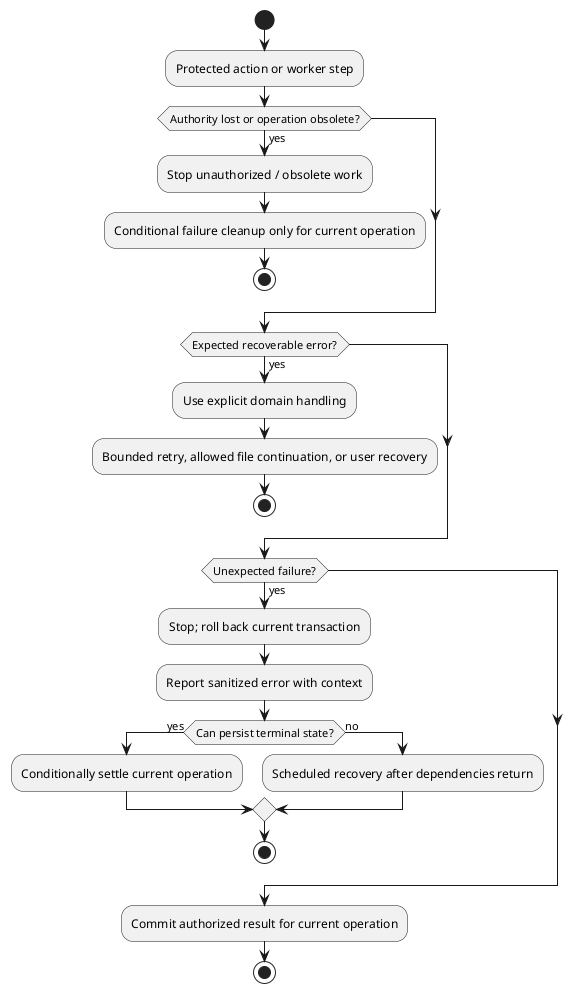
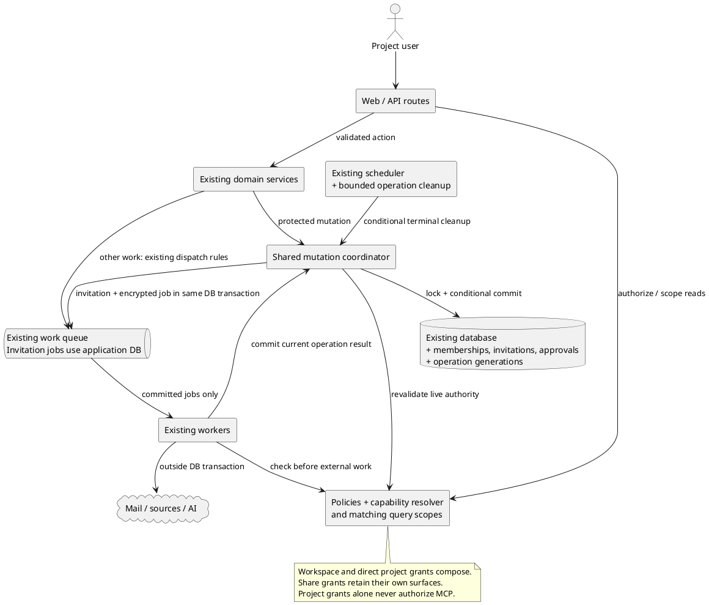
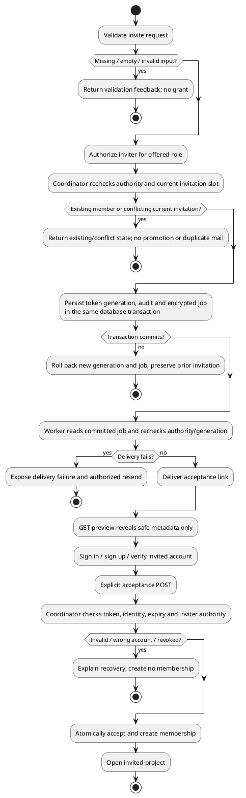
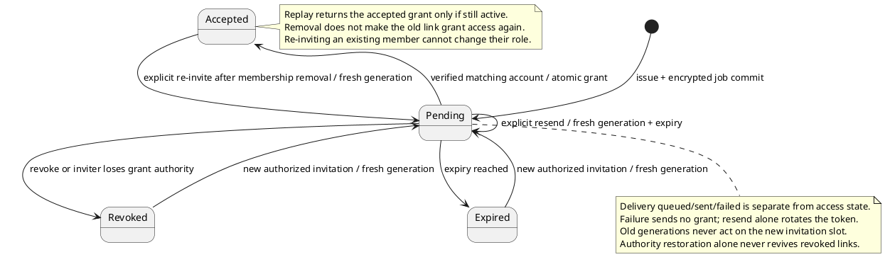

# Project access — engineering review

> Updated 2026-09-27 · Review interrupted for ticketing after decision 17A.
> Architecture, error-map, security, interaction, code-quality and test checkpoints
> recorded; performance issue 18 is unanswered, sections 8–11 remain pending.
> This is not implementation or release approval.
> Source of truth: [M4.1 module spec](../specs/m4.1-project-access.md).

## Review progress

| Section | Status |
|---|---|
| Step 0: scope challenge | 1A accepted: retain the full approved scope |
| 1. Architecture | Four findings resolved through decisions 2A–5A |
| 2. Error and rescue map | Two findings resolved through decisions 6A–7A; planned failure map below |
| 3. Security and threat model | Five findings resolved through decisions 8A–12A; planned controls below |
| 4. Data flow and interaction edge cases | Three findings resolved through decisions 13A–15A; flow/state map below |
| 5. Code quality | One finding resolved through decision 16A; checkpoint below |
| 6. Tests and coverage diagram | One finding resolved through 17A; [coverage map](project-access-test-map.md) includes diagram and failure registry; 28 planned coverage gaps |
| 7. Performance | Issue 18 unanswered; carried into draft ticket T01 |
| 8. Observability | Pending |
| 9. Deployment and rollout | Pending |
| 10. Long-term trajectory | Pending |
| 11. Design and UX | Pending |

The coverage diagram and failure registry are recorded in the test map. Deployment
sequence, worktree strategy and final task consolidation remain for later sections.
No unasked finding is treated as an accepted decision.

## Scope checkpoint: 1A

The module exceeds eight files and two new classes. The user chose the complete
approved scope, including delegated sources and branch/path configuration, over
deferring those capabilities. Deliver in stages, with public invitation enablement
waiting for the complete permission boundary. Do not reopen scope reduction.

No new distributable artifact or external infrastructure is required. Existing
API/web/worker/scheduler deployment paths carry this feature.

## What already exists

| Existing seam | Planned reuse |
|---|---|
| Laravel Policies and workspace authorization concerns | Add project capabilities and matching query scopes; retain credential restrictions |
| Registration, mailbox verification, reviewer upgrade, safe auth return flows | Reuse for invited verified-account acceptance |
| Encrypted queued auth notifications and database queue | Reuse transport/encryption; 14A persists invitation jobs atomically instead of copying auth mail's after-commit dispatch |
| Document shares and share-reviewer identity | Keep as independent document access |
| MCP token revalidation inside write transactions | Compose with the shared mutation coordinator |
| Import, re-sync, scan, AI run and audit services | Add authority and operation checks around their existing behavior |
| AI run IDs and conditional terminal transitions | Retain rather than introduce another run-history model |
| Local/preview scheduler services | Run bounded cleanup outside the work queue |
| Content-addressed image and diagram storage | Retain caching/deduplication behind private storage and document-authorized delivery; migrate public references |
| PHPUnit authorization matrix, MCP concurrency tests, Playwright auth/share journeys | Extend agreed test seams; no new test framework |

Framework references verified during review:
[encrypted jobs](https://laravel.com/framework/docs/13.x/queues#encrypted-jobs),
[database locks](https://laravel.com/framework/docs/13.x/queries#pessimistic-locking),
[SQLite isolation](https://www.sqlite.org/isolation.html), and
[Laravel scheduling](https://github.com/laravel/docs/blob/13.x/scheduling.md).
SQLite's transaction serialization must be tested independently of PostgreSQL
row locks; using `lockForUpdate()` alone is not a SQLite locking protocol.

Recent MCP revocation and AI deadline/lease/double-billing fixes overlap this
module. Preserve those guarantees when composing new access checks. In-flight
external work cannot be recalled or unbilled, and cleanup must retain recorded
spend. Existing unrelated README changes are outside this review.

## Architecture findings and accepted decisions

### Issue 2 — shared mutation boundary: 2A

**P1, confidence 9/10.** Existing transaction boundaries differ.
`api/app/Services/Documents/DocumentProjectAssignment.php:61` writes
`$document->save();`, while
`api/app/Services/Comments/CommentThreadService.php:99–101` opens
`DB::transaction(...)` and conditionally invokes `$guard();` inside it.
A controller-only check does not establish the spec's removal/write ordering.

**Accepted:** one shared coordinator owns lock ordering, live grant/resource
revalidation, and the protected mutation in a short transaction. Policies retain
permission decisions. Compose existing service transactions and MCP guards with
this protocol; keep external calls outside it. This costs a broader refactor but
avoids maintaining a separate locking protocol in every service.

### Issue 3 — obsolete worker writes: 3A

**P1, confidence 9/10.**
`api/app/Jobs/ImportDocumentJob.php:108–112` saves
`'status' => DocumentStatus::Failed` without an operation-generation condition.
`api/app/Services/TrackedRepos/TrackedRepoScanService.php:297–302` similarly saves
`'last_scan_status' => TrackedScanStatus::Failed` and a report.
Late cleanup could overwrite a replacement operation's successful state.

**Accepted:** retain AI run IDs and terminal checks; add operation generations
to document import/re-sync and scan work. Condition all result and cleanup writes
on current operation ownership. Keep operation identity separate from permission
grant versions. Reuse resource records instead of a shared operation-history table.

### Issue 4 — branch configuration versus document fetch: 4A

**P1, confidence 9/10.**
`api/app/Services/Import/DocumentImporter.php:110` passes
`url: (string) $document->source_url`, while
`api/app/Services/TrackedRepos/TrackedRepoScanService.php:349` only updates
`$held->forceFill(['tracked_blob_sha' => $currentSha])->save();` for an existing
document. A new branch setting would not itself update that old fetch URL.

**Accepted:** existing tracked documents follow the selected branch at the same
repository/path, including later manual re-syncs and initially identical content.
Preserve Document identity and history through normal versioning, re-anchoring,
and approval rules. Missing/excluded paths retain last good content. Current
document authority still applies; never reassign or duplicate inaccessible moved
documents. Discovery and fetch share the selected configuration version.

### Issue 5 — recovery without another user action: 5A

**P1, confidence 9/10.**
`api/app/Jobs/ScanTrackedRepoJob.php:20–22` documents that the record is left
`running` and recovered by stale reclaim or a manual re-scan.
`api/app/Services/AI/AiRunLedger.php:80` checks
`if ($existing !== null && $this->isAbandoned($existing))` inside `startOrJoin()`.
Neither establishes recovery without another request. The module promises work
will not remain running/importing forever.

**Accepted:** a bounded periodic cleanup command through the existing scheduler
settles revoked or demonstrably abandoned work without a browser visit. Preserve
last good content and recorded spend; never automatically restart imports or paid
AI. Respect legitimate runtime, queue waiting, and retry/backoff budgets. Use
operation identity and conditional writes to avoid touching replacement work.
Recovery requires the scheduler and database to be available. Scheduler execution
must be verified in both deployment modes. This adds bounded database scans but
does not depend on the work queue making progress to perform cleanup.

## Error-map findings and accepted decisions

### Issue 6 — uncertain email delivery: 6A

**P2, confidence 9/10.** The module requires bounded transport retries but
previously left uncertain send outcomes implicit. Laravel's
`api/vendor/laravel/framework/src/Illuminate/Notifications/NotificationSender.php:165`
calls `$this->manager->driver($channel)->send(...)` before `afterSending(...)`
at line 183 and `NotificationSent` at line 187. A worker or status-write failure
between those steps cannot undo mail already accepted by the transport.

**Accepted:** bounded automatic retries retain the same token/generation/expiry;
only explicit Resend rotates the invitation. Duplicate emails may arrive but
acceptance stays idempotent. Recheck current invitation authority before every
attempt and condition status writes on generation. Exhausted uncertain sends
show Failed with honest "may have arrived" copy and resend recovery. Do not
promise exactly-once delivery or guaranteed inbox receipt. This favors delivery
reliability over suppressing every duplicate email.

### Issue 7 — catch-all per-file continuation: 7A

**P1, confidence 8/10.**
`api/app/Services/TrackedRepos/TrackedRepoScanService.php:214–225` catches
`Throwable`, records `$report->failed($path, 'This file could not be imported.');`,
and executes `continue;`. If new authority checks throw within that path, the
handler would swallow them along with database and programming failures. This is
an integration risk in the planned change, not a claim that project-access code
already exists.

**Accepted:** continue only for explicitly classified, recoverable file errors.
Lost scan authority/approval stops the scan; unexpected infrastructure/programming
errors stop and are reported. Preserve previous valid commits and content. An
inaccessible moved document is still a redacted skip under the confirmed scope
rules. Settle failure conditionally on operation identity; use scheduled cleanup
when a failure prevents immediate persistence. This preserves useful partial
progress while keeping security and system failures visible.

## Planned error and rescue map

This maps required behavior, not verified implementation. Existing exception
types are named below; new project-specific domain outcomes still need typed
representations during implementation. HTTP status mapping follows the module
spec. A process crash has no catchable PHP exception, so it is listed separately.
There are 28 path groups, including later security/interaction findings; the two
error-policy gaps originally raised in this section were resolved by 6A and 7A.
Detailed assertions and test coverage remain section 6 work.

| Method/codepath | Failure | Exception or outcome | Required handling | User sees |
|---|---|---|---|---|
| Invite issue/resend input | Missing, malformed email/role | `ValidationException` | Reject before grant/mail mutation | 422 field feedback |
| Authenticated actions | No session, unverified identity, stale CSRF | `AuthenticationException`, authorization denial, `TokenMismatchException` | Existing auth/verification/CSRF handling; no mutation | Sign in, verify, or refresh/retry |
| Scoped resource lookup | Missing or foreign project/nested ID | `ModelNotFoundException` or policy not-found response | Same not-found boundary, no metadata leak | 404 |
| Visible action authorization | Role cannot perform action | `AuthorizationException` | Deny; do not infer write authority from read access | 403 with allowed recovery |
| Invite/resend/preview throttles | Limit or cooldown exceeded | `ThrottleRequestsException` / cooldown outcome | Refuse extra attempt without rotating/sending | 429 and retry guidance |
| Invitation slot lifecycle | Existing member, pending duplicate, conflicting state | Unique-key `QueryException` or typed lifecycle outcome | Resolve expected conflict under coordinator; never promote or send twice accidentally | Existing state or 409 |
| Invitation preview | Invalid, expired, revoked or replaced token | Typed invalid/inactive outcome, not an infrastructure exception | Uniform invalid response or permitted recognized recovery state; no grant | Invalid/gone page |
| Acceptance identity | Wrong email or reviewer identity lacks fresh verification | Typed identity/verification outcome | Keep membership unchanged; reuse account switch/upgrade/verification | Correct-account guidance |
| Acceptance transaction | Expiry/revoke races, replay, inviter lost authority | Typed inactive/conflict outcome; expected unique-key race | Atomic checks; accepted replay returns existing membership, removed replay never recreates it | Existing destination, 409 or recognized 410 |
| Invitation queue handoff | Job insert fails, configuration differs, process dies around commit | `QueryException`, explicit configuration failure, or no exception on hard kill | 14A: same-transaction encrypted queue insert; rollback issue/resend on failure; committed job survives caller loss | Failed save or committed queued invitation; previous generation survives failed resend |
| Invitation mail send | Known transport failure or uncertain acceptance | Symfony `TransportException` family; crash has no exception | Bounded same-generation retry, then explicit failure; no expiry extension | Failed/resend, with may-have-arrived copy when uncertain |
| Invitation stale delivery | Resend/revoke/expiry/authority loss wins | Typed stale-generation/inactive outcome | Skip send or obsolete status write; cannot recall an already-sent message | Current invitation state |
| Member/role/move mutation | Permission/resource placement changed mid-request | `AuthorizationException` or typed conflict | Coordinator reauthorizes; roll back forbidden mutation | 403/404/409 under visibility rules |
| Protected DB transaction | Deadlock, lock timeout, database unavailable | `QueryException` / underlying `PDOException` | Roll back; report failure with context, never claim success | Recoverable error; prior state remains |
| Grant creation/escalation audit | Required audit write fails | `QueryException` | Roll back grant and audit together | Failure without a stranded grant |
| Access reduction audit | Audit/log sink fails after reduction | Existing `AuditLogger::recordSafely` boundary | Preserve security change; best-effort sanitized reporting | Successful reduction |
| Repository approval/preview | Invalid repo/ref/pattern, upstream denial/rate limit | `DiscoveryException` with existing stable discriminator | Existing source failure mapping, constrained by project authority | Validation/source recovery; no credential disclosure |
| Source config/untrack | Pending/running work or changed config | Typed conflict/generation outcome | Refuse conflicting edit or suppress obsolete result | 409 or current operation state |
| Import/re-sync external work | SSRF block, revoked PAT, throttling, fetch/projection/re-anchor failure | `BlockedUrlException`, `TokenRevokedException`, `RateLimitedException`, `FetchException`, `ProjectionFailedException`, `ReanchorUnavailableException`, `ReanchorRequestException` | Preserve existing specific retry/terminal policies; new authority/generation checks apply to every attempt and commit | Import failed or last-good-version recovery |
| Delegated worker authority | Removed grant or approval | Typed access-revoked outcome | Stop external/descendant work; conditional terminal cleanup | Access/source withdrawn, no unauthorized result |
| Scan file processing | Recoverable file failure versus system failure | Allowlisted file-domain errors/confirmed unique-key conflict versus unexpected `QueryException`, `Error`, other exceptions | 7A: continue only for known recoverable cases; otherwise stop/report; moved inaccessible documents skip without disclosure | Accurate partial report or interrupted scan |
| AI execution | Provider/rate/deadline/queue fault or revoked authority | Existing `AiFailureClassifier` types plus typed access-revoked outcome | Keep deterministic/transient rules and cost-safe default; retain spend, suppress unauthorized output | Existing failed-run state and safe reason |
| Worker crash or obsolete completion | Failure handler never runs; old generation writes late | No exception on hard kill; typed obsolete-operation outcome | 3A/5A: conditional writes and scheduled cleanup; never overwrite replacement | Settled failure or intact newer success |
| Cleanup/read/status endpoints | Database unavailable or poll fails | `QueryException`, transport/network failure | Report failure, retain last known data; cleanup can run again when dependencies recover | Load/recovery state, never an invented empty/success state |
| Shared logout/account switch | Failed response or overlapping request restores old identity | Network/HTTP failure or session race | 11A: confirmed shared logout, retry, server concurrency guarantee | Recoverable sign-out failure; retained invitation destination |
| Document asset delivery | Missing grant, wrong document association, storage unavailable | Authorization/not-found or storage failure | 12A: authorize each request and association; private origin; retain safe rendering fallback | Denial or asset error, no bypass through public storage |
| Stale administrative action | Changed/recreated target after screen was loaded | Typed revision conflict | 13A: compare target revision under coordinator; no mutation; refresh permitted state | 409 then explicit retry, preserving 403/404 precedence |
| Competing content update | Another update is pending/running | Typed busy conflict | 15A: reject before input changes or dispatch; retain accepted operation | 409, preserved draft, refresh and explicit retry |

The existing AI job's outer `catch (Throwable)` delegates to an explicit typed
classifier with a deterministic fallback; preserve that cost-safe behavior.
`AuditLogger::recordSafely` intentionally shields an already-committed security
reduction from audit failure. Neither justifies a catch-all continue inside the
scan's file loop. Never translate every `QueryException` into a duplicate or a
user-validation error; only a verified matching constraint conflict qualifies.

## Security findings and accepted decisions

### Issue 8 — invitation tokens in request metadata: 8A

**P1, confidence 9/10.** The planned API embeds the token in the request path.
When optional Nightwatch is enabled,
`api/vendor/laravel/nightwatch/src/Sensors/RequestSensor.php:89` builds the full
path/query URL and line 120 emits `'url' => $record->url`.
`api/config/nightwatch.php:12–14` configures payload/header redaction, which does
not itself redact URL segments. `web/lib/auth-redirect.ts:8` puts the destination
in `next` through `encodeURIComponent(safeAuthNext(next))`. The new flow must
explicitly protect those surfaces; this is not a claim that project invitations
already exist or have leaked in production.

**Accepted:** retain only allowlisted request diagnostics such as route template,
status, timing, and correlation ID. Strip secrets before capture across web/API,
token-bearing auth return paths (including nested destinations), headers, and
deployed proxy logs. Include no-referrer, no-store, and no-indexing controls on
invitation/token-bearing auth-return responses, including errors. Nightwatch
remains optional; self-hosted protections cannot depend on it.

`web/app/(auth)/reset-password/page.tsx:4` already sets
`referrer: 'no-referrer'`. The same protection principle is supported by
[OWASP's emailed-token guidance](https://cheatsheetseries.owasp.org/cheatsheets/Forgot_Password_Cheat_Sheet.html#url-tokens).
Apply that principle to invitations while preserving their separate verified
account requirement. Verify synthetic token absence from logs/telemetry/referrers
and retain enough safe diagnostics to investigate failures.

### Issue 9 — repository identity and transfer: 9A

**P1, confidence 9/10.** The module's canonical-identity requirement did not yet
define rename/transfer policy. `api/app/Services/TrackedRepos/RepoRef.php:53`
identifies the repository as `return "{$this->owner}/{$this->repo}";`.
`GithubRepoClient.php:41–48` reads repository metadata but returns only the default
branch. GitHub documents redirects after
[renames](https://docs.github.com/en/repositories/creating-and-managing-repositories/renaming-a-repository)
and [transfers](https://docs.github.com/en/repositories/creating-and-managing-repositories/transferring-a-repository),
and explains that another repository at the original location can replace the
redirect. Therefore a URL alone is insufficient evidence of the approved identity.

**Accepted:** bind approval to GitHub repository ID and owner ID. Matching-ID
renames continue; replacement repositories do not inherit grants. A different
owner ID requires explicit Kedge workspace-owner reapproval before delegated
credentialed work resumes. Apply to preview and all source/descendant jobs.
Imported content/history remain subject to normal project permissions; a later
transfer back cannot revive an already-invalidated grant or queued operation.
This introduces an intentional recovery step when control of the source changes.

### Issue 10 — credential forwarding through redirects: 10A

**P1, confidence 10/10.**
`api/app/Services/Import/Connectors/GithubPatConnector.php:52` returns
`['Authorization' => 'Bearer '.$this->token($source)]`.
`GuardedFetcher.php:70–78` passes the same `$headers` on each redirect hop, and
line 143 passes them into `PinnedRequest` unchanged. `CurlHttpTransport.php:44`
uses `$client->withHeaders($request->headers)` before sending the request.
`GuardedFetcherTest.php:169–182` explicitly permits an ordinary redirect to a
different public host. The forwarding path is verified; no actual credential
exposure was observed during this review.

**Accepted:** authenticated repository requests reject a changed scheme, host,
or effective port before contacting that destination. Same-origin redirects must
still satisfy approved repository/owner identity. Keep credential-free public
redirects and the current SSRF/DNS/size/timeout defenses. Apply to discovery and
document fetches, including multi-hop chains. This chooses a simple credential
boundary over adding connector-specific anonymous download redirects.
[HTTP redirect guidance](https://www.rfc-editor.org/rfc/rfc9110.html#section-15.4)
also calls out the security implications of forwarding sensitive headers.

**CRITICAL regression requirement:** test host/port/scheme changes and later-hop
origin changes, asserting no request or credential reaches the rejected target;
retain public-redirect coverage and reject same-origin repository substitution.

### Issue 11 — reliable shared sign-out and account switching: 11A

**P1, confidence 9/10 for client failure handling.**
`web/lib/auth-client.ts:102` declares `signOut(): Promise<void>`; its final logout
response is never checked for success, and line 112 says
`// swallow — the redirect + server re-check is the source of truth`.
`api/app/Http/Controllers/Auth/SessionController.php:40` calls
`$request->session()->invalidate();`, but the browser test explicitly avoids a
documented concurrent-session race: `web/e2e/auth-edges.spec.ts:75` uses
`await page.waitForLoadState('networkidle');` before sign-out. The historical
four-worker finding is recorded in the logout debt in `docs/TODOS.md`; its exact
mechanism has **not** been reproduced against the current driver during this
review. Client failure handling is verified by source inspection.

**Accepted:** harden the shared sign-out flow, including ordinary logout. Account
switching waits for confirmed completion, keeps the internal invitation return
destination, and offers retry after failed or uncertain outcomes. Completed
logout must not be undone by an in-flight request. Reproduce the historical race
first, then choose the smallest server fix proven with the actual session driver,
including session-ID rotation and remember-me restoration. Neither a browser
network-idle wait nor blocking only the logout route establishes this guarantee.
Do not preselect custom session epochs without evidence. Reuse the shared auth
flow rather than introducing an invitation-specific duplicate; verified recipient
matching remains a separate server-side acceptance check.

**CRITICAL regression requirement:** ordinary logout and invitation switching
cover failed/uncertain responses, exhausted CSRF recovery, retry, preserved return
destination, and controlled overlap with authenticated requests, rotation, and
remember-me restoration. Browser and server concurrency tests must prove the old
account cannot return after confirmed logout; tests are planned, not executed.

### Issue 12 — document asset delivery bypasses access checks: 12A

**P1, confidence 9/10 from source and configuration, not a production probe.**
`api/app/Services/Import/Normalization/ImageReHoster.php:160` returns
`[$disk->url($path), null]`; `api/app/Services/Diagrams/DiagramRenderer.php:80`
returns `$disk->url($path)` on cache hit. `api/config/kedge.php:277` defaults
`MEDIA_DISK` to `public`, and `api/config/filesystems.php:45` configures
`'visibility' => 'public'`. Those default storage URLs do not recheck document
reach after a member is removed. A hash in the path is not an access check.

**Accepted:** begin with document-authorized image/diagram delivery backed by
private storage, rechecking live access for every new request. Bind asset lookup
to the requested document/version; shared hashes cannot grant access. Retain
render/storage caching behind the authorization boundary. Existing assets and
references are part of migration, as are direct origin/storage/CDN bypasses.
Preserve historical version hashes/anchors, safe embedding/CSP, valid independent
shares, and public demo access. Already delivered/in-flight bytes cannot be recalled.

The user asked whether 12B could follow later. Keep storage and delivery separate
to make that change manageable, without implementing a speculative second mode.
[Laravel temporary URLs](https://github.com/laravel/docs/blob/13.x/filesystem.md#temporary-urls)
are a potential later delivery mechanism, but issued URLs can remain usable until
expiry after membership removal. A switch therefore needs measured justification
and explicit acceptance of weaker asset revocation; it is not an automatic
performance fallback or a commitment to build 12B.

**CRITICAL regression requirement:** API/browser coverage for access loss, moves,
share revocation and valid independent grants, wrong-document asset IDs, shared
hashes, public bypasses, and legacy references. Migration must preserve version
hashes and anchors. Exercise local storage automatically and verify deployed
object-store/cache rules before enabling invitations.

### Security checkpoint

These are reviewed plan requirements, not claims that implementation is secure.

| Threat surface evaluated | Required control / disposition |
|---|---|
| New endpoints, nested IDs, cross-project reads and mutations | Policies plus live scoped capabilities/query scopes; nested binding and field projection; same inaccessible-resource response; 2A coordinator |
| Input and identity | Validated bounded email/role/repository/ref/path input, backed enums, exact normalized verified recipient, internal auth-return destinations, CSRF and throttles; reuse existing validation patterns |
| Secret handling and source substitution | 8A redaction and response controls; encrypted invitation jobs; 9A stable repository/owner identity; 10A credential-origin boundary; no public-to-private credential fallback |
| Sessions, derived resources, and access loss | 11A reliable shared logout; 12A live asset authorization/private storage; document-bound AI privacy, mention audience, independent shares and unchanged MCP credential scope |
| SQL, content, template, and prompt injection | Existing parameterized queries/validated identifiers, untrusted rendering and SVG defenses, Kroki allowlist, SSRF controls, and human-confirmed AI drafts remain required |
| Dependency exposure | Reuse current framework/storage/mail/queue seams; no new permission engine or mandatory SaaS telemetry dependency proposed |

No additional security finding is promoted at this checkpoint. Stale admin intent
and user-visible conflict recovery are evaluated next under interaction edges.

## Interaction findings and accepted decisions

### Issue 13 — stale administrative intent: 13A

**P1, confidence 9/10 for the plan gap.** The pre-decision module spec at
`docs/specs/m4.1-project-access.md:286` specified a membership `grant version`,
but its API contract at line 411 specified only
`PATCH /projects/{project}/members/{user}` with role. The coordinator already
rechecks the actor's authority; that does not prove the target is the membership
the administrator saw before another administrator removed and recreated it.
These are references to the reviewed spec, not implemented endpoint behavior.

**Accepted:** require the reviewed target identity/revision for membership,
invitation, approval, tracked-source configuration, and document-move actions.
Compare under the shared coordinator, reusing the relevant existing version
where possible. Include target incarnation so a remove/recreate or move away/back
cannot satisfy a stale precondition merely by returning to the same visible value.
Keep current authorization and inaccessible-resource behavior. Missing/malformed
preconditions fail validation; stale actionable targets return 409 without side
effects. Refresh only permitted state, explain the conflict, and require explicit
retry; never automatically substitute a fresh revision and replay. Recover lost
responses by reading current state. Acceptance retains its separate token and
idempotency semantics. This adds API/UI work but preserves the administrator's
intent when multiple people manage a project.

**Required coverage:** fresh/missing/malformed/stale preconditions; re-invited
members, rotated/reissued invitations, replaced approvals, changed source config,
document moves away/back; no stale mutation/dispatch; preserved 403/404 behavior;
two concurrent requests with the same revision; two browser contexts with refresh
and explicit retry; uncertain response followed by current-state recovery.

### Issue 14 — crash between invitation commit and delivery enqueue: 14A

**P1, confidence 9/10 for the planned failure window.** Before this decision,
`docs/specs/m4.1-project-access.md:365` said
`Queue mail after the invitation transaction commits`. A process death after
commit but before enqueue leaves no job for normal retries. Framework source
`api/vendor/laravel/framework/src/Illuminate/Queue/Queue.php:370` registers an
in-memory transaction callback via `addCallback`, while
`DatabaseQueue.php:344` inserts a job through `$this->database->table($this->table)`.
`api/config/queue.php` already defaults to the database driver, with a configurable
database connection. This is a plan gap supported by source, not a reproduced
production incident.

**Accepted:** invitation issue/resend, required audit, and encrypted job insertion
share the same application database connection and transaction. Workers see only
committed work; a rollback removes the new generation/job, and a process dying
after commit leaves a durable job. Failed resend preserves the old generation.
Validate configuration and refuse mismatched/synchronous invitation queue paths;
do not assume `beforeCommit()` alone proves shared-transaction behavior. Preserve
other jobs' dispatch rules and configured Laravel mail transports. No new outbox
platform is required; 6A retry and secret-protection rules still apply.

[Laravel's queue transaction guidance](https://github.com/laravel/docs/blob/13.x/queues.md#jobs-and-database-transactions)
distinguishes immediate from deferred dispatch. The same-connection transactional
handoff is the chosen application design and must be proved against both supported
databases; it is not a blanket guarantee for all queue drivers.

**Required coverage:** real encrypted database jobs, independent worker visibility,
rollback and job-insert failure, failed resend preserving old state, and process
loss before/after commit with worker recovery. Exercise PostgreSQL and file-backed
SQLite, reject incompatible configuration, and run invitation browser journeys
with an asynchronous worker rather than a queue fake/synchronous substitute.

### Issue 15 — silently coalesced content updates: 15A

**P1, confidence 9/10 from source and existing debt, not a new reproduction.**
`api/app/Http/Controllers/Api/V1/DocumentController.php:475–484` saves
`'source_meta' => $this->pasteSourceMeta(...)` before
`ResyncDocumentJob::dispatch($document, $request->user()?->id)` and then returns 202.
`api/app/Jobs/ResyncDocumentJob.php:31` implements `ShouldBeUnique`; line 54 returns
the document ID as `uniqueId()`. A second submission can therefore change stored
input while its dispatch is suppressed. If the first worker already read its
body, the second body has no worker; if it has not, attribution can belong to the
wrong actor. The existing Update pasted content debt records the lost-update case.
3A protects conditional completion but does not decide admission for new input.

**Accepted:** atomically admit one active content update before changing source
content; reject competing updates with 409 while pending/running. Use the shared
coordinator and operation state/generation, not only queue uniqueness or UI
disabling. A rejected update changes neither payload nor actor/generation and
queues no work. Preserve the competing editor's draft, refresh after settlement,
and require explicit retry. Accepted work retains its input and attribution;
grant revalidation and generation-safe failure/cleanup remain required. No ordered
backlog of submitted bodies is introduced.

**CRITICAL regression requirement:** controlled overlap after the first worker
reads its input, admission races before worker start, correct body/actor/version,
and no second job or mutation on rejection. Cover failed/revoked operation recovery
and two Maintainer browser contexts preserving the unsent draft. Use asynchronous
dispatch and independent database connections; a synchronous queue cannot prove
the worker overlap. Poll timeout is not proof of completion or unchanged content.

### Interaction checkpoint: data flow and boundary cases

The following traces cover the new flow families. They specify required behavior;
test implementation and coverage accounting remain section 6 work. Each row runs
through input, validation, transformation, persistence, and output. Typed errors
and infrastructure exceptions follow the error map above, without silent success.

| Flow | Input → validation → transform | Persist → output | Nil, empty, error, timeout and concurrency |
|---|---|---|---|
| Discovery/project/roster | Actor + page/filter → live scope and bounded pagination → safe capability/resource projection | Read only → page + metadata | Empty collection is valid; hidden project is 404; failed load is not empty; 10k rows remain DB-paginated |
| Invitation issue | Email + role → normalized bounded input and grantable role → current slot/token generation | Invitation + audit + encrypted job atomically → queued response | Missing/invalid input 422; existing member conflicts; duplicate pending request sends no extra mail; 14A handles crash/rollback |
| Resend/revoke | Target revision → actor and current slot rechecked → rotate generation or terminate pending grant | Conditional transaction → current delivery state/204 | Missing revision 422; stale state 409; old mail/status writes cannot affect replacement; failed resend preserves old generation |
| Preview/account switch | Token + current account → token state/safe metadata and internal return path → sign-in/verification or switch | GET grants nothing; shared logout confirms completion → explicit Join action | Invalid/inactive link recovery; wrong account creates no membership; 11A covers logout/network/CSRF failure and overlap |
| Acceptance | Token + verified full account → exact normalized recipient and live inviter authority → direct grant | Membership + accepted state + audit atomically → project destination | Duplicate acceptance is idempotent; expiry/revoke race cannot grant; replay after removal never recreates access; lost response can retry safely |
| Role/removal/leave | Target + expected revision → actor/target authority → grant revision and capability changes | Coordinator mutation + required invalidation/audit → state/204 | 13A rejects stale/recreated targets; inherited/independent grants remain; stale client responses are discarded after access loss |
| Review/moderation/shares | Resource IDs + action/body → reach and per-action role/ownership → existing domain mutation | Protected write and attribution → updated resource | Cross-project nested IDs denied; former author cannot write; no impersonation; shares retain their own grant path and explicit revocation |
| Repository approval/config | Repository/config + expected revision → owner/source capability, identity, bounded ref/path input → canonical approval/config revision | Protected save/audit → configuration | 9A/10A reject transfer/substitution/credential-origin changes; stale revision or active scan conflicts; external validation failure grants nothing |
| Import/re-sync/scan | Source + initiating grant/config → live authority → existing guarded fetch/normalization pipeline | Current operation result only → good content or explicit failure/report | Empty repository vs no matches remain distinct; 4A branch binding, 7A partial failures, generation-safe cleanup and last-good-content preservation |
| Content replacement | Body + actor → validation and atomic operation admission → accepted source input | One active operation → queued/terminal status | 15A prevents overlapping payload/actor overwrite; keep unsent draft on 409; timeout is not completion; retry requires settled state |
| Document move | Destination + placement revision → both ends/current actor → new audience | Atomic placement change with history/provenance → document | Null means owner-authorized Unfiled; no cross-workspace move; away/back or changed destination authority is rechecked; shares remain independent |
| AI generation/artifact read | Run type/target/question + actor → role, privacy, provider gates → existing run identity/dedupe | Current authorized run/output + cost accounting → private/shared artifact | Empty latest result differs from denial/failure; downgrade stops forbidden work; preserve spend and personal draft privacy; no automatic paid retry |
| Image/diagram delivery | Document/version + asset reference → live reach and association → private stored/rendered bytes | Internal cache only → safe authorized image | 12A covers moved/removed grants, shared hashes, missing assets and old public URLs; valid share/demo access remains; delivered bytes cannot be recalled |

Cross-flow interaction requirements:

- Double-click/rapid submit: duplicate invite/accept behavior is explicit; target
  revisions guard administrative actions; content updates use atomic admission;
  AI retains its existing start-or-join contract.
- Stale CSRF, expired session, and network failure: follow existing auth recovery
  and confirmed logout; keep unsent input and internal destinations, with no
  mutation claimed from an ambiguous result.
- Navigation away: committed delivery/operations continue under server authority;
  returning reads current state, never resubmits implicitly. Private drafts keep
  their existing per-actor boundary.
- Concurrent role changes, moves, resend/revoke, and worker completion: 2A/3A/13A
  govern authoritative ordering, target revisions, and conditional result writes.
- Zero/large results: inherited access is distinct from an empty direct roster;
  shared projects, members, invitations and source lists paginate in the database;
  loading/error/empty states remain distinguishable.

No interaction decision presented so far is unanswered. The three findings were
stale administrative intent (13A), missing delivery handoff (14A), and overlapping
content input (15A); no further finding is promoted at this checkpoint.

## Code-quality findings and accepted decisions

### Issue 16 — duplicate AI run-start orchestration: 16A

**P2, confidence 9/10; duplication verified in source.**
`api/app/Http/Controllers/Api/V1/AiRunController.php:111–115` calls
`$ledger->startOrJoin(...)` then `GenerateAiRunJob::dispatch($run->id)` and handles
dispatch failure inline. `CommentSplitController.php:76–94` duplicates that
sequence. `api/app/Services/AI/AiRunStarter.php:48–63` already owns it, and Ask/thread
controllers already call that service. The existing TODO flags digest consolidation.
This is a maintenance/integration risk, not evidence of a new production breach.

**Accepted:** consolidate digest, improve-prompt, and split starts through existing
`AiRunStarter`, then compose project grant snapshots and the shared coordinator
there. Policies retain run-type authorization; controllers retain appropriate
validation and HTTP projection. Preserve readiness/version checks, dedupe-exempt
Ask, actor/target/variant scope, 200/202 behavior, dispatch failure, per-actor privacy,
provider/rate gates, cost accounting and explicit retry. A join does not redispatch
or replace the original initiating authority. No generic AI framework is added.

The user explicitly approved necessary refactoring as well as consolidation. Make
the shared service/coordinator integration coherent instead of forcing a minimal
diff that duplicates rules. Pin current endpoint behavior first, refactor, then
add the project-role changes. Implementation has not started. The backend part of
the old consolidation TODO is absorbed here; unrelated frontend phase aliases
remain outside this finding.

**Required coverage:** all six run types through real endpoints; mint/join and
dispatch failure; actor/target/variant/Ask dedupe distinctions; required input and
status codes; private reads and provider/cost behavior; project-role denial and
revocation before outbound work/commit. Existing fakes avoid live provider calls.

### Code-quality checkpoint

| Dimension evaluated | Disposition |
|---|---|
| Organization and boundaries | Existing Policies, request validation, resources and domain services remain; 2A owns shared transactions, 16A owns AI start orchestration |
| Duplication | 16A removes the verified duplicate start paths; capability/query/projection parity uses the already-agreed resolver rather than separate role checks in controllers/UI |
| Names and state ownership | Keep grant revision, operation generation, invitation token generation, target revision and delivery status distinct; each protects a different invariant |
| Error patterns | 7A replaces scan catch-all continuation; known AI dispatch failure handling remains deliberate and shared; no catch-all conversion of DB faults to lifecycle conflicts |
| Complexity and defensive branches | Keep validation, grant resolution, operation admission, external execution and conditional completion as explicit service steps; the existing ledger keeps its dedupe/state transitions, with refactoring authorized where needed for integration |
| Over/under-engineering | No new generic ACL, AI framework, outbox platform or snapshot backlog; shared guard, operation IDs and typed outcomes address the observed boundaries |
| Comments and diagrams | Update stale ownership/workspace-only comments in Policies/resources when behavior changes; existing ledger state comments and plan diagrams must match the final transaction flow |

No additional code-quality finding is promoted at this checkpoint. The mandatory
branch/user-flow coverage review follows; code organization is not test evidence.

## Test review findings and accepted decisions

### Issue 17 — CI does not exercise required queue/concurrency behavior: 17A

**P1, confidence 10/10 for the configuration mismatch.**
`web/e2e/serve-api.sh:120` writes `QUEUE_CONNECTION=sync`;
`api/phpunit.xml:42` sets `DB_DATABASE` to `:memory:` and line 45 selects the
synchronous queue. `McpWriteToolsTest.php:655` skips its lock test outside
MySQL/PostgreSQL. Those existing defaults cannot establish the new cross-process
mail/content guarantees or PostgreSQL locking, even if those suites pass.

**Accepted:** a required focused integration profile alongside the existing fast
suites. Run concurrency contracts on PostgreSQL and file-backed SQLite and affected
Playwright journeys with a real database worker/shared cache state. Use isolated,
committed fixtures; controlled barriers; readiness and teardown; safe logs/traces.
Missing engines/workers, incompatible configuration or skipped required contracts
must fail the profile. Configure a required merge/release check and document local
reproduction. Keep deterministic external-service fixtures; no whole-suite async
migration or extra test framework is required.

This makes the existing accepted test requirements executable rather than reducing
coverage. Costs are a focused CI harness and its process lifecycle; the unrelated
fast suites keep their current purpose.

### Test review checkpoint

The [test coverage map](project-access-test-map.md) records the detected PHPUnit/
Playwright seams, inspected baseline assertions, a combined code/user-flow diagram,
per-entry-point branch/error requirements, proposed test files, and real-queue/
database boundaries. None of the 28 new M4.1 contract groups is implemented yet;
existing tests are regression foundations, not evidence for new project grants.
The execution-harness choice is now 17A. The map includes a failure registry for
all 18 code-path groups. These tests remain implementation requirements; no
application tests have been run or new test coverage implemented in this review.

## System boundary

The diagram describes the agreed target, not code already implemented. Existing
baseline requests use Policies and service-specific transaction boundaries;
queued source work does not yet carry the new project authority and operation
generations.

## Invitation flow and states

These are the existing product decisions, included to expose the transaction and
identity boundaries. Detailed exception classes and interaction tests remain for
the later review sections.

Invitation lifecycle remains pending → accepted/revoked/expired. Resend rotates
the pending token generation and expiry; delivery queued/sent/failed is separate.
An accepted replay cannot regrant removed membership. An empty Shared with you
list is a valid empty state, distinct from a failed load or denied project read.

## Architecture failure scenarios

All protections below are planned. This table does not claim implemented tests
or replace the exception-level failure registry due in sections 2 and 6.

| Path | Production failure | Agreed protection |
|---|---|---|
| Invitation issue/resend | Caller dies around commit or transport fails later | Atomic encrypted job handoff; rollback preserves prior generation; committed delivery uses 6A retries and failure recovery |
| Invitation acceptance | Revoke races acceptance | Shared transaction boundary; one membership, live inviter/token checks |
| Discovery and direct reads | Foreign project appears in counts or lists | Matching query scopes, explicit project authorization and minimized resources |
| Member changes and review writes | Request retains a removed grant | Coordinator revalidation and serialization through commit |
| Document move | Destination permission changes mid-request | Both-end authorization and deterministic locks |
| Import/re-sync | Obsolete worker completes after replacement | Generation checks on every result/cleanup write |
| Repository delegation | Credential replaced or approval withdrawn | Owner-controlled integration binding and approval-version checks |
| Scan/configuration | Scan reads new branch but fetch uses old URL | Selected configuration shared by discovery and fetch |
| Moved tracked documents | Source scan reimports or exposes another project's document | Preserve provenance, reauthorize each document, redact outcomes |
| AI generation | Grant revoked while provider is working | Suppress unauthorized output, retain spend and existing deadline/lease behavior |
| Independent shares | Removal is mistaken for revoking all access | Preserve share grants and explain explicit share revocation |
| Worker crash | Failure handler never runs | Scheduled generation-safe cleanup without automatic paid retry |

At 10×/100× load, project write serialization, roster/discovery pagination, source
fan-out, and cleanup scans need particular scrutiny in the performance section.
Keep external calls outside locks and paginate/eager-load per the module spec.
The database remains the coordination dependency. Recovery also depends on the
scheduler; ordinary delivery depends on mail/workers. Deployment review must pin
mixed-version behavior and rollback rather than assuming a web rollback revokes
already-issued access.

## Implementation tasks from accepted findings

These are planning requirements, not published tickets. Proposed new filenames
are illustrative; match repository conventions during implementation.

- [ ] **T1 (P1)** — Authorization — centralize protected mutations and job commits.
  - Surfaced by: issue 2 / decision 2A.
  - Files: `api/app/Services/` (coordinator and affected domain services),
    `api/app/Policies/`, affected controllers and jobs.
  - Verify: extend `AuthorizationMatrixTest` and real PostgreSQL/file-backed
    SQLite concurrency coverage; preserve `McpWriteToolsTest` revocation checks.
- [ ] **T2 (P1)** — Background work — condition writes on operation identity.
  - Surfaced by: issue 3 / decision 3A.
  - Files: document/tracked-repo migrations and models, import/re-sync/scan jobs
    and services; retain `AiRunLedger` terminal behavior.
  - Verify: old completion/failure/revocation cleanup cannot modify newer work;
    prove late cleanup after replacement success with independent DB connections.
- [ ] **T3 (P1)** — Sources — make existing documents follow branch changes.
  - Surfaced by: issue 4 / decision 4A.
  - Files: tracked-repo controller/service, `TrackedRepoScanService`,
    `DocumentImporter`, `ResyncService`, source/configuration persistence.
  - Verify: extend `TrackedRepoScanTest` and import/re-sync features for selected
    branch fetch, identical-content changes, preserved history, missing paths,
    inaccessible moved documents, and later manual re-sync.
- [ ] **T4 (P1)** — Recovery — settle abandoned or revoked operations on schedule.
  - Surfaced by: issue 5 / decision 5A.
  - Files: `api/app/Console/Commands/` (cleanup command), `api/routes/console.php`,
    operation services/configuration, deployment documentation as needed.
  - Verify: command tests without browser traffic; repeated/concurrent cleanup;
    legitimate waiting/retrying work preserved; no import/AI dispatch or lost
    spend; local/self-host and SaaS scheduler smoke checks.
- [ ] **T5 (P2)** — Invitation delivery — make uncertain send retries explicit.
  - Surfaced by: issue 6 / decision 6A.
  - Files: planned invitation delivery service/notification, delivery-state
    persistence/resources, invitation management UI and translations.
  - Verify: a send accepted before worker/status-write failure retries with the
    same token/generation/expiry; duplicate links accept once; exhausted uncertain
    sends have recovery copy; stale status writes cannot overwrite a resend.
- [ ] **T6 (P1)** — Scan errors — replace catch-all continuation with typed handling.
  - Surfaced by: issue 7 / decision 7A.
  - Files: `TrackedRepoScanService`, scan/domain exception types, scan job failure
    settlement, and `TrackedRepoScanTest`.
  - Verify: expected file failures allow later files; lost scan/approval authority
    prevents later path processing and child dispatch; unexpected DB/programming
    failures stop/report without false success; prior content and replacements
    survive; inaccessible moved documents remain redacted skips.
- [ ] **T7 (P1)** — Invitation secrets — protect browser and diagnostic surfaces.
  - Surfaced by: issue 8 / decision 8A.
  - Files: invitation/auth-return pages, `web/next.config.mjs`, web/API logging
    boundaries, optional telemetry integration, proxy configuration/docs.
  - Verify: synthetic direct/encoded/nested invitation tokens never appear in
    request/error logs, telemetry, or browser referrers; safe diagnostics remain;
    success/error responses enforce no-referrer/no-store/no-indexing; protection
    works with Nightwatch disabled; deployment smoke inspects proxy logging.
- [ ] **T8 (P1)** — Repository approvals — bind identity and require transfer reapproval.
  - Surfaced by: issue 9 / decision 9A.
  - Files: planned Repository Approval persistence/service, `GithubRepoClient`,
    source connectors, preview/scan/import/re-sync authorization and owner UI.
  - Verify: matching repository/owner IDs survive rename; old-URL replacement
    fails; changed owner ID stops delegated work until explicit reapproval;
    queued work and transfer-back cannot revive the invalidated approval;
    imported content/history remain readable under normal project grants.
- [ ] **T9 (P1)** — Source credentials — reject authenticated cross-origin redirects.
  - Surfaced by: issue 10 / decision 10A.
  - Files: `GuardedFetcher`, `GithubPatConnector`, `GithubRepoClient`, relevant
    fetch/domain failure handling, `GuardedFetcherTest`, `GithubPatConnectorTest`.
  - Verify: critical regression tests for changed host/port/scheme and multi-hop
    redirects; rejected destinations receive no request or credentials; approved
    same-origin identity handling and credential-free public redirects still work.

- [ ] **T10 (P1)** — Shared authentication — make sign-out reliable for account switching.
  - Surfaced by: issue 11 / decision 11A; existing logout concurrency debt.
  - Files: `web/lib/auth-client.ts`, shared sign-out callers and invitation UI,
    `api/app/Http/Controllers/Auth/SessionController.php`, session/auth middleware
    or configuration as justified by reproduction, API auth concurrency tests,
    `web/e2e/auth-edges.spec.ts` and invitation journeys.
  - Verify: reproduce the documented race with the current driver; prove the
    smallest server fix across in-flight requests, session rotation, and
    remember-me; test failed/uncertain logout, CSRF exhaustion, retry and return
    destination. Both ordinary logout and account switching use the shared flow;
    no network-idle workaround substitutes for concurrency coverage.

- [ ] **T11 (P1)** — Document assets — enforce live authorization for delivery.
  - Surfaced by: issue 12 / decision 12A and the user's future-transition question.
  - Files: image rehosting, diagram rendering/delivery, filesystem/media config,
    document/share/demo rendering, new authorized asset routes, legacy-reference
    migration, proxy/cache configuration, API media tests and browser journeys.
  - Verify: new image/diagram requests require current document reach; asset IDs
    and shared hashes cannot cross document boundaries; removal/moves/share
    revocation apply while valid independent grants still work; old public paths
    and cache/origin routes cannot bypass checks; migration preserves history.
    Verify both local and deployed object-storage delivery. No 12B mode is built.

- [ ] **T12 (P1)** — Administrative mutations — reject stale target revisions.
  - Surfaced by: issue 13 / decision 13A.
  - Files: membership/invitation/approval/source/move request contracts and
    resources, persistence revisions, shared transaction coordinator, admin UI
    clients/dialogs, API concurrency tests and project-access browser journeys.
  - Verify: target identity and revision are compared atomically; replacement
    targets cannot match stale state; stale actions cause no side effects;
    authorization/discovery boundaries remain intact; UI refreshes and requires
    explicit retry, including after an ambiguous network outcome.

- [ ] **T13 (P1)** — Invitation delivery — persist an atomic encrypted queue handoff.
  - Surfaced by: issue 14 / decision 14A.
  - Files: invitation issue/resend service, encrypted delivery job, queue config
    validation, shared transaction coordinator integration, deployment/worker
    docs, real database-queue tests and asynchronous invitation browser setup.
  - Verify: invitation/audit/job share a connection and transaction; workers see
    no uncommitted work; rollback and job-insert failure leave no new generation;
    failed resend preserves previous state; committed jobs survive caller loss;
    ciphertext payloads and 6A retry behavior remain intact. Test PostgreSQL and
    file-backed SQLite; incompatible queue settings fail explicitly.

- [ ] **T14 (P1)** — Content updates — reject competing work before changing input.
  - Surfaced by: issue 15 / decision 15A and the existing content coalescing debt.
  - Files: `DocumentController::updateContent`, content-update service/admission
    through the coordinator, `ResyncDocumentJob`, operation state/payload handling,
    update-content UI and polling, `DocumentContentUpdateTest`, asynchronous
    concurrency coverage and `web/e2e/update-content.spec.ts`.
  - Verify: only one update is admitted; a second gets 409 without overwriting
    input/actor/generation or queuing work; accepted content alone commits;
    rejected drafts survive in the UI; explicit retry works after settlement;
    failures/revocation and late cleanup retain the agreed operation guarantees.

- [ ] **T15 (P2)** — AI starts — consolidate orchestration and refactor for project access.
  - Surfaced by: issue 16 / decision 16A and explicit authorization to refactor.
  - Files: `AiRunController`, `CommentSplitController`, `AiRunStarter`, integration
    with `AiRunLedger`/the coordinator, AI Policies and affected endpoint tests.
  - Verify: endpoint behavior is pinned before consolidation; all six run types
    use shared orchestration with no duplicate dispatch or grant replacement on
    join; preserve privacy, validation/status, dedupe, provider gates and cost;
    project revocation checks apply consistently before work and result commit.

- [ ] **T16 (P1)** — Integration CI — require real queue and database concurrency evidence.
  - Surfaced by: issue 17 / decision 17A.
  - Files: `.github/workflows/ci.yml`, focused PHPUnit/Playwright configuration,
    `web/e2e/serve-api.sh` or reusable profile boot helpers, worker/shared-cache
    setup, concurrency fixtures/barriers and local test documentation; required
    check configuration on the repository.
  - Verify: PostgreSQL and file-backed SQLite contracts execute without skips;
    browser journeys use committed database jobs and a real worker; missing
    prerequisites fail clearly; fixtures/processes are isolated and cleaned up;
    safe diagnostics persist on failure; the required check blocks merge/release.

## NOT in scope

- Workspace invitations/management, team ACLs and custom roles: future expansion
  uses the same capability/lifecycle seams with explicit scope records.
- A generic permission framework or universal operation-history table: the user
  chose existing Policies, a shared transaction boundary, and resource generations.
- A new queue, scheduler platform, or notification inbox: reuse deployed systems.
- Unapproved private sources, cross-workspace moves and project ownership/deletion:
  outside the confirmed product boundary.
- Automatic paid retries or recall of already-sent external work: preserve the
  existing explicit retry and honest accounting rules.
- Revoking independent shares/workspace grants during project removal: they are
  separate authorities, with explicit management and explanatory UI.
- A second asset-delivery mode using temporary storage URLs: possible future
  optimization only after measured need and an explicit revocation-policy decision.

## Decisions still pending

On 2026-09-27 the user switched to `$to-tickets` after accepting 17A. Issue 18
(request-local, batched grant reads) remains unanswered; neither option is accepted.
Performance, observability, rollout, long-term assessment and UX have not completed
review. The separate design review is also pending.

[Draft ticket T01](project-access-tickets.md) carries those reviews forward before
new invitation surfaces land; already-agreed prefactors can start independently.
Ticketing does not mark this review complete. Potential follow-up TODOs must still
be presented individually before being deferred.
