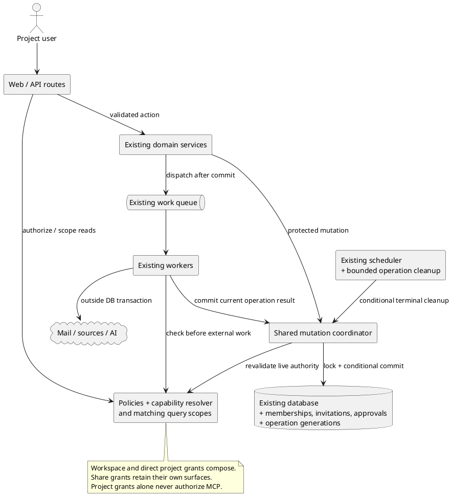
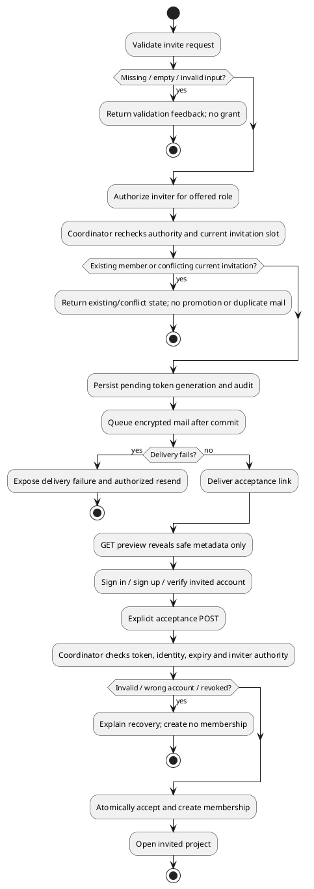

# Project access — engineering review

> 2026-09-26 · In progress. Architecture checkpoint recorded; error-map review
> started, sections 3–11 remain pending. This is not implementation or release approval.
> Source of truth: [M4.1 module spec](../specs/m4.1-project-access.md).

## Review progress

| Section | Status |
|---|---|
| Step 0: scope challenge | 1A accepted: retain the full approved scope |
| 1. Architecture | Four findings resolved through decisions 2A–5A |
| 2. Error and rescue map | In progress; no new decisions recorded yet |
| 3. Security and threat model | Pending |
| 4. Data flow and interaction edge cases | Pending |
| 5. Code quality | Pending |
| 6. Tests and coverage diagram | Pending; requirements below are not implemented coverage |
| 7. Performance | Pending |
| 8. Observability | Pending |
| 9. Deployment and rollout | Pending |
| 10. Long-term trajectory | Pending |
| 11. Design and UX | Pending |

The final failure registry, coverage diagram, deployment sequence, worktree
strategy, and consolidated task list will be completed through those sections.
No unasked finding is treated as an accepted decision.

## Scope checkpoint: 1A

The module exceeds eight files and two new classes. The user chose the complete
approved scope, including delegated sources and branch/path configuration, over
deferring those capabilities. Deliver in stages, with public invitation enablement
waiting for the complete permission boundary. Do not reopen scope reduction.

No new distributable artifact or external infrastructure is required. Existing
API/web/worker/scheduler deployment paths carry this feature.

## What already exists

| Existing seam | Planned reuse |
|---|---|
| Laravel Policies and workspace authorization concerns | Add project capabilities and matching query scopes; retain credential restrictions |
| Registration, mailbox verification, reviewer upgrade, safe auth return flows | Reuse for invited verified-account acceptance |
| Encrypted queued auth notifications and after-commit dispatch | Reuse transport and encryption for invitation delivery |
| Document shares and share-reviewer identity | Keep as independent document access |
| MCP token revalidation inside write transactions | Compose with the shared mutation coordinator |
| Import, re-sync, scan, AI run and audit services | Add authority and operation checks around their existing behavior |
| AI run IDs and conditional terminal transitions | Retain rather than introduce another run-history model |
| Local/preview scheduler services | Run bounded cleanup outside the work queue |
| PHPUnit authorization matrix, MCP concurrency tests, Playwright auth/share journeys | Extend agreed test seams; no new test framework |

Framework references verified during review:
[encrypted jobs](https://laravel.com/framework/docs/13.x/queues#encrypted-jobs),
[database locks](https://laravel.com/framework/docs/13.x/queries#pessimistic-locking),
[SQLite isolation](https://www.sqlite.org/isolation.html), and
[Laravel scheduling](https://github.com/laravel/docs/blob/13.x/scheduling.md).
SQLite's transaction serialization must be tested independently of PostgreSQL
row locks; using `lockForUpdate()` alone is not a SQLite locking protocol.

Recent MCP revocation and AI deadline/lease/double-billing fixes overlap this
module. Preserve those guarantees when composing new access checks. In-flight
external work cannot be recalled or unbilled, and cleanup must retain recorded
spend. Existing unrelated README changes are outside this review.

## Architecture findings and accepted decisions

### Issue 2 — shared mutation boundary: 2A

**P1, confidence 9/10.** Existing transaction boundaries differ.
`api/app/Services/Documents/DocumentProjectAssignment.php:61` writes
`$document->save();`, while
`api/app/Services/Comments/CommentThreadService.php:99–101` opens
`DB::transaction(...)` and conditionally invokes `$guard();` inside it.
A controller-only check does not establish the spec's removal/write ordering.

**Accepted:** one shared coordinator owns lock ordering, live grant/resource
revalidation, and the protected mutation in a short transaction. Policies retain
permission decisions. Compose existing service transactions and MCP guards with
this protocol; keep external calls outside it. This costs a broader refactor but
avoids maintaining a separate locking protocol in every service.

### Issue 3 — obsolete worker writes: 3A

**P1, confidence 9/10.**
`api/app/Jobs/ImportDocumentJob.php:108–112` saves
`'status' => DocumentStatus::Failed` without an operation-generation condition.
`api/app/Services/TrackedRepos/TrackedRepoScanService.php:297–302` similarly saves
`'last_scan_status' => TrackedScanStatus::Failed` and a report.
Late cleanup could overwrite a replacement operation's successful state.

**Accepted:** retain AI run IDs and terminal checks; add operation generations
to document import/re-sync and scan work. Condition all result and cleanup writes
on current operation ownership. Keep operation identity separate from permission
grant versions. Reuse resource records instead of a shared operation-history table.

### Issue 4 — branch configuration versus document fetch: 4A

**P1, confidence 9/10.**
`api/app/Services/Import/DocumentImporter.php:110` passes
`url: (string) $document->source_url`, while
`api/app/Services/TrackedRepos/TrackedRepoScanService.php:349` only updates
`$held->forceFill(['tracked_blob_sha' => $currentSha])->save();` for an existing
document. A new branch setting would not itself update that old fetch URL.

**Accepted:** existing tracked documents follow the selected branch at the same
repository/path, including later manual re-syncs and initially identical content.
Preserve Document identity and history through normal versioning, re-anchoring,
and approval rules. Missing/excluded paths retain last good content. Current
document authority still applies; never reassign or duplicate inaccessible moved
documents. Discovery and fetch share the selected configuration version.

### Issue 5 — recovery without another user action: 5A

**P1, confidence 9/10.**
`api/app/Jobs/ScanTrackedRepoJob.php:20–22` documents that the record is left
`running` and recovered by stale reclaim or a manual re-scan.
`api/app/Services/AI/AiRunLedger.php:80` checks
`if ($existing !== null && $this->isAbandoned($existing))` inside `startOrJoin()`.
Neither establishes recovery without another request. The module promises work
will not remain running/importing forever.

**Accepted:** a bounded periodic cleanup command through the existing scheduler
settles revoked or demonstrably abandoned work without a browser visit. Preserve
last good content and recorded spend; never automatically restart imports or paid
AI. Respect legitimate runtime, queue waiting, and retry/backoff budgets. Use
operation identity and conditional writes to avoid touching replacement work.
Recovery requires the scheduler and database to be available. Scheduler execution
must be verified in both deployment modes. This adds bounded database scans but
does not depend on the work queue making progress to perform cleanup.

## System boundary

The diagram describes the agreed target, not code already implemented. Existing
baseline requests use Policies and service-specific transaction boundaries;
queued source work does not yet carry the new project authority and operation
generations.

## Invitation flow and states

These are the existing product decisions, included to expose the transaction and
identity boundaries. Detailed exception classes and interaction tests remain for
the later review sections.

Invitation lifecycle remains pending → accepted/revoked/expired. Resend rotates
the pending token generation and expiry; delivery queued/sent/failed is separate.
An accepted replay cannot regrant removed membership. An empty Shared with you
list is a valid empty state, distinct from a failed load or denied project read.

## Architecture failure scenarios

All protections below are planned. This table does not claim implemented tests
or replace the exception-level failure registry due in sections 2 and 6.

| Path | Production failure | Agreed protection |
|---|---|---|
| Invitation issue/resend | Commit succeeds, delivery fails | Separate delivery status, visible failure, authorized token-rotating resend |
| Invitation acceptance | Revoke races acceptance | Shared transaction boundary; one membership, live inviter/token checks |
| Discovery and direct reads | Foreign project appears in counts or lists | Matching query scopes, explicit project authorization and minimized resources |
| Member changes and review writes | Request retains a removed grant | Coordinator revalidation and serialization through commit |
| Document move | Destination permission changes mid-request | Both-end authorization and deterministic locks |
| Import/re-sync | Obsolete worker completes after replacement | Generation checks on every result/cleanup write |
| Repository delegation | Credential replaced or approval withdrawn | Owner-controlled integration binding and approval-version checks |
| Scan/configuration | Scan reads new branch but fetch uses old URL | Selected configuration shared by discovery and fetch |
| Moved tracked documents | Source scan reimports or exposes another project's document | Preserve provenance, reauthorize each document, redact outcomes |
| AI generation | Grant revoked while provider is working | Suppress unauthorized output, retain spend and existing deadline/lease behavior |
| Independent shares | Removal is mistaken for revoking all access | Preserve share grants and explain explicit share revocation |
| Worker crash | Failure handler never runs | Scheduled generation-safe cleanup without automatic paid retry |

At 10×/100× load, project write serialization, roster/discovery pagination, source
fan-out, and cleanup scans need particular scrutiny in the performance section.
Keep external calls outside locks and paginate/eager-load per the module spec.
The database remains the coordination dependency. Recovery also depends on the
scheduler; ordinary delivery depends on mail/workers. Deployment review must pin
mixed-version behavior and rollback rather than assuming a web rollback revokes
already-issued access.

## Implementation tasks from accepted architecture findings

These are planning requirements, not published tickets. Proposed new filenames
are illustrative; match repository conventions during implementation.

- [ ] **T1 (P1)** — Authorization — centralize protected mutations and job commits.
  - Surfaced by: issue 2 / decision 2A.
  - Files: `api/app/Services/` (coordinator and affected domain services),
    `api/app/Policies/`, affected controllers and jobs.
  - Verify: extend `AuthorizationMatrixTest` and real PostgreSQL/file-backed
    SQLite concurrency coverage; preserve `McpWriteToolsTest` revocation checks.
- [ ] **T2 (P1)** — Background work — condition writes on operation identity.
  - Surfaced by: issue 3 / decision 3A.
  - Files: document/tracked-repo migrations and models, import/re-sync/scan jobs
    and services; retain `AiRunLedger` terminal behavior.
  - Verify: old completion/failure/revocation cleanup cannot modify newer work;
    prove late cleanup after replacement success with independent DB connections.
- [ ] **T3 (P1)** — Sources — make existing documents follow branch changes.
  - Surfaced by: issue 4 / decision 4A.
  - Files: tracked-repo controller/service, `TrackedRepoScanService`,
    `DocumentImporter`, `ResyncService`, source/configuration persistence.
  - Verify: extend `TrackedRepoScanTest` and import/re-sync features for selected
    branch fetch, identical-content changes, preserved history, missing paths,
    inaccessible moved documents, and later manual re-sync.
- [ ] **T4 (P1)** — Recovery — settle abandoned or revoked operations on schedule.
  - Surfaced by: issue 5 / decision 5A.
  - Files: `api/app/Console/Commands/` (cleanup command), `api/routes/console.php`,
    operation services/configuration, deployment documentation as needed.
  - Verify: command tests without browser traffic; repeated/concurrent cleanup;
    legitimate waiting/retrying work preserved; no import/AI dispatch or lost
    spend; local/self-host and SaaS scheduler smoke checks.

## NOT in scope

- Workspace invitations/management, team ACLs and custom roles: future expansion
  uses the same capability/lifecycle seams with explicit scope records.
- A generic permission framework or universal operation-history table: the user
  chose existing Policies, a shared transaction boundary, and resource generations.
- A new queue, scheduler platform, or notification inbox: reuse deployed systems.
- Unapproved private sources, cross-workspace moves and project ownership/deletion:
  outside the confirmed product boundary.
- Automatic paid retries or recall of already-sent external work: preserve the
  existing explicit retry and honest accounting rules.
- Revoking independent shares/workspace grants during project removal: they are
  separate authorities, with explicit management and explanatory UI.

## Decisions still pending

No architecture choice presented so far is unanswered. Detailed error mapping,
security, interaction edges, code quality, test coverage, performance,
observability, rollout, long-term assessment, and UX have not completed review.
Potential follow-up TODOs must be presented individually before being deferred.
