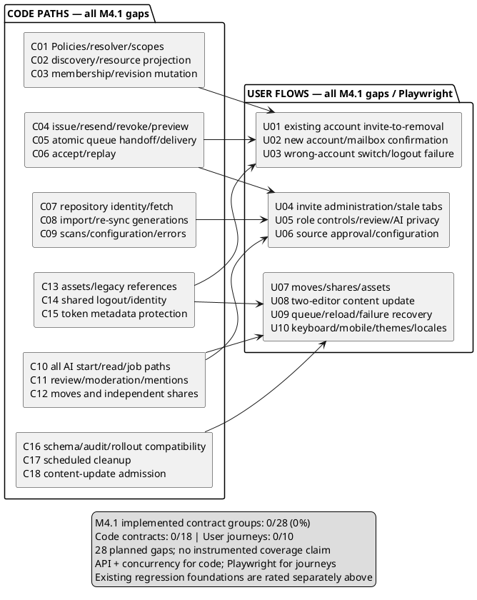

# Project access — test coverage map

> 2026-09-27 · Engineering review coverage checkpoint; decisions 17A and 18A accepted.
> Source: [module spec](../specs/m4.1-project-access.md) and
> [accepted review decisions](project-access-eng-review.md).
> This is a coverage plan, not a test-run report. No application tests were run
> during this documentation review. Proposed files below do not yet exist.

## Framework and execution evidence

- Backend: PHPUnit, `cd api && php artisan test`; existing feature tests use
  `RefreshDatabase`. `api/phpunit.xml` defaults to in-memory SQLite, synchronous
  jobs, and array cache. Those defaults suit many feature assertions but cannot
  prove independent worker visibility or multi-connection locking.
- Browser: Playwright, `cd web && npm run e2e`; `web/playwright.config.ts` starts
  API/web/fixtures. `web/e2e/serve-api.sh:120` sets `QUEUE_CONNECTION=sync`, and line
  121 sets `CACHE_STORE=array`. A new worker process cannot share that array cache.
- Existing lock-test precedent: `McpWriteToolsTest.php:651` uses an independent
  connection; line 655 skips drivers other than MySQL/PostgreSQL. Default CI's
  SQLite run does not prove PostgreSQL locking. The accepted plan requires both
  PostgreSQL and file-backed SQLite evidence, not a skipped test or shared PDO.
- Frontend Vitest exists for pure/rendering helpers; retain its current uses.
  The agreed module seams remain API feature/concurrency tests and real browser
  journeys, with no new component-test framework or mocked permission resolver.
- Keep GitHub, AI, mail-vendor responses controlled in automated tests. Real
  database queues, workers, cookies, local storage, and account/invitation flows
  must remain real where their integration is the behavior under test.

**17A accepted:** a required focused integration CI profile runs the PostgreSQL
and file-backed SQLite contracts and affected Playwright journeys with a real
database worker and shared cache state. Keep the existing fast suites. Isolate
fixtures and processes, use explicit barriers/readiness, clean up on failure, and
retain safe diagnostics. Missing prerequisites or skipped required checks fail the
profile; configure it as a required merge/release gate and document a local command.
Do not treat a synchronous job invocation or queue fake as the 14A/15A proof.

## Existing regression foundations

Ratings describe the inspected assertions for the stated baseline, not new
project-access coverage or a passing test run. ★★★ = behavior plus edge/error;
★★ = happy behavior only; ★ = smoke only.

| Existing test location | Evidence and quality | Remaining module gap |
|---|---|---|
| `api/tests/Feature/Auth/LogoutTest.php:21` | ★★★ replays a real session cookie, then asserts denial and deleted session after logout; guest denial at line 48 | Concurrent late requests, failure recovery, rotation/remember-me and invitation switching (C14/U03) |
| `api/tests/Feature/Api/V1/ShareLinkTest.php:153` | ★★★ wrong-document revoke is 404 with unchanged share; invalid visibility creates no row at line 172 | Maintainer administration, independent grants after removal, authorized assets (C12/C13) |
| `api/tests/Feature/Api/V1/AiDigestTest.php:254` | ★★★ repeated request returns same run/one job; abandonment recovery at line 272 and late-failure protection at line 583 | Consolidated starts, project roles, initiating grant and revocation (C10) |
| `api/tests/Feature/Api/V1/AiDocumentAskTest.php:1132` | ★★★ another member's Ask is forbidden, including the owner; own polling has separate coverage | Reviewer project grant and live document reach in addition to privacy (C10) |
| `api/tests/Feature/Fetch/GuardedFetcherTest.php:169` | ★★★ public redirect succeeds; private redirect at line 185 asserts only first hop connected; downgrade/caps/timeouts covered nearby | Authenticated origin changes and stable approved identity (C07) |
| `web/e2e/auth-edges.spec.ts:75` | ★★ logout journey waits for network-idle before testing the guard | That wait deliberately avoids the race and cannot prove 11A (U03) |

Six selected baseline groups: ★★★ = 5, ★★ = 1, ★ = 0. This is not a quality
score for the whole repository. Existing content, source, authorization-matrix,
MCP and rendering suites are additional extension points named below.

## Combined code-path and user-flow coverage diagram

Repository convention uses PlantUML for technical diagrams. Each node below is
a **GAP for the M4.1 contract**, even where a baseline exists. The tables expand
every node into branches, errors, assertions, and a test location. Counts refer
to contract groups, not source-line or instrumented branch coverage.

## Code branches and assertions

All C01–C18 groups below are unimplemented module coverage. A test must assert
observable status/data, database effects, jobs/external calls, and attribution as
applicable. A successful status alone does not establish a permission boundary.
Use the module's 403/404/409 precedence; never disclose a hidden target via a
conflict response. Test fixtures may set up prerequisite resources, but acceptance
journeys must not insert project membership directly.

| ID and implementation entry points | Required branches and failure assertions | Test file / seam |
|---|---|---|
| C01 — new capability resolver/query scopes; all affected Policy methods | Every capability-matrix row × Viewer/Reviewer/Maintainer/owner; workspace and independent-share union; no-grant, sibling project, foreign workspace, Unfiled; removed/recreated/downgraded grant; authored resource still requires live reach; MCP scope unchanged; nil principal/unknown capability fails closed; 18A actor/credential/surface isolation and fresh write/job authority despite warmed response facts | Extend `api/tests/Feature/AuthorizationMatrixTest.php`, `Api/V1/AgentTokenRestRejectionTest.php`, `Api/V1/AgentTokenWorkspaceScopeTest.php`; exercise actual routes, no resolver mock |
| C02 — shared-project index, project read, roster and explicit project filters; resource projections | Empty, one, page boundary and large dataset; clamped page size; accurate scoped counts; no unrelated workspace directory/integrations/email/errors; Viewer/Reviewer safe source grouping; missing capabilities fail closed; failed load differs from empty; 18A bounded page grant loading and query counts across small/full pages and repeated capabilities; next-request and post-mutation freshness | New `api/tests/Feature/Api/V1/ProjectAccessTest.php`; extend `ProjectTest.php`, `DocumentListTest.php`, current user/summary/activity tests |
| C03 — role/remove/leave service + coordinator | Fresh, missing, malformed and stale target revision; owner-only Maintainer changes; self-leave vs inherited owner; remove/reinvite with same visible role; unauthorized/hidden target precedence; simultaneous downgrade/write and identical revisions; no stale dispatch/audit escalation | New `api/tests/Feature/Api/V1/ProjectMemberTest.php` and `api/tests/Feature/ProjectAccessConcurrencyTest.php`; real independent DB connections |
| C04 — invitation lifecycle issue/resend/revoke/preview | Normalized valid email; blank/invalid/oversize email and invalid role; duplicate pending vs existing member; grantable role; expiry boundary; cooldown/429; token rotation; stale admin revision; inviter authority lost/restored; old generation cannot revive; preview GET creates no session/grant and reveals only allowed metadata | New `api/tests/Feature/Api/V1/ProjectInvitationTest.php`; clock control and real route validation; mail fake only when transport timing is not under test |
| C05 — encrypted job insertion, worker handle/failure/status | 14A commit/rollback/job-insert failure and caller death; same DB connection validated; worker sees only committed rows; encrypted queue and failed payload; generation/expiry/authority check before each send; 6A uncertain send/status-write failure, bounded duplicate delivery, unchanged expiry, old status cannot overwrite resend; failed resend preserves old job/link | New `api/tests/Feature/ProjectInvitationDeliveryTest.php` plus concurrency test; real database queue/worker for handoff, controlled transport for mail outcomes |
| C06 — acceptance POST and replay | Guest, unverified, wrong account, upgraded reviewer with/without fresh proof, matching verified password/OAuth identity; nil/invalid/expired/revoked/replaced token; simultaneous accept/revoke; duplicate acceptance one grant; existing member no role escalation; replay after removal/reinvite never grants access; transaction/audit failure rolls back | `ProjectInvitationTest.php`, `ProjectAccessConcurrencyTest.php`; extend existing auth verification/OAuth features; U01–U03 use mailbox links |
| C07 — approval service, `GithubRepoClient`, PAT/public connectors, `GuardedFetcher` | Owner approval vs Maintainer use; project/integration binding; repository+owner IDs, matching rename, old-name replacement, transfer and explicit reapproval, transfer-back no revival; no public credential fallback; same-origin substitution; changed scheme/host/port and later redirect hop connects nowhere; retain public redirects and SSRF/caps/timeouts | New `api/tests/Feature/Api/V1/RepositoryApprovalTest.php`; extend `Import/GithubPatConnectorTest.php`, `Import/GithubPublicConnectorTest.php`, `Fetch/GuardedFetcherTest.php`, tracked preview tests; fake connector/DNS/transport |
| C08 — import/re-sync admission, worker and conditional persistence | Grant/config snapshot recorded; recheck before outbound and commit; revoked/recreated grant cannot succeed; old success/failure/cleanup cannot overwrite replacement; initial import vs last-good re-sync; all supported connector errors; candidate/anchor/history invariants | Extend `Api/V1/DocumentImportTest.php`, `DocumentResyncTest.php`, `DocumentUploadTest.php`, `PatImportTest.php`; new concurrency cases for old worker vs replacement |
| C09 — tracked-source configuration and scan loop | Busy config conflict and stale revision; selected branch shared by discovery/fetch/later re-sync, including equal content; missing/excluded paths preserve history; empty repository vs zero matches; moved inaccessible doc redacted, no duplicate/reassignment; recoverable per-file continuation vs global authority/system failure stopping later work; obsolete report writes blocked | Extend `Api/V1/TrackedRepoScanTest.php`, `TrackedRepoRescanTest.php`, `TrackedRepoPreviewTest.php`, `TrackedRepoDeleteTest.php`, `EmptyTrackedRepoTest.php`; add config feature cases |
| C10 — `AiRunStarter`, ledger, all six start/read controllers, worker | Pin pre-refactor validation and 200/202/204 contracts; mint vs join, Ask exemption, target/variant/actor identity, no redispatch on join, original initiating grant retained; allowed run types by role; per-actor privacy even from owner; no output/application privilege escalation; grant loss before call/commit; provider failure, spend/deadline/terminal cleanup retained | Extend `Api/V1/AiDigestTest.php`, `AiImprovePromptTest.php`, `AiCommentSplitTest.php`, `AiDocumentAskTest.php`, `AiThreadTriageTest.php`, and authorization matrix; real routes + scripted AI |
| C11 — comment/thread/suggestion/approval/mention paths | Reviewer owns-only vs Maintainer moderation; nobody edits others' words or signs/revokes their approval; version-pinned own sign-off; live reach after move/removal; mention suggestion and new mention validation use visible audience; historical attribution remains but is no new mention grant; notification failure cannot lose a comment | Extend `Api/V1/ThreadCommentTest.php`, `ApprovalTest.php`, relevant mention/triage tests and authorization matrix |
| C12 — document assignment + share administration | Both-end Maintainer vs missing/downgraded grant; owner to/from null Unfiled; no cross-workspace; stale/away-back placement revision; current audience covers all versions/history; provenance retained; share issuer-independent Maintainer management, Viewer/Reviewer denial; direct removal keeps valid independent shares; explicit revoke closes only that share | Extend `Api/V1/DocumentProjectAssignmentTest.php`, `ShareLinkTest.php`, share reviewer tests and concurrency cases |
| C13 — authorized image/diagram delivery, association lookup, legacy migration | Each new read checks document/version grant and asset association; removed/moved/revoked-share access; valid independent share/demo access; wrong-document ID and identical hashes never bypass; missing/failed storage safe fallback; old URLs/direct public origin/cache blocked; unchanged snapshot hashes/anchors and safe SVG embedding | New `api/tests/Feature/Api/V1/DocumentAssetAccessTest.php`; extend `Internal/DiagramRenderTest.php`, normalization tests; local storage real, deployed object/cache rules smoke-tested |
| C14 — shared `signOut`, API session invalidation, switch-account callers | Success, network/5xx/uncertain response, one CSRF recovery then failure/retry; internal destination retained; no next-account flow on unconfirmed logout; controlled concurrent late session writes, rotation and remember-me cannot restore old account; normal logout shares fix | Extend `api/tests/Feature/Auth/LogoutTest.php`; new `api/tests/Feature/Auth/LogoutConcurrencyTest.php`; `web/e2e/auth-edges.spec.ts` and U03 without network-idle avoidance |
| C15 — invitation/auth-return request metadata and response controls | Direct, encoded and nested tokens absent from web/API/header/proxy logs/telemetry/referrers; route/status/timing diagnostics retained; no-store/no-referrer/noindex on success and error; protection with Nightwatch off; arbitrary return destination rejected | New `api/tests/Feature/Api/V1/ProjectInvitationPrivacyTest.php`; browser request inspection, existing auth-return tests; deployed proxy smoke |
| C16 — schema constraints, migrations, audit and compatibility projections | Unique project/user and current project/email slot; project/workspace FK integrity and explicit indexes; zero direct-membership backfill; creation/escalation audit failure rolls back, reduction survives audit sink failure; sanitized event projections; old API missing capability fields fail closed; existing personal workspace behavior unchanged | New `api/tests/Feature/ProjectAccessSchemaTest.php`; extend audit/current-user/project features; migration fixtures from pre-module state and browser compatibility cases |
| C17 — scheduled operation cleanup command | Revoked vs demonstrably abandoned vs legitimately waiting/retrying; bounded batches; no browser trigger; no paid/import restart; preserve good content/spend; repeat safe; cleanup racing new generation cannot overwrite; DB outage reports failure then recovers; scheduler deployment verified | New `api/tests/Feature/Console/RecoverProjectOperationsTest.php`, concurrency tests and scheduler deployment smoke |
| C18 — content update admission/source payload and completion polling | Two pending/running submissions: exactly one admitted, other 409 before body/actor/generation changes; overlap before worker and after input read; only accepted body commits; no unique-job lost update; completion/failure/revocation cleanup allows explicit retry; timeout is pending/unknown, not fabricated unchanged success | Extend `Api/V1/DocumentContentUpdateTest.php`, `DocumentResyncTest.php`; real async concurrency and `web/e2e/update-content.spec.ts` |

Every mutation family also needs a denial assertion that no resource, queued work,
external call or audit escalation was created. Each new route must participate
in the agent-bearer refusal sweep with only the established MCP exception.
Boundary cases use accepted limits (mail expiry/cooldown, body/ref/path sizes,
page clamps), including values immediately below/at/above each boundary.

## User journeys, interactions and visible failures

Extend existing Playwright helpers and test-transport mailbox reading. New
`web/e2e/project-access.spec.ts` is the proposed home for shared flows; split
large journeys by behavior as implementation warrants. No new browser framework.

| ID | Complete journey and assertions | Proposed location |
|---|---|---|
| U01 | Owner invites existing account → read actual mail → preview without grant → verified sign-in → explicit accept → Shared with you/direct project → review → sibling denied → removed → access-loss screen; history remains | `project-access.spec.ts` |
| U02 | Invite → signup → confirmation mailbox link → return to invitation → accept; include unverified/reviewer upgrade and supported OAuth return coverage at the API seam; no membership fixture shortcut | `project-access.spec.ts`, reuse `account-recovery.spec.ts` helpers |
| U03 | Open invite under wrong account → sign out/switch → failure/uncertainty retry preserving destination → matching identity; controlled concurrent requests cannot restore old identity after confirmed logout | `project-access.spec.ts`, `auth-edges.spec.ts` |
| U04 | Pending list → resend/cooldown → old link fails/new link works → revoke/expiry recovery; two administrators use stale membership/invitation revisions → conflict/refetch/explicit retry; absent permissions never show controls | `project-access.spec.ts` |
| U05 | Viewer read-only/shared artifact read; Reviewer comments/own triage/Ask/reply draft but no source or broader AI; Maintainer moderation/shares/all AI; downgrade while page/worker active; another person's private draft stays unreadable | `project-access.spec.ts`, extend `ai-ask.spec.ts`, `ai-triage.spec.ts`, `ai-split.spec.ts` |
| U06 | Owner approves repo → Maintainer configures branch/filter → scan → branch change including equal-content binding → later re-sync; approval loss/error/partial scan recover honestly and expose no sibling content | `tracked-repos.spec.ts` plus project-access fixture roles |
| U07 | Maintainer moves between authorized projects → audience warning/history follows → old project access ends; independent share still works until explicitly revoked; copied image/diagram URLs reauthorize; owner Unfiled and legacy assets remain correct | `project-access.spec.ts`, `projects.spec.ts`, `share-lifecycle.spec.ts`, `diagrams.spec.ts` |
| U08 | Two Maintainers paste different updates while first job is held → second gets busy and keeps draft → first version/attribution correct → refresh and explicit retry; last good version survives a failed worker | `update-content.spec.ts` with actual asynchronous worker |
| U09 | Navigate away/reload during queued invite/import/scan/AI → reattach to authoritative state; empty differs from load failure; dispatch/transport error and worker restart recover; old responses after removal discarded; scheduler recovery needs no browser visit | `project-access.spec.ts`, affected existing operation journeys; API/process tests control failure barriers |
| U10 | Invite/roster/role/remove/conflict/acceptance screens with keyboard focus and labelled errors, narrow viewport, both themes and all four locale keys; long names and pagination; failed request leaves recoverable form/input | `project-access.spec.ts`, existing i18n journey/helper conventions |

## Execution boundaries and release evidence

- PHPUnit features cover API behavior with connector/mail/AI fakes as appropriate.
  Separate real-process/connection checks establish the concurrency and queue
  guarantees; they must not run inside a parent test transaction that hides
  fixtures from workers. Use committed, isolated fixtures and controlled barriers,
  not sleep timing as proof. Test both competing orderings where they differ.
- PostgreSQL proves row-lock ordering; file-backed SQLite proves its actual
  write-transaction serialization. Required tests must fail setup rather than
  silently skip when the intended engine/worker is unavailable.
- Playwright must run the common multi-service/auth/access-loss journeys, reading
  actual test mail and using the asynchronous worker where mandated by 14A/15A.
  API concurrency tests supplement those journeys; UI disabling alone proves no
  server invariant. Worker processes need shared state for any cache locks used.
- **CRITICAL regressions:** authenticated redirect credentials (10A); confirmed
  logout under overlap (11A); private/legacy asset access (12A); stale target and
  operation writes (3A/13A); atomic encrypted queue handoff (14A); no lost content
  updates (15A); unchanged endpoint behavior through AI refactoring (16A).
- No prompt or model-output change is proposed. Existing prompt-fencing and
  scripted AI behavior tests remain; no new model-quality eval suite is needed
  for authorization/orchestration alone.
- Deployment smoke, both modes: actual controlled-mailbox invite/accept/remove,
  queue and scheduler execution, log/referrer redaction, private object storage
  and CDN/origin bypass checks. Already downloaded bytes are not recallable.

## Failure-mode registry

All handling below is **planned**, not newly implemented or verified. `GAP` means
the module-specific test is required by the matching C row above. Logging follows
8A's secret-free diagnostics; concrete operational metrics/alerts remain section 8
work. A visibility-safe denial is deliberate, not a silent success.

| Code path | Realistic failure | Required handling | Test | User sees | Diagnostic requirement |
|---|---|---|---|---|---|
| C01 capability/scopes | Removed grant retained during a write | Fresh coordinator check blocks commit | GAP, concurrency | Denied/access removed | Safe action/outcome correlation |
| C02 discovery/projection | DB failure rendered as an empty list | Propagate recoverable load error | GAP, API/browser | Failed load with retry | Route/status/error context |
| C03 membership mutation | Old tab removes a recreated membership | Target revision conflict, no write | GAP, API/concurrency | Refresh then explicit retry | Conflict classification, no private target leak |
| C04 invitation lifecycle | Old resend job targets replaced slot | Generation/authority checks skip obsolete work | GAP, API/job | Current generation/status | Safe generation/outcome metadata |
| C05 queue/delivery | Process dies around invitation commit | Atomic handoff; committed job survives, rollback removes both | GAP, real queue/process | Queued or failed save, never stranded success | Queue readiness/failure and correlated generation |
| C06 acceptance | Revoke races acceptance | Single protected transition; no unauthorized grant | GAP, both DB engines | Joined once or inactive/conflict | Sanitized acceptance outcome |
| C07 approval/fetch | Redirect exposes credential or repository transfers | Reject origin/identity change before delegated access | GAP, transport | Source access/reapproval recovery | Redacted origin/identity failure category |
| C08 import/re-sync | Old worker completes after replacement | Conditional commit/cleanup refuses obsolete operation | GAP, concurrency | New operation preserved | Operation/generation and ignored stale outcome |
| C09 scan/config | Catch-all swallows global authority loss | Stop/report scan; preserve valid prior work | GAP, job | Interrupted/partial scan | Explicit failure category, no inaccessible paths |
| C10 AI | Role revoked after paid call starts | Keep spend, suppress forbidden output; no automatic paid retry | GAP, job/API | Access lost or safe failed state | Run identity, cost and terminal reason, no prompt |
| C11 review/mentions | Former author writes or mentions hidden person | Live reach and audience validation before mutation | GAP, API | Denial or field feedback | Safe validation/action result |
| C12 move/shares | Destination authority changes during move | Recheck both ends/revision, rollback move | GAP, concurrency | Conflict/denial with old placement intact | Safe move outcome |
| C13 assets | Old public URL bypasses removal | Private origin plus live document/asset check | GAP, local/API/deploy | Asset denied or safe render fallback | Status/storage failure without token/path disclosure |
| C14 logout | Late response restores old account | Proven shared server/session fix and confirmed UI completion | GAP, concurrent API/browser | Retry or confirmed account switch | Safe auth outcome without cookies/return token |
| C15 telemetry | Error logger captures token in nested return URL | Redact before capture; response/referrer controls | GAP, synthetic token/deploy | Normal recovery page | Allowlisted diagnostics only |
| C16 schema/audit | Audit fails during privilege escalation | Atomic rollback; reductions follow safe audit rule | GAP, failure injection | Failed escalation, no stranded grant | Sanitized persistence failure |
| C17 cleanup | Hard-killed worker never settles | Scheduled bounded, generation-safe terminal cleanup | GAP, command/concurrency | Honest settled failure on return | Cleanup result/backlog/error signal |
| C18 content update | Unique job suppresses second accepted body | Reject second request before input changes | GAP, async/API/browser | Busy, retained draft, explicit retry | Admission conflict/current operation |

No new failure row is intentionally left without planned handling or user-visible
recovery. All rows still have a **release-blocking implementation/test gap** until
the required assertions execute successfully; a complete plan is not a passed gate.

Coverage checkpoint: **0/28 M4.1 contract groups implemented**, with **18 code
groups and 10 browser-flow groups specified above**. All remain planned gaps;
baseline tests are reuse evidence only. The execution harness is decided by 17A,
and the failure registry above will be maintained as later review sections refine
performance, operations, deployment and UX requirements.
