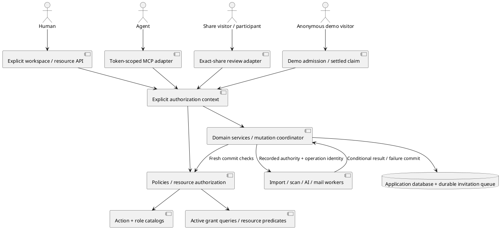
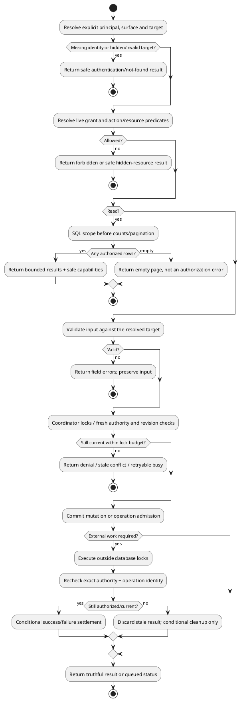
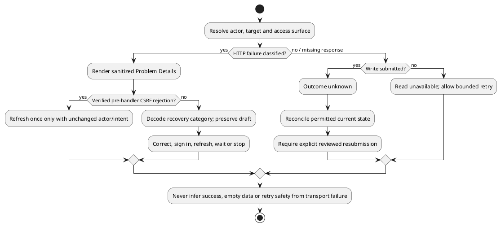
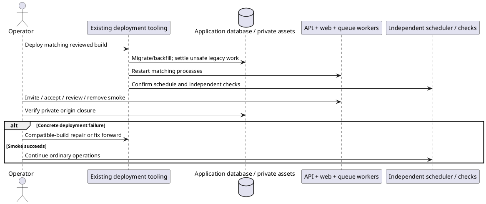

# Workspace membership — engineering review

> Completed 2026-09-27 · Engineering planning review only; no implementation or ticket publication.
> Source: [M4.0 workspace membership spec](../specs/m4.0-workspace-membership.md).
> Prior [project review](project-access-eng-review.md) supplies reusable decisions;
> it does not automatically approve the new workspace architecture or matrix.

## Progress

| Review section | Status |
|---|---|
| Step 0 — scope | Complete: 1A, full scope retained |
| 1 — architecture | Complete: four findings resolved (2A–5A) |
| 2 — error and rescue map | Complete: 6A/7A; 22 paths mapped, no unresolved recovery decisions |
| 3 — security and threat model | Complete: existing privacy requirement extended to checkpoints; no new decision |
| 4 — data flow and interaction edge cases | Complete: 10 flows plus seven interaction groups |
| 5 — code quality | Complete: accepted refactors cover findings |
| 6 — tests and coverage diagram | Complete: 30 contract groups mapped; implementation proof pending |
| 7 — performance | Complete: bounded paths, query/index checks and planning estimates |
| 8 — observability | Complete: required diagnostics and independent checks specified |
| 9 — deployment | Complete: ordinary deployment decision retained |
| 10 — long-term trajectory | Complete: reversibility 3/5; no new deferral |
| 11 — design and UX | Complete: engineering pass; separate visual review remains |

## Accepted decisions

### 1A — retain the complete scope

User selected 1A on 2026-09-27. Keep the entire M4.0 spec and deliver it in
reviewable slices, including source configuration and complete paginated scan
reports. Do not reopen scope reduction in later sections. The architecture,
invitation lifecycle, resource authorization, queued-result checks, private assets,
recovery, testing and operating requirements remain release requirements.

Reuse existing Laravel/application boundaries instead of adding a second
permission platform. The user's earlier deployment decision also stands: ordinary
migration, process restarts and smoke checks; temporary disruption/manual recovery
are accepted. No maintenance cutover, forced queue drain or fleet-version gate.

### 2A — first-class membership lifecycle and active access queries

Accepted through the user's explicit direction on 2026-09-27: refactoring and
migration time are not constraints worth preserving an inferior architecture for;
choose the cleaner end state. Promote the membership pivot to a lifecycle model,
use active-only relationship reads and a shared active-grant query, and make
historical/revoked access explicit. Lifecycle mutation/locking still needs an
unfiltered identity query, so do not hide inactive rows behind a global scope.

Evidence: the spec retains revoked rows, while current membership checks use
`$user->workspaces()->whereKey($workspaceId)->exists()` in
`api/app/Policies/Concerns/AuthorizesWorkspaceMembership.php:52` and raw existence
queries in `api/app/Http/Resources/V1/ThreadCapabilities.php:120`,
`api/app/Http/Resources/V1/CommentCapabilities.php:127` and
`api/app/Services/Comments/CommentMentionService.php:154`. This is a verified
integration risk for the proposed lifecycle, not a claim that revoked-state rows
are already implemented. P1, confidence 9/10.

Replace attach/detach/sync lifecycle paths, the closed enum role cast and direct
membership-based capability bypasses. Preserve registration, historical attribution
and explicit reactivation without granting access from history. Require feature
coverage across lifecycle, relations, Policies, directory/mentions, AI, capabilities
and MCP. No application implementation has started.

For remaining decisions, prefer correctness, clear boundaries and long-term
maintenance. Do not offer retaining a weaker structure merely to save refactoring
time; substantive product/API tradeoffs still require review.

### 3A — explicit workspace routes replace personal aliases

User selected 3A on 2026-09-27. Remove superseded personal-workspace collection,
create and settings aliases. Refactor API, web/BFF clients, validation, Policies,
queries, services, audit and queued-work admission around one explicit target.
MCP resolves its token workspace, not the owner's personal workspace; resource-ID
routes derive the target from stored ownership. No ambient session/global target.
Personal workspace identity and `/me` retain their personal meaning.

Evidence: the previous spec preserved aliases, while
`api/app/Http/Requests/StoreProjectRequest.php:27` scopes validation using
`$this->user()?->personalWorkspace()?->id` and
`api/app/Mcp/Tools/ListDocumentsTool.php:55` lists through
`$agent->personalWorkspace()->documents()`. Joined-workspace support must replace
these deeper assumptions, not just change controller routes.

The user accepts removing the extra compatibility surface. This explicitly
supersedes the generic additive-only v1 API convention for the affected routes;
ordinary deployment with temporary interruption remains accepted. Test the full
request target through validation, persistence/audit/jobs and MCP, parent/child
mismatches, absence of working old aliases, multi-tab targeting and stable personal
identity. Commit-time checks remain fresh.

### 4A — explicit share-review routes, without legacy compatibility

Accepted through the user's direction on 2026-09-27: existing shared links and
clients need not keep working; there are no production users, so build the clean
contract now. Use dedicated `/shared/{token}/…` review routes over shared business
services. The selected share/document and exact verified participant supply write
authority. Token possession alone remains read-only. Workspace and MCP requests
must not silently fall back to share permissions, nor share requests to membership.

Evidence: `api/app/Policies/Concerns/ResolvesShareReviewers.php:32–33` returns
`$this->memberOf($user, $document) || $this->reviewerOf($user, $document)`, and
`api/app/Policies/ThreadPolicy.php:21–30` uses it for create/reply. The shared review
client currently posts to the same document-ID routes. This is an integration gap
between the proposed separate surfaces and the existing implementation, P1,
confidence 9/10; it is not evidence of a deployed workspace-role regression.

Refactor route/context adapters, client calls, Policy/capability/mention decisions,
cache keys and commit guards together. Require exact-share, wrong-child,
revocation-race, token-only-write-denial and no-fallback tests. Preserve future
independent Share semantics, but do not build compatibility aliases, redirect
bridges or old-link migration. Update route and security documentation accordingly.

The user's broader instruction applies through the remaining review: backward
compatibility is not a pre-customer release requirement. Prefer a clear and correct
end state; continue to preserve intended domain behavior and data deliberately.

### 5A — claim demos only after the import settles

User selected 5A on 2026-09-27. Anonymous demo imports receive narrowly scoped
operation authority for one document/generation/public source in the reserved
system workspace, never a synthetic membership or unrestricted null-actor bypass.
Claim requires ready/failed terminal state with no active content operation. An
active/retrying import returns `409 demo_import_in_progress` without mutation.
The UI waits for settlement and requires an explicit claim submission. Failed
imports can be claimed and separately retried under current member authority.

Evidence: `api/app/Http/Controllers/Api/V1/DemoDocumentController.php:85` persists
`'created_by' => null` and dispatches the shared import job at line 113, while
`api/app/Http/Controllers/Api/V1/ClaimDocumentController.php:46–50` immediately
changes `workspace_id`, `created_by` and `expires_at`. The new membership-bound
job contract needs this explicit non-member path and terminal handoff. P1,
confidence 9/10, planned integration gap rather than a claimed runtime test result.

Serialize claim, import settlement and prune against current operation/placement
and expiry. Claim invalidates old demo authority; late success/failure/cleanup and
redelivery cannot mutate a claimed document. Destination membership is checked
fresh; no automatic retry or import-authority transfer. The system workspace has
no Owner/member and is excluded from ordinary membership administration. Add
CRITICAL regression coverage for anonymous import and both successful/failed claim
journeys, active claims, late worker callbacks, expiration, concurrent claims and
prune races. This preserves intended demo behavior without promising old-client
compatibility.

### 6A — RFC 9457 HTTP failures and explicit recovery

User selected 6A on 2026-09-27. Use centralized Laravel Problem Details rendering
and shared client decoding across affected HTTP flows. Keep native MCP errors and
existing background classifications. Distinguish input correction, authentication,
access loss, stale state, in-progress work, contention and uncertain write outcomes.
A lost response never authorizes replay, a success toast or an empty-state fiction.

Evidence: the spec §7 says “A lost response does not justify replay against a new
membership,” but `web/lib/workspace-client.ts:29` unconditionally parses successful
JSON and line 46 collapses remaining failures to “Could not save your changes.
Please try again.” `api/bootstrap/app.php` currently configures JSON rendering but
no shared Problem Details contract. This is a verified integration requirement for
the planned flows, P1, confidence 9/10; no new runtime regression is claimed.
Existing agent-token mint recovery already distinguishes a lost secret response.

Options differed in kind (RFC 9457 versus an application-owned envelope), not
coverage. The chosen contract uses standard HTTP problem semantics with explicitly
application-owned recovery/field-error extensions. The client must tolerate proxy
errors and unknown types; no error format can prove a missing response did not
commit. Current source: [RFC 9457](https://www.rfc-editor.org/rfc/rfc9457.html).

### 7A — durable AI progress and safe resumption

**P1, confidence 9/10.** Further inspection after recording 6A found that preserving
the existing AI retry policy does not satisfy the stronger planned replay guarantee.
User selected 7A on 2026-09-27; 6A remains accepted. This is a source-verified contract
mismatch, not a reproduced production double charge or a new implemented regression.

Motivating requirement: spec §9 says “Retrying a job still rechecks its original
authority and never repeats a completed paid call.” Existing evidence:

- `api/app/Services/AI/AiRunLedger.php:273` claims either `Pending` or `Running`,
  then line 278 returns true whenever the refreshed state is `Running`.
- `api/app/Jobs/GenerateAiRunJob.php:134` executes the generator before recording
  completion; lines 142–152 rethrow transient failures for another queue attempt.
- `api/app/Services/AI/Generators/ReviewDigestGenerator.php:66–73` initializes an
  empty merge and calls every chunk anew. Lines 85–100 record spend but retain the
  merged chunk outputs only in memory until final completion.
- `api/config/queue.php:17–20` explicitly distinguishes dispatch uniqueness from
  redelivery. A correct reservation timeout prevents premature parallel execution;
  it does not prove a killed worker made no paid call before redelivery.

Scenario: chunk one succeeds and is billed; chunk two receives a retryable failure.
A retried job starts at chunk one again. Separately, a worker killed after provider
acceptance but before local completion leaves a running row that can execute again.
The existing exception classifier cannot classify a crash that never reaches it.

**Accepted 7A:** persist completed per-call/chunk results with immutable run/input
identity and fence attempts before provider calls. Resume only known-safe remaining
work under the original live authority. An uncertain provider outcome terminates
automatic execution; it is not made safe by a queue lease expiring. Final publication
can retry from saved results without regeneration. Late accounting is idempotent
and cannot resurrect results after revocation. Apply the boundary to all six tools,
including SDK/transport retries and single-call generators. Preserve private input/
result storage and refine classifier retry eligibility rather than discarding useful
error categories. No provider exactly-once claim is made.

The user chose this over 7B's run-level stop-and-explicit-restart approach. Options
differed in kind, not coverage. 7A requires more persisted state but preserves completed
work and a clear recovery model; refactoring effort is not a reason to retain the
weaker behavior. Required tests include crashes before/after provider acceptance and
checkpoint commit, successful chunk one plus later safe retry, final publication
failure, duplicate delivery, changed input, concurrent revoke and honest spend.
Application implementation and runtime verification remain pending.

Security follow-through already required by SPEC §14: `AiRunLedger.php:474–503`
scrubs replayed conversations at terminal settlement. New immutable input snapshots
must not reintroduce those transcripts through a different column. Purge temporary
execution content on terminal settlement, retain existing final artifacts and safe
accounting metadata, and test late callbacks cannot restore it. This carries an
existing privacy requirement forward; no new retention-policy decision is requested.

## Architecture checkpoint — complete

Four new findings were resolved through decisions 2A–5A. Full scope remains 1A.
The remaining architecture responsibilities are already stated in the spec:

- **Boundaries/dependencies:** catalogs define actions/roles, live-grant queries
  supply facts, Laravel Policies enter the shared evaluator, and the coordinator
  rechecks authority at protected commits. Route adapters select one surface;
  domain services are reused. The dependency direction is inward from web/REST/
  MCP/share adapters, not from domain services back into HTTP/session selection.
- **State machines:** membership incarnation and assignment revision are distinct;
  invitation token/delivery generation is distinct from offered role revision;
  content operation identity is distinct from its authority. The approved demo
  transition makes the non-member case explicit. Terminal transitions cannot
  resurrect a revoked grant or overwrite a replacement operation.
- **Data flows:** missing target/grant denies; empty authorized collections return
  an empty paginated result; validation errors preserve input; stale and busy
  outcomes do not claim success; external work happens outside locks and fresh
  authorization gates result commits. Diagram below records these paths.
- **Scaling:** at 10x, batch authorization and database pagination avoid one grant
  query per resource. The workspace guard deliberately serializes short commits;
  at 100x concurrency in one workspace, contention/connection pressure is the likely
  bottleneck. Keep bounded waits and measure before changing lock granularity.
  These are architectural estimates, not measured throughput claims; detailed
  performance analysis is recorded in its checkpoint below.
- **Failure domains:** the application database is shared by state, grants and
  durable invitation enqueue; its outage refuses mutations. A stopped worker
  delays jobs/mail; independent scheduled cleanup and monitoring detect stalls.
  Private asset storage can fail delivery without permitting a public bypass.
  External mail/AI/source failures cannot widen permissions or roll back unrelated
  committed reviews. Detailed exception/rescue mapping is the next section.
- **Security:** each surface chooses its own grant evidence; no global Owner,
  null-actor or share fallback bypass. Actor privacy, credential bounds and
  resource relationships constrain role actions. Threat-model analysis is recorded below.
- **Recovery/distribution:** update matching API/web/worker builds, migrate/restart
  and smoke-test; temporary disruption and manual compatible-build/fix-forward
  recovery are accepted. No new package, binary, container type or authorization
  service needs its own distribution pipeline. Existing application packaging
  remains the distribution boundary; deployment details are recorded below.

### System boundaries



### Request and background data flow



These diagrams describe the reviewed contract, not implemented code or passing
application tests. The Section 6 test-coverage diagram is in the accompanying implementation test map.

## Error and rescue checkpoint — complete

22 failure paths mapped below. **No unresolved recovery decisions** after 6A/7A.
7A closes the planned AI recovery gap found after the initial 6A map. All
implementation and test proof remain pending. This is a plan map, not a claim that all rescues exist today. Named
application conflict/lifecycle/authority failures below are proposed typed domain
outcomes, not an instruction to create a class for every row. Framework and existing
source/AI exception names identify current integration seams.

| Method / codepath | What can go wrong | Exception / outcome | Planned rescue | User sees |
|---|---|---|---|---|
| Action/role resolution | Unknown/wrong-scope role; malformed catalog | Denied decision; configuration `LogicException` | Deny unknowns; fail closed and report invalid definitions | Safe denial or unavailable, no accidental grant |
| Target/authentication resolution | Missing session, hidden target, forbidden action | `AuthenticationException`, `ModelNotFoundException`, `AuthorizationException` | Central 401/404/403 mapping without resource leakage | Sign-in, not found or denied |
| Collections/directory/role inspector | Database failure instead of empty result | `QueryException` | Report; unavailable problem; no empty-list fallback | Retry reading; retained last known state |
| Request validation | Wrong type, bounds, invalid role or target | `ValidationException` | 422 safe field projection after tenant authorization | Correct fields; draft retained |
| Role/remove/move/source mutations | Stale revision, revoked grant, contention | Planned stale/denied outcomes; classified lock `QueryException` | Fresh check; rollback-only bounded retries; 409/403/503 | Refresh or busy; never false success |
| Invitation creation/acceptance uniqueness | Concurrent pending offer or membership activation | `UniqueConstraintViolationException` | Roll back/reload under protected state; reuse offer or conflict, no implicit role overwrite | Current offer or already-member recovery |
| Invitation preview/acceptance | Invalid token, inactive generation, wrong verified recipient, changed role definition | Planned invitation lifecycle outcomes | Uniform invalid response; safe 410/403/409 where recognized | Contact inviter, switch account or refresh |
| Invitation/audit/encrypted enqueue transaction | Queue insertion, encryption or required audit fails | `QueryException`; encryption/serialization exception at queue boundary | Roll back whole mutation; report unexpected failures | Not queued; previous invitation generation remains usable |
| Mail delivery/status commit | Transport refusal, timeout, ambiguous delivery or stale generation | `TransportExceptionInterface`; `QueryException`; obsolete-generation outcome | Bounded same-generation retry; conditional status; never silently rotate | Queued, failed or email may have arrived |
| Session/logout/CSRF | Expired CSRF; failed or uncertain logout; actor changed | `TokenMismatchException`; browser transport failure | Recognized 419 refresh once; confirm logout; stop on actor change | Explicit sign-in/switch-account recovery |
| Exact-share review | Revoked share/participant; wrong nested document | Authorization/not-found outcomes | Recheck exact context at commit; no alternate-share/member fallback | Access unavailable, retained draft |
| MCP read/write adapters | Revoked token or grant; inaccessible target | `AuthenticationException`, `McpToolException` | Safe native MCP errors; report unexpected exceptions | Tool denial/recovery without HTTP-envelope nesting |
| Job admission/result settlement | Lost authority, old incarnation/revision or superseded operation | Planned authority-lost/obsolete-operation outcomes | Terminal conditional settlement/no-op; preserve good content and spend | Cancelled/obsolete current operation; no stale overwrite |
| Import/resync source fetching | Blocked URL, revoked credential, upstream limit/timeout/oversize | `BlockedUrlException`, `TokenRevokedException`, `RateLimitedException`, fetch/import exceptions | Specific bounded classifiers; no public-to-credential fallback | Sanitized source failure or retrying status |
| Tracked-repo scan/file results | Expected file failure versus unexpected database/program error | Explicit recoverable source exceptions; `QueryException`/unexpected exception | Continue only recoverable file cases; stop/report others; atomic report publication | Honest per-file result or failed scan, last good report retained |
| AI start/generate/commit | Dispatch failure, provider timeout/refusal, database failure after paid call | `AiGenerationException`, provider/connection exceptions, `QueryException` | 7A durable call fencing/checkpoints plus classified safe retries; uncertain calls stop, final publication reuses results | Safe resumption or explicit interrupted-run recovery; honest cost status |
| Private image/diagram delivery | Lost reach, missing object or render/storage outage | Authorization outcome; filesystem exceptions; `DiagramRenderException` | Deny or safe unavailable/source panel; never public-origin fallback | Unavailable asset; document remains usable |
| Demo import/claim/prune | Import active, expired demo, competing claim/prune | Planned operation-in-progress/expired/stale outcomes | Ordered locks and terminal claim; generation-conditional callbacks | Wait, explicit retry or unavailable demo |
| Independent abandoned-work cleanup | Database unavailable or operation replaced | `QueryException`; obsolete-operation outcome | Report; retry bounded scan next schedule; settle only current abandoned work | Honest stale/unavailable operational status |
| Optional notification/telemetry | Post-commit transport/observer failure | Specific transport failure; unexpected exception reported at boundary | Preserve committed result; record optional failure safely | Confirmed mutation remains successful |
| HTTP response decoding | Lost response, abort, malformed/unknown/non-JSON response | `TypeError`, `DOMException` (`AbortError`), `SyntaxError`, invalid-shape outcome | Read unavailable; submitted write outcome unknown; reconcile without replay | Retained draft and refresh/recovery, no false toast |
| One-time agent-token result | Created token response lost or secret absent | Transport/invalid-success outcome | Inspect list and revoke orphan if needed; no secret reconstruction | Explicit token recovery instructions |

Catch-all audit: `TrackedRepoScanService::completeScan` currently catches `Throwable`
per file and continues (around line 214); narrowing this was already approved in
the carried project decision 7A. It must not turn authorization loss or programming/
database failures into ordinary file failures. By contrast, the outer AI job catch
feeds `AiFailureClassifier`, whose known categories and conservative unknown handling
are useful existing behavior. Keep a final reporting boundary, not a catch-and-ignore
policy. All new typed outcomes need safe messages and either bounded retry,
conditional terminal settlement, graceful read degradation or contextual rethrow.



Implementation tasks T6/T7 are recorded in the consolidated task list below.

## Security and threat-model checkpoint — complete

No new independent decision. One privacy integration gap is resolved by carrying
SPEC §14's existing transcript scrubbing into 7A (P1, confidence 9/10, evidence in
the 7A entry). The remaining threats already have required handling in the spec.
These are implementation requirements, not claims of runtime enforcement today.

| Threat / entry point | Required boundary and verification |
|---|---|
| Caller-controlled workspace/child IDs | Resolve the explicit workspace before tenant-sensitive validation, scope nested IDs, and apply live Policies to resource routes; test two workspaces, same IDs under wrong parents, removed grants and Unfiled |
| Role/Owner escalation | Server-controlled action catalog, role scope/provenance validation, explicit current-and-requested role ceilings, immutable Owner; reject mass-assigned actor/state/incarnation/definition fields |
| Historical attribution as access | 2A active queries and current role predicates on all read/write consumers, including raw-query mentions and AI poll; former author/Viewer cannot keep writes |
| Share confusion | 4A exact-share participant, no member/share fallback; `CommentMentionService::audienceQuery` currently chooses membership then any active document participant and must be refactored, not reused as-is |
| Agent credential confusion | Preserve app-wide `RejectAgentTokenAuth` and MCP-only opt-in; token workspace/incarnation and current role restrict every tool; cookies cannot become agent identity |
| Invitation theft/replay/enumeration | High-entropy hashed token, verified exact recipient, explicit CSRF POST, generation/revision/expiry/inviter recheck; invalid secrets uniform, valid preview deliberately exposes only the documented offer |
| Secrets escaping through infrastructure | Encrypted delivery job, no plaintext in failed-job/log payloads, nested return URL/header/proxy redaction, no-referrer/no-store/no-index including errors; synthetic-token smoke probes |
| Email/member-directory disclosure | Context-specific projection/search allowlist; ordinary member cannot infer hidden email via search or totals; `UserResource` contains self email and is not a reusable public-directory serializer |
| Source credentials and SSRF | Owner-only credential use, no credential fallback for public imports, reject authenticated cross-origin redirect before request, retain existing URL/IP/size protections |
| Assets bypassing revocation | Private backing storage, exact document/asset association and selected surface on every delivery; test legacy direct URLs and cache/origin bypasses |
| AI prompt injection and saved content | Existing untrusted-input fencing and human-confirmed drafts remain; checkpoints do not create new tool powers; temporary content scrubs on terminal settlement and never appears in shared run projection |
| Input/SQL/template abuse | Use FormRequest scalar/type/length validation, allowed filter/sort keys, parameterized queries and escaped text; preserve mention LIKE escaping, MDX allowlists and diagram engine allowlist |
| Queue duplicates and authority races | Coordinator at admission/result publication, exact operation and grant evidence; 7A per-call fence; no external I/O under locks and no automatic uncertain replay |
| Dependency and resource abuse | Reuse framework crypto/queue/auth and existing SDK; no new policy engine; bounded input/page/job budgets and existing source/AI limits; invitation limiters must cover authenticated actor/workspace and anonymous preview ingress |

The inspection covered `api/routes/api.php`, `api/bootstrap/app.php`, Policies,
`CommentMentionService`, `AiRunResource`, `UserResource`, `ShareResource`, current
rate-limit definitions and the proposed catalog/admin contracts. `CommentResource`
projects author ID/name, not the general self-user resource; no email leak through
that inspected projection was found. Existing mixed membership/share and personal-
workspace assumptions are the already accepted 2A–4A work, not new choices.

_No new tasks beyond accepted authorization, secrecy and 7A privacy work._

## Data-flow and interaction checkpoint — complete

No new independent decision. The following traces cover the plan's new flows; each
row lists behavior from input through output, including nil/empty/error/timeout.
No operation treats malformed/missing data as permission or a fabricated success.

| Flow | Input → validation → transform → persist → output | Boundary behavior |
|---|---|---|
| Provision/migrate | User identity → unique personal workspace/Owner invariant → mapped role → lifecycle row/reference → stable personal identity | Missing/ambiguous legacy Owner reports repair; duplicate provisioning joins the same identity; transaction failure leaves no partial workspace |
| Discover/switch | Actor + explicit workspace → active reach → scoped page/capabilities → optional last-used preference → named workspace | No memberships yields permitted personal/onboarding state, not system workspace; missing target denies; unavailable read is distinct from zero results |
| Invite/resend | Email/role/expected revision → verified admin + ceilings → normalize/token generation → offer/audit/encrypted job atomically → queued offer | Nil/empty/overlong/wrong type is 422; duplicate pending offer reused without another send; failed resend preserves old token; unknown response reconciles |
| Accept | Token + signed-in verified account → recipient/expiry/generation/inviter → membership incarnation → accepted grant/audit atomically → joined workspace | No token invalid; wrong account switches only after confirmed logout; double acceptance returns same active accepted incarnation; removed/rejoined grant never revived |
| Role/remove/leave | Target + expected revision → current actor/target ceiling → role/revoke transition → membership/audit → refreshed capabilities | Owner protected; stale/ABA state 409; unauthorized stale request does not disclose revision; lost response may have committed; self-leave refreshes accessible workspaces |
| Resource mutation | Explicit context + input/revisions → current action and nested scope → domain mutation → guarded resource/audit → updated resource | Empty content follows existing validation; conflicting active content write fails before body change; validation preserves draft; optional notification failure cannot undo commit |
| Source/scan | Source/filter revision → scope/credential/SSRF checks → bounded discovery/import → generation-bound staged report → paginated published report | Empty repository/zero matches remain distinct from source failure; retained history unbounded in count but batched; partial expected file errors recorded; unexpected failure preserves prior report |
| Async AI/content | Original context + immutable operation → preflight/live authority → fetch/generate → conditional checkpoints/result → honest terminal/progress state | Obsolete/no-longer-authorized work stops; uncertain paid call stops; known-safe call resumes from saved progress; cleanup handles dead worker without user traffic |
| Shared review/assets | Exact share token + participant/child → selected surface and live reach → safe projection/review mutation → guarded write/private asset read → document-scoped result | Missing/invalid token uniform; no workspace discovery; token alone read-only; revoke mid-write denies; unavailable asset degrades without public fallback |
| Demo claim | Demo + explicit destination → terminal import/expiry/destination capability → ownership handoff → ordered guarded claim → destination document | Import still active 409; ready/failed claims allowed; competing prune/claim serialized; failed claim does not enqueue a hidden import retry |

Interaction follow-through (covered by existing accepted intent, not new scope):

- **Double-click:** disable duplicate UI submits, but prove server behavior too:
  invite/accept coalesce as specified; role/remove use expected revisions; content
  has single-operation admission. Ask intentionally remains dedupe-exempt per
  SPEC §14; an uncertain POST must not be silently resent as another question.
- **Account/workspace switch during fetch:** capture original actor/target and tag
  reads with their context. Cancel/ignore late responses after context changes;
  a previous workspace's success cannot overwrite the new screen. Scope cache keys
  and clear account-scoped state on confirmed sign-out. A pending form never moves
  its target because another tab changed the last-used preference.
- **Reinvite after accepted membership is removed:** the one current invitation
  slot must admit a new generation after live checks find no active membership,
  including a previously accepted slot. Preserve its prior audit history; the old
  digest/link cannot restore or change the replacement incarnation. This is necessary
  follow-through on the existing one-slot plus explicit-rejoin requirements.
- **Navigate away or abort:** aborting a client fetch does not cancel a committed
  mutation or prove its failure. Reconcile on return; do not auto-submit on mount.
- **Zero/one/10k results:** explicit empty states, database pagination with stable
  order/tie-breaker and bounded sizes; no read-all-and-slice, hidden-email search or
  inaccessible totals. Deletion between pages may change the live list; no snapshot
  promise is introduced. Report pages remain pinned to one published generation.
- **Stale CSRF / slow connection:** one recognized pre-handler refresh under the
  same actor/intent; request timeout or malformed response uses 6A recovery.
- **Concurrent change:** role revisions, membership incarnations, placement/source
  revisions and call/operation generations protect distinct identities. A move-back
  or role restoration never makes an old expected revision current again.

_No new tasks beyond applying these interactions to the accepted lifecycle/UI tests._

## Code-quality checkpoint — complete

No new independent decision. Required refactoring is already authorized, and the
review favors clear shared boundaries over preserving current shortcuts.

- **Organization:** keep route/FormRequest/Policy adapters thin; services own
  lifecycle, mutation coordination, source work and call execution. Domain failure
  outcomes feed HTTP/MCP adapters; they do not depend on a browser or HTTP session.
- **DRY:** 2A removes repeated membership-existence checks; 3A removes repeated
  personal-workspace targeting; 4A shares review business services under separate
  contexts; 6A consolidates response decoding; 7A consolidates six generators' paid-
  call handling. The reason is consistent authority/recovery, not cosmetic similarity.
- **Naming/state:** distinguish membership identity/incarnation/assignment revision,
  role-definition revision, invitation generation, operation generation and AI call
  attempt. Fixed lifecycle states use backed enums; role references remain extensible.
  Do not overload a generic version or status field across these purposes.
- **Complexity:** the current AI classifier has more than five branches, but named
  exception classification is intentional; use explicit category helpers/tables
  and boundary tests, not catch-and-continue. New lifecycle coordinators should
  separate resolve/validate/lock/transition/project stages rather than nesting each
  role, surface and exception combination in one controller. Policies delegate
  decisions rather than duplicating the matrix in every method.
- **Under/over-engineering:** durable call receipts are justified by 7A's crash gap;
  a general workflow/event-sourcing platform, runtime role inheritance, global
  ambient workspace state and a second authorization service are unnecessary.
- **Stale explanatory code:** update the additive-only comment in `api/routes/api.php`,
  personal-only workspace client/controller comments, pivot semantics, mixed-share
  Policy comments and `GenerateAiRunJob`'s statement that stuck runs are impossible.
  Its own comment admits hard-killed workers may skip failure handling; the revised
  model explicitly relies on independent cleanup and durable call evidence.
- **Diagrams:** preserve the system/operation diagrams and update touched inline
  state explanations alongside implementation. Planning diagrams describe the new
  contract, not today's runtime. No unrelated diagram rewrite is required.

_No independent code-quality task beyond the accepted refactors and their documentation._

## Test checkpoint — complete

The required combined code-path/user-flow diagram, branch mapping, proposed test
files and failure registry are in the [implementation test map](workspace-membership-test-map.md).
It traces 22 code contracts and eight journeys, with all 30 requiring proof during
implementation. No application tests ran in this planning review, and no percentage
of application line/branch coverage is claimed. The target is behavior plus edge and
error assertions for every group, not one unit test per implementation method.

Harness inspection confirmed PHPUnit, Vitest and Playwright. The current in-memory
SQLite/sync-queue defaults cannot prove the accepted concurrency/durability promises;
the already approved PostgreSQL/file-backed SQLite/real-worker CI profile is required.
Critical demo regression coverage is explicit, and 7A adds deterministic provider-call
counts across process crashes and publication retries. No new framework or paid
provider test is introduced. Prompt semantics remain unchanged; input-equivalence
and injection-fence tests protect the refactor, with no new quality eval needed.

The map includes expected success, missing/invalid inputs, zero/large collections,
exceptions, partial work, timeout, unknown writes, actor/context changes and all
role/action cases. Extend existing suites rather than treating them as proof of new
features. No new testing-seam decision is needed; these are the agreed seams.

## Performance checkpoint — complete

No new independent decision. Existing accepted batching, private caching, lock-budget
and complete-report decisions cover the identified risks. The following are required
implementation checks, not measured performance claims.

| Hot path / risk | Required treatment |
|---|---|
| Collections/directory/capabilities create N+1 grant checks | Scope in SQL, load membership/role facts once per bounded actor/credential/surface/context page, eager-load projected relations; compare query counts for 1 versus 50 records |
| Personal-only collections currently call `get()` | Replace affected unbounded collection reads, including tracked-repo and share-management listings, with bounded database pagination; no post-fetch slicing |
| Workspace totals perform repeated full scans | Use shared authorized base queries and combined compatible aggregates; do not load documents to count them; retain explicit safe error rather than false zero |
| Membership/invitation/call/report lookups | Unique workspace/user, invitation workspace/normalized email, run/call identity; explicit indexes for workspace/state, inviter, expiry, actor/grant, operation/deadline and report generation/order access paths |
| Search by lowercased display name | Preserve escaped parameterized LIKE and tenant filtering; a leading-wildcard search is not accelerated merely by adding a normal name index; inspect real supported-database plans with large fixtures |
| Large retained scan history | Bounded batches and generation-bound paginated reports; memory bounded by batch/page, not historical repository count; stage publication atomically and clean abandoned staging |
| AI checkpoint storage | Bound immutable inputs/results by existing context/output budgets, process ordered calls without loading unrelated runs, scrub terminal transient content; receipt/index writes are short transactions |
| Workspace guard contention | Five-second total/three-attempt budget with shorter enclosing deadline, no network under locks; separate DB implementations; measure wait versus hold time before changing granularity |
| Private images/diagrams | Cache content-addressed backing objects while checking live authorization per delivery; no public delivery URL or cross-context permission cache |
| Connection pressure | Web and worker processes share finite database connections; do not hold transactions/connections across provider calls unnecessarily; stagger bounded cleanup and cap worker concurrency to deployment capacity |

Planning estimates for the three likely slowest newly affected request paths, under
warm local database/indexes and low contention (not benchmarks or SLO promises):

1. **Source preview:** roughly 1–15 seconds per upstream request under the current
   fetch timeout, potentially longer for bounded multi-request discovery. External
   latency dominates; keep it off GET and within endpoint/time/size budgets. Record
   total duration and preserve a clear unavailable outcome when the budget expires.
2. **Workspace summary / large member-search page:** estimated p99 0.2–1 second at
   roughly 10k relevant rows before tuning. Compare query plans, aggregates and
   serialization cost with representative fixtures; no full-row materialization.
3. **Membership administration / guarded publication:** estimated p99 0.05–0.3 seconds
   without lock contention; a busy workspace can hit the accepted five-second cap.
   Keep audit/enqueue local and atomic; network time must not lengthen lock hold.

AI itself remains asynchronous; the current 300-second default job ceiling is not
an HTTP latency target. At 10x load, query growth/page memory are the first checks;
at 100x concentrated in one workspace, the stable guard and shared database can
become bottlenecks. The plan bounds failure and measures contention rather than
promising linear scaling. Refine locking only with measured need, as already agreed.

_No new performance task beyond the accepted query/scan/coordinator work and tests._

## Observability checkpoint — complete

No new independent decision. Use the existing structured logger, operational commands,
worker/scheduler processes and optional telemetry. No mandatory SaaS monitoring
service or new analytics platform. Safe diagnostics are part of the accepted work.

| Operation / branch | Evidence to record without private payloads |
|---|---|
| Request/lifecycle entry and committed exit | Correlation ID, actor/workspace/target IDs, action/surface, expected/result revision and safe outcome; required audit atomic with mutation |
| Permission/stale/busy branch | Safe reason category, bounded counters, transaction wait/hold duration and retry exhaustion; avoid hidden-resource details in client response |
| Invitation delivery | Invitation ID/generation, queue age, sent/failed/uncertain status and attempt; no token, full recipient or secret-bearing URL in general diagnostics |
| Content/scan/AI work | Operation/run/call/attempt identity, admission/conditional commit/obsolete/cancelled/failed/uncertain events, duration, known spend and unknown-cost flag; never prompts/results |
| Cleanup and mail recovery | Last successful scan time, examined/settled/skipped/error counts and oldest overdue age; an unavailable DB is not an empty successful scan |
| Private delivery | Safe route/status, cache-hit backing lookup and render/storage failure class, no token/path source leakage |

Operational defaults to document and make configurable during implementation: cleanup
runs every minute in bounded batches; warn after three missed minute heartbeats;
flag still-unsettled operations two cleanup intervals beyond their derived execution/
queue/retry deadline. Check oldest queued invitation delivery at five minutes.
Require five consecutive one-minute samples before alerting on persistent lock-budget
exhaustion. These are initial low-traffic defaults to calibrate, not measured SLOs.
Use absolute deadline/counter signals so zero traffic is distinguishable from a
stopped worker. High-cardinality IDs belong in correlated logs, not metric labels.

The read-only operational command supplies machine-readable status and nonzero exit
for unavailable/unhealthy checks. An independent existing operator check consumes it
and heartbeat age; monitoring a dead scheduler through that same scheduler is not
sufficient. Day-one diagnosis should reconstruct actor/context, original grant,
operation revision, last completed boundary and safe failure without reopening a
private prompt or leaking a token. Fault-injection smoke stops worker/scheduler and
confirms the distinction between healthy idle, stale and unavailable. Optional
telemetry failure never prevents removal or rolls back a completed comment.

_No new observability scope beyond the accepted independent checks and recovery._

## Deployment checkpoint — complete

Follow the user's explicit ordinary-deployment decision. Temporary interruption,
manual recovery and refactoring are acceptable; no compatibility aliases, maintenance
cutover, traffic gate, fleet gate, forced drain or seamless downgrade protocol.

1. Ship reviewed migrations/backfills with the matching application build. Preserve
   IDs/attribution; report ambiguous Owner/creator data for explicit repair rather
   than guessing another member. Use bounded backfills where needed. Verify data
   invariants through the migration tests, without inventing a production-user gate.
2. Map roles/revisions/personal-workspace identity and bind valid token incarnations.
   Settle old jobs/runs lacking trustworthy grant/call evidence. Migrate retained
   reports/assets and close public-origin delivery as part of their slices.
3. Run migrations and restart API/web/queue processes using the current deployment
   tooling; confirm the independent scheduler runs in both supported editions.
   Users may need a page refresh for 3A/4A route changes. No old-client promise.
4. Smoke invite → receive mail → accept → review → remove, matching API/UI paths,
   database worker, scheduler heartbeat and private image/diagram delivery. Self-host
   remains free of demo endpoints and mandatory telemetry/provider credentials.
5. On failure, diagnose the concrete migration/build/process fault and use a compatible
   build or fix forward. Do not assert an old binary can interpret the new schema or
   resurrect unsafe jobs. Backup restoration, if needed, is manual recovery with its
   normal data-loss implications, not an automatic step in this plan.

Accepted risks: mixed builds can fail during restart; schema/backfill changes can
need manual repair; route/public-asset changes invalidate stale clients/links.
Rollback is not guaranteed seamless. These were deliberately accepted and are not
reopened as a request for a maintenance window. Existing images/Compose/CI remain
the distribution path; the module introduces no separate binary/package to publish.



_No new rollout choice; no implementation deployment was performed in this review._

## Long-term trajectory checkpoint — complete

**Reversibility: 3/5.** Built-in role definitions, named actions and adapters can evolve
cleanly, but persisted membership/incarnation, public route and call-ledger contracts
will become meaningful compatibility obligations once customers exist. Their state
names and invariants must stay documented alongside migrations and tests.

The workspace-first design does not force project guests into workspace membership:
project grants remain additive, scope-specific inputs to the same resolver. Future
workspace-owned roles use the catalog provider seam and explicit assignment ceilings;
no wildcard or implicit hierarchy has to be unwound. Ownership transfer/private
projects/team grouping remain deliberate later capabilities. An Org/account entity
is not smuggled in merely to rename the workspace tenancy root.

The main maintenance burden is keeping actions, role assignments, route adapters,
query scopes, capabilities and tests in sync. The matrix/endpoint manifest and custom
provider contract tests make omissions visible. AI call checkpoints add state, but
it solves a demonstrated retry-contract gap and stays within AI execution rather
than becoming an application-wide workflow platform. Keep safe metadata after
terminal scrubbing so future debugging does not depend on retained prompt copies.

A new engineer's starting path is SPEC §10.1 → module spec → action matrix and state
diagrams → implementation test map. Legacy project drafts are visibly superseded/
rebase-pending; do not publish both sets of overlapping tickets. No new independent
debt item or deferral was introduced by this review.

## Design and UX checkpoint — complete (engineering pass)

No new engineering UX decision. Visual design review remains separate and required
before UI delivery; this pass does not approve mockups or claim browser QA occurred.

- **Information order:** visible selected workspace in the app shell; Members in
  workspace settings; active people/invitations separately paginated; role inspector
  explains powers in product language. Owner is visibly protected; invite defaults
  to Member and states all projects plus Unfiled before submission.
- **Interaction states:** loading/empty/unavailable are distinct; queued/sent/failed/
  uncertain mail are truthful; accepting is explicit after sign-in/verification;
  wrong account can recover; stale admin form refreshes without silent resubmit.
  Removed access closes unavailable controls and does not submit into another workspace.
- **Partial/unknown outcomes:** saved AI progress stays internal until final artifact
  publication; uncertainty explains potential charges and offers an explicit new run.
  An uncertain write or missing one-time token is not a success toast or generic
  retry loop. Preserve useful drafts and the original target.
- **Responsive/accessibility:** keyboard-accessible switcher/list/role inspector,
  labeled forms, announced status/errors, focus restoration after dialogs and
  narrow-screen identity/role/action layouts. Role and delivery status are textual,
  not color-only. Test Owner/Admin/Member/Viewer presentations and both themes.
- **Design conventions:** existing Open Harbor patterns, Tailwind utilities,
  self-hosted display font and localized strings; no new font, custom-role editor
  placeholder or implementation identifiers in product copy.

```text
Selected workspace -> Members -> Invite (Member; all-projects disclosure)
  -> queued/sent/uncertain mail -> recipient opens read-only offer
     -> wrong account: confirmed logout -> sign in to exact verified account
     -> unverified/new account: verify/register -> return to offer
     -> valid: explicit Accept -> joined workspace -> review
     -> inactive: contact inviter; no automatic resend/accept
Administration -> role/remove confirmation -> current revision check
  -> success: refreshed capabilities / accessible workspace list
  -> stale: keep intent -> refresh permitted state -> explicit resubmit
  -> uncertain: reconcile, never auto-replay
Removal -> workspace authority ends; explicit independent Share can still work
```

## Implementation tasks

This is a review task list, not a published tracker breakdown. Each includes the
already approved full-scope work; no tasks are permission to ship a partial boundary.
Test IDs refer to the accompanying test map. T6/T7 are the new error-review decisions;
the other tasks implement accepted architecture or carried project decisions.

- [ ] **T1 (P1)** — Authorization domain — implement catalogs, lifecycle membership and full action matrix.
  - Surfaced by: 1A/2A, active versus historical membership and extensible roles.
  - Files: `api/app/Models`, `api/app/Policies`, authorization services, membership/catalog migrations and fixtures.
  - Verify: C01/C02/C08/C19; unknown roles deny, custom provider seam works and revoked history grants nothing.
- [ ] **T2 (P1)** — Target adapters — replace personal-workspace aliases with explicit workspace context.
  - Surfaced by: 3A and collection/MCP targeting evidence.
  - Files: `api/routes`, FormRequests/controllers/services, MCP tools, `web/lib` and workspace navigation.
  - Verify: C03/C19/F04, including tenant-sensitive validation, old aliases and late-response context isolation.
- [ ] **T3 (P1)** — Membership workflows — implement invitation, acceptance, role/remove/leave and durable delivery.
  - Surfaced by: 1A plus carried invitation/atomic mail/concurrency decisions.
  - Files: membership/invitation services/models/routes/resources/jobs/mail, auth return and shared logout integration.
  - Verify: C04–C06/C20/C22/F01–F05; real queue/audit rollback, ceilings, new generation after removal and concurrent logout.
- [ ] **T4 (P1)** — Shared review — bind explicit share routes to the exact participant and shared business services.
  - Surfaced by: 4A mixed-surface fallback gap.
  - Files: shared routes/controllers, Policies/capabilities, mentions, shared client/cache keys.
  - Verify: C09/C16/F06; wrong share/child, token-only writes and no fallback after revocation.
- [ ] **T5 (P1)** — Demo operations — implement scoped anonymous authority and settled claim/prune handoff.
  - Surfaced by: 5A demo regression risk.
  - Files: demo/claim controllers, import and prune services/jobs, demo UI and operation persistence.
  - Verify: C17/F07 critical regression cases with real controlled worker overlap.
- [ ] **T6 (P1)** — HTTP/client errors — implement RFC 9457 and truthful recovery.
  - Surfaced by: 6A fragmented failure handling.
  - Files: `api/bootstrap/app.php`, domain failure adapters, `web/lib/csrf-client.ts`, affected clients and recovery UI.
  - Verify: C18/F03/F04; malformed/lost responses, valid 204, unchanged-actor CSRF retry and native MCP errors.
- [ ] **T7 (P1)** — AI execution — persist immutable plans, fenced call attempts and completed checkpoints.
  - Surfaced by: 7A paid replay gap and existing transcript-scrubbing requirement.
  - Files: AI models/migrations, ledger/job, `StructuredCall`, six generators, classifier/transport, cleanup and run projection.
  - Verify: C11/C12/F08; no repeated completed calls, uncertain execution stops, final publication retry, idempotent spend and terminal scrubbing.
- [ ] **T8 (P1)** — Commit authorization — integrate one coordinator across human/MCP/content jobs and token incarnations.
  - Surfaced by: accepted ordered-commit, lock-budget and queued-authority decisions.
  - Files: transaction coordinator/Policies/services, tokens/MCP writer, content jobs and operation migrations.
  - Verify: C07/C08/C10/C13 on PostgreSQL and file-backed SQLite; original authority and expected revision always retained.
- [ ] **T9 (P1)** — Source and reports — complete role-aware source configuration and bounded scan/report publication.
  - Surfaced by: retained full scope, credential boundaries and carried scan/redirect/report decisions.
  - Files: source/fetch/tracked-repo services/jobs/controllers/resources/migrations and report UI.
  - Verify: C14/C15/C19; Owner-only credentials, no authenticated cross-origin request, large retained history and atomic complete reports.
- [ ] **T10 (P1)** — Assets — serve images/diagrams through live authorization with private backing storage.
  - Surfaced by: carried private-delivery decision.
  - Files: asset/diagram routes, render/storage services, web rendering, legacy-reference migration and deployed origin configuration.
  - Verify: C16/F06; old public URLs closed, valid member/share/demo access and hashes/anchors preserved.
- [ ] **T11 (P1)** — Operations — implement independent cleanup, safe diagnostics and ordinary migration/recovery runbook.
  - Surfaced by: carried cleanup/observability/deployment decisions and 7A uncertain calls.
  - Files: migrations, commands/schedule, structured events, read-only checks, existing deployment/setup docs.
  - Verify: C20/C21/C22; stopped-worker/scheduler versus idle, expired deadlines, unsafe legacy work settled and real deployment smoke.
- [ ] **T12 (P1)** — Workspace UI — complete switcher, members/roles/invitations and every recovery state.
  - Surfaced by: full accepted product scope and interaction review.
  - Files: app shell/settings/invitation pages, localized strings, capability-driven review clients and responsive components.
  - Verify: F01–F08, accessibility/keyboard/narrow-screen checks and separate approved visual review.
- [ ] **T13 (P1)** — Verification harness — add the required database/worker/browser integration CI profile.
  - Surfaced by: carried test-seam decision and test-map gaps; current sync queue is insufficient.
  - Files: `.github/workflows/ci.yml`, API integration harness, Playwright worker/provider fixtures and local reproduction docs.
  - Verify: all 30 contract groups, deterministic barriers/call counts, isolated teardown; missing prerequisites or skipped mandatory scenarios fail.

## Workstream sequencing

Sequential implementation, no parallelization opportunity at the reviewed module
boundary: the tasks share `api/app` authorization/services and most also affect
`web/lib` context/capabilities. Separate worktrees would not make these independent.
After T1 fixes the domain contract, land T2/T8 and the T13 harness early, then complete
T3–T7 and T9–T11 in reviewable vertical slices with T12 alongside each user journey.
This is sequencing advice, not authorization to spawn agents or publish tickets.
Revisit parallel UI/document work only after stable contracts permit truly separate
modules. Every slice keeps relevant tests; invitations are not release-ready until
all required boundaries are complete.

## Completion summary

| Area | Result |
|---|---|
| Step 0 | 1A full scope accepted; no later reduction |
| Architecture | Four independent findings resolved by 2A–5A |
| Error map | 22 failure paths; two independent decisions 6A/7A resolved; no unresolved recovery choice |
| Security | One checkpoint-retention integration gap resolved under existing privacy requirements; no unresolved High-severity decision |
| Edge cases | 10 end-to-end data flows and seven interaction groups mapped; required follow-through recorded |
| Code quality | Accepted refactors cover findings; no independent unresolved choice |
| Tests | Combined diagram produced; 30 contract groups require implementation proof (22 code + eight journeys) |
| Performance | Batching/index/lock/storage risks mapped; three estimated slow request paths; no measurement claim |
| Observability | Required events, independent health signals and initial thresholds specified; implementation pending |
| Deployment | Three accepted operational risk categories; ordinary migration/restart/smoke and compatible-build repair |
| Long term | Reversibility 3/5; no new independent debt/deferral |
| Design/UX | Engineering flow/state review complete; separate visual review pending |
| NOT in scope / existing code | Written below; previous product deferrals unchanged |
| TODOS | Accepted decisions/completion recorded; no new deferral needing approval |
| Failure modes | 22 code-path rows in test map; no unacknowledged silent failure; all new proof remains pending |
| Tasks / workstreams | 13 review tasks, sequential shared-module implementation; no tickets published |

Unresolved engineering decisions: **none**. This means the plan is ready for its
remaining design/ticket preparation steps, not that implementation is complete.
The project-access spec and unpublished 27-ticket draft still need rebasing onto
this workspace foundation. No runtime behavior, live email delivery, deployment
smoke or application-test pass is claimed by this planning review.

## What already exists

| Sub-problem | Existing implementation | Review direction |
|---|---|---|
| Tenancy and membership | Workspace, WorkspaceMember pivot, User workspace relations | Promote to a lifecycle model with active reads and explicit history (2A) |
| Route authorization | Laravel Policies and shared membership/share concerns | Keep enforcement entry points; centralize role/action decisions |
| Accounts and mailbox proof | Registration, reviewer upgrade, email confirmation, OAuth and shared sign-out | Reuse; preserve recent auth fixes and cover documented logout-race debt |
| Agent identity | Sanctum-backed AgentToken, exact workspace abilities and write-time token checks | Compose with live membership and the shared transaction boundary |
| AI generation | AiRunStarter, run ledger and conditional transitions | Consolidate starts; retain privacy, deduplication and accounting |
| Import and scans | Existing source/import/tracked-repo services and jobs | Add authority/operation evidence around their behavior |
| Delivery and recovery | Database queue, configured mail transport, Compose worker/scheduler | Reuse; validate durable invitation enqueue and independent cleanup |
| Test seams | PHPUnit API/MCP tests, database concurrency checks and Playwright journeys | Extend agreed seams; full coverage mapping is in the implementation test map |

## NOT in scope

- Custom-role editing or a policy-expression engine: preserve the extensible
  contract while shipping explicit built-in definitions.
- Direct project memberships and repository delegation: subsequent project module
  will reuse this foundation after its old ticket structure is rebased.
- Private-project exclusions, workspace-wide identity bans or bulk offboarding of
  independent grants: distinct future product semantics.
- Multiple Owners, ownership transfer, extra workspace creation or deletion UI:
  personal provisioning and protected ownership remain the selected starting point.
- Billing, SSO/SCIM, team groups, domain auto-join and bulk invitations: independent
  capabilities outside the workspace-membership foundation.
- New MCP administration tools, automatic AI posting and new source connectors:
  this work changes authority for existing capabilities.
- Maintenance cutover, seamless downgrade or additional distribution artifacts:
  ordinary deployment and existing application distribution remain sufficient.

## Review baseline

At review start, main contains local workspace-planning commits 08a734d and
d2afd25; GitHub reports no open PRs and the local stash is empty. Unrelated README
and deployment-note changes are left untouched. Prior review-driven work in git
history includes queued authority, scan results, logout, private assets and AI
starts; these areas require verification against code, not assumptions that a
planning commit implemented them. No application tests have run in this review.
