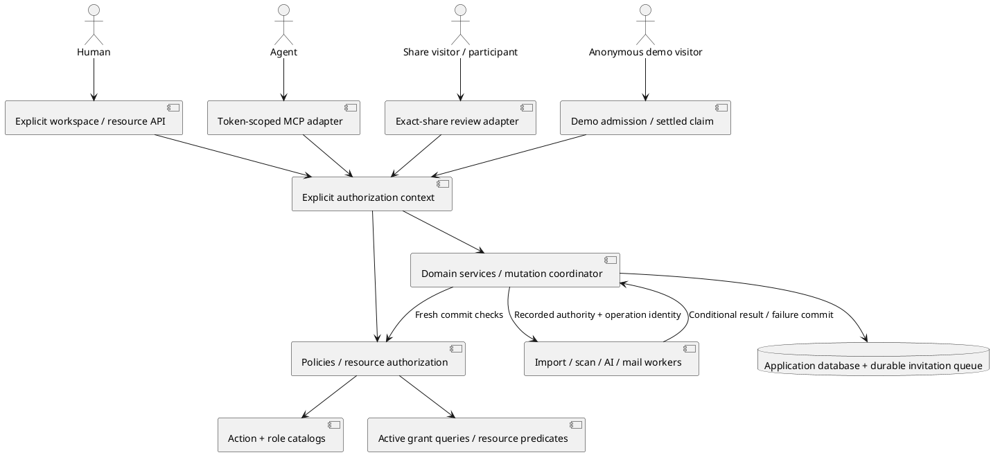
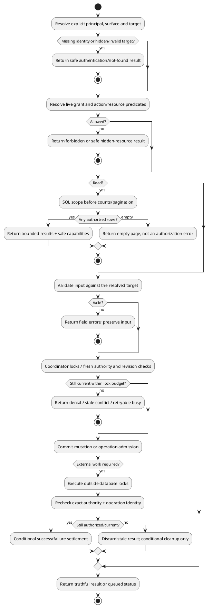

# Workspace membership — engineering review

> Started 2026-09-27 · In progress; no implementation or ticket publication.
> Source: [M4.0 workspace membership spec](../specs/m4.0-workspace-membership.md).
> Prior [project review](project-access-eng-review.md) supplies reusable decisions;
> it does not automatically approve the new workspace architecture or matrix.

## Progress

| Review section | Status |
|---|---|
| Step 0 — scope | Complete: 1A, full scope retained |
| 1 — architecture | Complete: four findings resolved (2A–5A) |
| 2 — error and rescue map | Pending |
| 3 — security and threat model | Pending |
| 4 — data flow and interaction edge cases | Pending |
| 5 — code quality | Pending |
| 6 — tests and coverage diagram | Pending |
| 7 — performance | Pending |
| 8 — observability | Pending |
| 9 — deployment | Pending |
| 10 — long-term trajectory | Pending |
| 11 — design and UX | Pending |

## Accepted decisions

### 1A — retain the complete scope

User selected 1A on 2026-09-27. Keep the entire M4.0 spec and deliver it in
reviewable slices, including source configuration and complete paginated scan
reports. Do not reopen scope reduction in later sections. The architecture,
invitation lifecycle, resource authorization, queued-result checks, private assets,
recovery, testing and operating requirements remain release requirements.

Reuse existing Laravel/application boundaries instead of adding a second
permission platform. The user's earlier deployment decision also stands: ordinary
migration, process restarts and smoke checks; temporary disruption/manual recovery
are accepted. No maintenance cutover, forced queue drain or fleet-version gate.

### 2A — first-class membership lifecycle and active access queries

Accepted through the user's explicit direction on 2026-09-27: refactoring and
migration time are not constraints worth preserving an inferior architecture for;
choose the cleaner end state. Promote the membership pivot to a lifecycle model,
use active-only relationship reads and a shared active-grant query, and make
historical/revoked access explicit. Lifecycle mutation/locking still needs an
unfiltered identity query, so do not hide inactive rows behind a global scope.

Evidence: the spec retains revoked rows, while current membership checks use
`$user->workspaces()->whereKey($workspaceId)->exists()` in
`api/app/Policies/Concerns/AuthorizesWorkspaceMembership.php:52` and raw existence
queries in `api/app/Http/Resources/V1/ThreadCapabilities.php:120`,
`api/app/Http/Resources/V1/CommentCapabilities.php:127` and
`api/app/Services/Comments/CommentMentionService.php:154`. This is a verified
integration risk for the proposed lifecycle, not a claim that revoked-state rows
are already implemented. P1, confidence 9/10.

Replace attach/detach/sync lifecycle paths, the closed enum role cast and direct
membership-based capability bypasses. Preserve registration, historical attribution
and explicit reactivation without granting access from history. Require feature
coverage across lifecycle, relations, Policies, directory/mentions, AI, capabilities
and MCP. No application implementation has started.

For remaining decisions, prefer correctness, clear boundaries and long-term
maintenance. Do not offer retaining a weaker structure merely to save refactoring
time; substantive product/API tradeoffs still require review.

### 3A — explicit workspace routes replace personal aliases

User selected 3A on 2026-09-27. Remove superseded personal-workspace collection,
create and settings aliases. Refactor API, web/BFF clients, validation, Policies,
queries, services, audit and queued-work admission around one explicit target.
MCP resolves its token workspace, not the owner's personal workspace; resource-ID
routes derive the target from stored ownership. No ambient session/global target.
Personal workspace identity and `/me` retain their personal meaning.

Evidence: the previous spec preserved aliases, while
`api/app/Http/Requests/StoreProjectRequest.php:27` scopes validation using
`$this->user()?->personalWorkspace()?->id` and
`api/app/Mcp/Tools/ListDocumentsTool.php:55` lists through
`$agent->personalWorkspace()->documents()`. Joined-workspace support must replace
these deeper assumptions, not just change controller routes.

The user accepts removing the extra compatibility surface. This explicitly
supersedes the generic additive-only v1 API convention for the affected routes;
ordinary deployment with temporary interruption remains accepted. Test the full
request target through validation, persistence/audit/jobs and MCP, parent/child
mismatches, absence of working old aliases, multi-tab targeting and stable personal
identity. Commit-time checks remain fresh.

### 4A — explicit share-review routes, without legacy compatibility

Accepted through the user's direction on 2026-09-27: existing shared links and
clients need not keep working; there are no production users, so build the clean
contract now. Use dedicated `/shared/{token}/…` review routes over shared business
services. The selected share/document and exact verified participant supply write
authority. Token possession alone remains read-only. Workspace and MCP requests
must not silently fall back to share permissions, nor share requests to membership.

Evidence: `api/app/Policies/Concerns/ResolvesShareReviewers.php:32–33` returns
`$this->memberOf($user, $document) || $this->reviewerOf($user, $document)`, and
`api/app/Policies/ThreadPolicy.php:21–30` uses it for create/reply. The shared review
client currently posts to the same document-ID routes. This is an integration gap
between the proposed separate surfaces and the existing implementation, P1,
confidence 9/10; it is not evidence of a deployed workspace-role regression.

Refactor route/context adapters, client calls, Policy/capability/mention decisions,
cache keys and commit guards together. Require exact-share, wrong-child,
revocation-race, token-only-write-denial and no-fallback tests. Preserve future
independent Share semantics, but do not build compatibility aliases, redirect
bridges or old-link migration. Update route and security documentation accordingly.

The user's broader instruction applies through the remaining review: backward
compatibility is not a pre-customer release requirement. Prefer a clear and correct
end state; continue to preserve intended domain behavior and data deliberately.

### 5A — claim demos only after the import settles

User selected 5A on 2026-09-27. Anonymous demo imports receive narrowly scoped
operation authority for one document/generation/public source in the reserved
system workspace, never a synthetic membership or unrestricted null-actor bypass.
Claim requires ready/failed terminal state with no active content operation. An
active/retrying import returns `409 demo_import_in_progress` without mutation.
The UI waits for settlement and requires an explicit claim submission. Failed
imports can be claimed and separately retried under current member authority.

Evidence: `api/app/Http/Controllers/Api/V1/DemoDocumentController.php:85` persists
`'created_by' => null` and dispatches the shared import job at line 113, while
`api/app/Http/Controllers/Api/V1/ClaimDocumentController.php:46–50` immediately
changes `workspace_id`, `created_by` and `expires_at`. The new membership-bound
job contract needs this explicit non-member path and terminal handoff. P1,
confidence 9/10, planned integration gap rather than a claimed runtime test result.

Serialize claim, import settlement and prune against current operation/placement
and expiry. Claim invalidates old demo authority; late success/failure/cleanup and
redelivery cannot mutate a claimed document. Destination membership is checked
fresh; no automatic retry or import-authority transfer. The system workspace has
no Owner/member and is excluded from ordinary membership administration. Add
CRITICAL regression coverage for anonymous import and both successful/failed claim
journeys, active claims, late worker callbacks, expiration, concurrent claims and
prune races. This preserves intended demo behavior without promising old-client
compatibility.

## Architecture checkpoint — complete

Four new findings were resolved through decisions 2A–5A. Full scope remains 1A.
The remaining architecture responsibilities are already stated in the spec:

- **Boundaries/dependencies:** catalogs define actions/roles, live-grant queries
  supply facts, Laravel Policies enter the shared evaluator, and the coordinator
  rechecks authority at protected commits. Route adapters select one surface;
  domain services are reused. The dependency direction is inward from web/REST/
  MCP/share adapters, not from domain services back into HTTP/session selection.
- **State machines:** membership incarnation and assignment revision are distinct;
  invitation token/delivery generation is distinct from offered role revision;
  content operation identity is distinct from its authority. The approved demo
  transition makes the non-member case explicit. Terminal transitions cannot
  resurrect a revoked grant or overwrite a replacement operation.
- **Data flows:** missing target/grant denies; empty authorized collections return
  an empty paginated result; validation errors preserve input; stale and busy
  outcomes do not claim success; external work happens outside locks and fresh
  authorization gates result commits. Diagram below records these paths.
- **Scaling:** at 10x, batch authorization and database pagination avoid one grant
  query per resource. The workspace guard deliberately serializes short commits;
  at 100x concurrency in one workspace, contention/connection pressure is the likely
  bottleneck. Keep bounded waits and measure before changing lock granularity.
  These are architectural estimates, not measured throughput claims; detailed
  performance review remains pending.
- **Failure domains:** the application database is shared by state, grants and
  durable invitation enqueue; its outage refuses mutations. A stopped worker
  delays jobs/mail; independent scheduled cleanup and monitoring detect stalls.
  Private asset storage can fail delivery without permitting a public bypass.
  External mail/AI/source failures cannot widen permissions or roll back unrelated
  committed reviews. Detailed exception/rescue mapping is the next section.
- **Security:** each surface chooses its own grant evidence; no global Owner,
  null-actor or share fallback bypass. Actor privacy, credential bounds and
  resource relationships constrain role actions. Threat-model review is pending.
- **Recovery/distribution:** update matching API/web/worker builds, migrate/restart
  and smoke-test; temporary disruption and manual compatible-build/fix-forward
  recovery are accepted. No new package, binary, container type or authorization
  service needs its own distribution pipeline. Existing application packaging
  remains the distribution boundary; detailed deployment review is pending.

### System boundaries

### Request and background data flow

These diagrams describe the reviewed contract, not implemented code or passing
application tests. The Section 6 test-coverage diagram remains required and pending.

## What already exists

| Sub-problem | Existing implementation | Review direction |
|---|---|---|
| Tenancy and membership | Workspace, WorkspaceMember pivot, User workspace relations | Promote to a lifecycle model with active reads and explicit history (2A) |
| Route authorization | Laravel Policies and shared membership/share concerns | Keep enforcement entry points; centralize role/action decisions |
| Accounts and mailbox proof | Registration, reviewer upgrade, email confirmation, OAuth and shared sign-out | Reuse; preserve recent auth fixes and cover documented logout-race debt |
| Agent identity | Sanctum-backed AgentToken, exact workspace abilities and write-time token checks | Compose with live membership and the shared transaction boundary |
| AI generation | AiRunStarter, run ledger and conditional transitions | Consolidate starts; retain privacy, deduplication and accounting |
| Import and scans | Existing source/import/tracked-repo services and jobs | Add authority/operation evidence around their behavior |
| Delivery and recovery | Database queue, configured mail transport, Compose worker/scheduler | Reuse; validate durable invitation enqueue and independent cleanup |
| Test seams | PHPUnit API/MCP tests, database concurrency checks and Playwright journeys | Extend agreed seams; coverage mapping remains pending |

## NOT in scope

- Custom-role editing or a policy-expression engine: preserve the extensible
  contract while shipping explicit built-in definitions.
- Direct project memberships and repository delegation: subsequent project module
  will reuse this foundation after its old ticket structure is rebased.
- Private-project exclusions, workspace-wide identity bans or bulk offboarding of
  independent grants: distinct future product semantics.
- Multiple Owners, ownership transfer, extra workspace creation or deletion UI:
  personal provisioning and protected ownership remain the selected starting point.
- Billing, SSO/SCIM, team groups, domain auto-join and bulk invitations: independent
  capabilities outside the workspace-membership foundation.
- New MCP administration tools, automatic AI posting and new source connectors:
  this work changes authority for existing capabilities.
- Maintenance cutover, seamless downgrade or additional distribution artifacts:
  ordinary deployment and existing application distribution remain sufficient.

## Review baseline

At review start, main contains local workspace-planning commits 08a734d and
d2afd25; GitHub reports no open PRs and the local stash is empty. Unrelated README
and deployment-note changes are left untouched. Prior review-driven work in git
history includes queued authority, scan results, logout, private assets and AI
starts; these areas require verification against code, not assumptions that a
planning commit implemented them. No application tests have run in this review.
