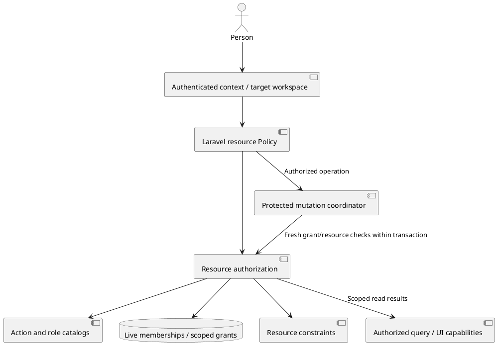

# Workspace membership and resource authorization

> 2026-09-27 · Historical definition draft, superseded by the
> [M4.0 workspace membership spec](../specs/m4.0-workspace-membership.md).
> Proposals/open questions below record the earlier discussion, not remaining spec gaps.
> Confirmed direction: workspace membership first; extensible roles with good
> built-in defaults; an explicit action/role interface under resource authorization.
> Role definitions, default resource visibility and customization rollout below
> are proposals unless marked confirmed. No application implementation has started.

## Confirmed direction and effect on existing work

Workspace is the existing tenancy boundary; “org” and “workplace” in this
conversation refer to Workspace, not a new entity above it. Define and implement
workspace membership before project-specific membership. The user explicitly
requires an expandable membership model, useful defaults, and clear interfaces
for actions/roles that become the authorization baseline for resources.

The project-access spec and 27-ticket draft are prior-scope artifacts. Reuse their
invitation, verification, transaction, queued-grant, privacy, asset, test and
ordinary-deployment work, but do not publish/implement that ticket order until the
workspace foundation is resolved and dependencies are rewritten. Do not assume
this automatically authorizes every proposed workspace role or grants all members
unrestricted access to all resources. Milestone numbering can follow final scope.

## What the current code gives us

- Workspace and workspace_members already exist, with Owner and Member enum values.
- User.personalWorkspace() means the first owned workspace. It cannot serve as the
  target resolver for work in a workspace someone joined.
- ProjectPolicy.update and IntegrationPolicy.delete accept workspace membership.
  Adding invitations without revising these rules would grant broad powers.
- Document Policies mix membership and authorship; AI reads additionally enforce
  private, per-actor artifacts. Preserve those resource-specific distinctions.
- Laravel Policies, the planned capability resolver/coordinator, and existing
  invitation/auth flows are reusable. No new external authorization platform is
  selected or needed by this proposal.

## Proposed authorization model

An action is a stable name for one operation on a resource. A role is a named
set of granted actions at a scope. Membership binds an account to a workspace and
its role. Roles do not change the meaning of actions or override resource rules.

| Contract | Required information | Responsibility |
|---|---|---|
| ActionDefinition | Stable action ID; subject type; valid assignment scopes; display label/description keys; explicit dependencies where needed | Describe an operation once for authorization, role inspection and tests |
| RoleDefinition | Stable role ID/key; definition revision; display name/description keys; assignment scope; explicit granted action IDs; built-in/custom provenance | Bundle allowed actions without spreading role-name checks through application code |
| WorkspaceMembership | User; workspace; role reference; active/revoked lifecycle and grant revision | Establish baseline authority and its revocable identity |
| AuthorizationContext | Authenticated principal and credential restrictions; access surface; server-resolved target workspace | Keep tenant selection and caller identity separate from submitted role names |
| AuthorizationDecision | Allow/deny; safe internal reason; authority evidence identifying the grant and role definition used | Explain and enforce one action on one subject; evidence is not a transferable permission token |
| Authorized resource scope | Principal/context, requested read action and resource query | Filter lists/counts/search/mentions to the same access rules as direct reads |

Role IDs are durable identifiers; labels and translations are not authorization
keys. Built-in role keys may use enums, while the contract must be able to resolve
a future workspace-owned role without every Policy requiring a new enum case.
Choose code-backed versus persisted definitions after the customization decision;
do not prebuild a role editor or an arbitrary policy-expression language.

Illustrative service surface, not implementation code or a frozen PHP signature:

```text
ActionCatalog.definitions() -> ActionDefinition[]
RoleCatalog.definitions(scope) -> RoleDefinition[]
RoleCatalog.resolve(roleId, scope) -> RoleDefinition
ResourceAuthorization.decide(context, action, subject) -> AuthorizationDecision
ResourceAuthorization.scope(context, action, query) -> authorized query
ResourceAuthorization.capabilities(context, subject) -> permitted UI actions
```

Existing Laravel Policy methods remain route enforcement entry points. They
consult the same definitions/resolver and resource rules used by list scoping and
capability projection. Controllers authorize and delegate. Frontend controls read
safe capability results; they do not recreate the role matrix. The catalog is
application-defined metadata, not a user endpoint for inventing arbitrary actions.



## Actions and boundaries

Illustrative action vocabulary; final names and complete inventory need agreement.
Define meaningful operations rather than a single broad `manage` switch.

| Area | Example actions |
|---|---|
| Workspace | workspace.read, workspace.update, workspace.members.invite, workspace.members.remove, workspace.members.change_role |
| Projects | project.read, project.create, project.update |
| Documents | document.read, document.import, document.update_content, document.resync, document.move |
| Review | comment.create, comment.update_own, comment.delete_own, comment.moderate, approval.create_own, suggestion.decide |
| Sources | integration.manage, repository_approval.manage, tracked_repo.configure, tracked_repo.scan |
| AI | ai.ask, ai.reply_draft, ai.digest, ai.improve_prompt, ai.thread_summary, ai.split_proposal |

Subject rules still enforce current document reach, authorship where an action is
own-only, current version/state, private AI artifacts and source authority. A role
never lets someone approve as another person, read another person's private draft,
or choose another tenant's credential. Workspace selection never itself grants
access, and credentials may be narrower than their owner's human membership.

Suggested evaluation order:

1. Resolve the actual subject and owning workspace; validate credential/surface.
2. Resolve live membership and applicable scoped grants and their role definitions.
3. Determine whether a grant contains the requested registered action at this scope.
4. Apply the subject-specific constraints and workflow preconditions.
5. Produce the decision; writes recheck authority and revisions inside the protected
   transaction, and queued work retains/revalidates its initiating authority.

Unknown actions/roles and out-of-scope assignments deny. Avoid a global Owner
bypass that skips resource privacy, credential bounds or action registration.
Explicit action sets make newly added operations a reviewed role-definition change,
not an accidental grant through a wildcard. Role definitions and assignments need
revision handling so queued work cannot silently gain new authority when they change.

This combines named role grants with resource constraints. Laravel's native
[Policies](https://github.com/laravel/docs/blob/13.x/authorization.md) remain the
framework seam; [OWASP's authorization guidance](https://cheatsheetseries.owasp.org/cheatsheets/Authorization_Cheat_Sheet.html)
supports explicit default denial and checking access on every request.

## Proposed built-in defaults — not yet approved

Start with Owner, Admin, Member and Viewer as a discussion baseline. Member is
the proposed ordinary teammate invitation default. A project Reviewer role and
the existing passwordless Reviewer identity remain separate concepts.

| Role | Proposed default experience |
|---|---|
| Owner | Workspace administration, ownership-sensitive changes and source credentials/approvals, plus collaborative actions |
| Admin | Day-to-day workspace/project administration, member administration and content moderation, subject to explicit assignment limits |
| Member | Read and review workspace content; create projects/documents and manage their own contributions; no membership or credential administration |
| Viewer | Read accessible workspace content and shared artifacts; no writes or generation |

Proposed visibility: ordinary workspace membership supplies baseline access to
workspace projects; project-scoped roles can add capabilities later. Project-only
collaborators remain scoped to selected projects. This is a proposal, not an
assumption that “define workspace membership first” settled default visibility.
Private-project exclusions, if desired, need an explicit visibility rule; a lower
project role cannot silently subtract a broader additive workspace permission.

Owner is not an all-purpose escape from privacy. The Owner/Admin distinction,
who may grant Admin, minimum owner count, and source-administration defaults must
be pinned before treating this table as the final capability matrix.

## Membership and scope lifecycle to define

Reuse the reviewed verified-email invitation/acceptance lifecycle, with explicit
workspace scope and an offered role. Scope must be present in the link landing,
confirmation and audit; opening an invitation grants nothing. Shared lifecycle
logic can support later project invitations without conflating the two memberships.

A joined workspace needs explicit selection/discovery. Preserve personal workspace
identity separately from current selection; resource IDs and current membership
remain authoritative. Import, project creation, source selection, activity and MCP
credentials must target the intended workspace instead of falling back to the
actor's personal workspace.

Resolve these before implementation:

- **Customization:** built-in extensible roles first, or owner-editable custom roles
  in the initial release? An interface is required either way.
- **Defaults:** approve the role set and action matrix; settle baseline visibility
  and contribution powers, including Unfiled content and source/AI administration.
- **Membership administration:** invitation role ceilings, Admin assignment,
  leaving/removal, last-owner protection and ownership transfer scope.
- **Offboarding:** whether removing workspace membership preserves independently
  granted project access, or a separate full-workspace removal clears those grants;
  existing document Shares need explicit treatment too.
- **Role changes:** assignment/definition revisions, pending invitations, running
  work, and whether later custom-role edits preserve or invalidate old authority.

Concrete scenarios for checking the model:

1. A Member may review a document but cannot disconnect its workspace integration.
2. A Viewer who authored an old comment still cannot write through stale authorship.
3. An Admin cannot inspect another person's private Ask history.
4. A future project-only reviewer sees the selected project, not sibling projects
   or the workspace directory; joining a workspace is a separate offer.
5. A removed/reinvited member's old queued work does not regain permission merely
   because the visible role name is the same.
6. A new action added in a release receives deliberate built-in-role assignments;
   an old custom role does not acquire it implicitly.
7. Switching the displayed workspace cannot redirect a pending form submission
   or queued operation into a different workspace.

## Proposed build order

1. Finalize the action/role/resource contract and built-in defaults with the user.
2. Refactor existing Policy checks through it while pinning current single-user
   behavior; map existing Owner/Member records deliberately.
3. Deliver workspace invite → verified acceptance → workspace discovery/selection
   → role-aware resource use → removal as complete vertical slices.
4. Rebase project membership and delegated project capabilities on that foundation.

Retain the meaningful authorization/concurrency/mail tests and ordinary deployment
choice already reviewed. Redistribute reusable project tickets into the foundation
where appropriate; do not duplicate their services or restart all review work.
The subsequent [M4.0 spec](../specs/m4.0-workspace-membership.md) supplies the concrete
contract and implementation/testing boundaries. Engineering review and project-ticket
rebasing remain; no runtime permission package or application code has been added.
