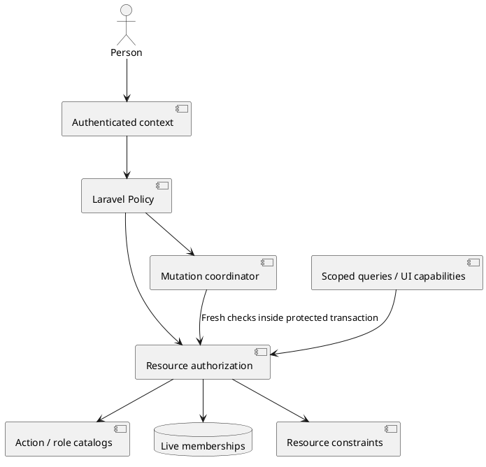

# Spec: Workspace membership and resource authorization

> M4.0 · 2026-09-27 · Specced; engineering/design review and implementation pending.
> Workspace-first sequencing, extensibility, explicit action/role interfaces and
> resource authorization are user requirements. The concrete defaults below are
> this spec's proposed implementation contract, not a claim of separate user
> approval for every matrix cell. Existing reviewed invitation/concurrency/testing
> decisions are retained where applicable. No tickets have been published.

## Problem Statement

A workspace owner cannot invite a teammate into Kedge. The existing membership
schema has Owner/Member values but no membership lifecycle or management interface.
Several resources assume that the caller's personal workspace is the target;
others treat any membership, or historical authorship, as sufficient authority.
Simply adding invitations would expose inconsistent and sometimes excessive powers.

Project-only membership would solve the first invitation but leave the broader
membership baseline undefined. We need a workspace model with useful defaults,
clear action and role contracts, and room for project guests and custom roles
without rewriting authorization a second time.

## Solution

Ship workspace invitations, verified acceptance, workspace selection, member and
role management, and live resource authorization using four built-in roles:
Owner, Admin, Member and Viewer. Member is the default invitation role. Joining
means access to all projects and Unfiled documents in that workspace, with writes
limited by role and resource rules. The invitation states that breadth explicitly.

Define actions independently of roles. A role grants an explicit set of actions;
a membership assigns one role in one workspace. Laravel Policies consult a shared
authorization service that also supplies collection scopes and UI capabilities.
Credentials, resource ownership, privacy and workflow conditions further constrain
the result. A role name alone is never the permission decision.

Ship code-backed built-in role definitions and a read-only role inspector now.
Custom-role authoring, project memberships and project-only guests follow later
through the same contracts. Workspace is the tenancy root; there is no new Org
entity. Both SaaS and self-hosted installations receive the same feature.

## User Stories

1. As an Owner, I want to invite a teammate by email so they can work in my workspace.
2. As an inviter, I want Member selected by default and a plain-language role summary.
3. As an inviter, I want to see that membership includes every project and Unfiled document before sending.
4. As an Owner, I want to appoint an Admin without sharing my account or credentials.
5. As an Admin, I want to invite and manage Members/Viewers without gaining ownership powers.
6. As an Owner, I want to remain protected from accidental removal or demotion.
7. As an invitee, I want to see the workspace, inviter and offered role before accepting.
8. As an invitee, I want to sign in, register or verify my account and return to the invitation.
9. As an invitee signed into the wrong account, I want a reliable account-switch flow.
10. As an invitee, I want acceptance to be explicit; opening an email must not join me automatically.
11. As an invitee, I want a clear recovery screen for an expired, revoked or replaced invitation.
12. As an administrator, I want pending invitations, expiry and delivery status in one place.
13. As an administrator, I want to resend or revoke an invitation without creating duplicate access.
14. As a member, I want to discover and switch between my personal and joined workspaces.
15. As a member, I want a pending form to retain its original workspace when I switch elsewhere.
16. As a Member, I want to read and review all workspace documents and manage my own contributions.
17. As a Member, I want to create projects and import public or uploaded documents into the chosen workspace.
18. As a Member, I want to update the documents I created while preserving version and review history.
19. As an Admin, I want to organize workspace projects/documents and moderate inappropriate comments.
20. As a Viewer, I want reliable read access without controls that suggest I can mutate or generate content.
21. As a former author now assigned Viewer, I expect my current role to control writes.
22. As a user, I expect my private AI questions and drafts to remain private from other members, including Owners.
23. As an Owner, I want sole control of stored source credentials until explicit delegation is introduced.
24. As a member, I want imported private content to be readable without exposing its source credentials.
25. As a user, I want agent tokens to target the selected workspace and obey my current role.
26. As an administrator, I want role changes and removal to stop unauthorized writes and queued results.
27. As a removed member, I want my historical contributions preserved without retaining membership authority.
28. As a member, I want to leave a joined workspace without deleting my account or personal workspace.
29. As an administrator, I want removal to explain that independent document share links remain usable.
30. As an administrator, I want stale forms to fail clearly instead of changing a replacement membership.
31. As an operator, I want failed mail and abandoned jobs to be diagnosable and recoverable.
32. As a developer, I want one action catalog, explicit role definitions and a consistent resource authorization interface.
33. As a developer, I want newly introduced actions to require deliberate role assignments.
34. As a future project guest, I want selected-project access to remain possible without workspace membership.
35. As a future custom-role administrator, I want stable role identities and revisions rather than scattered role-name checks.
36. As a self-hosted operator, I want the same authorization behavior without mandatory external telemetry or an authorization service.

## Implementation Decisions

### 1. Scope and default visibility

Workspace membership is a baseline grant over the workspace's projects, documents,
versions, discussions and Unfiled content. There are no private-project exclusions
in this release. Joining an existing personal workspace does not move or copy its
content. Its owner and stable workspace identity remain intact.

This module implements workspace grants only. Later project grants add authority
within a project; a lower project role cannot subtract workspace authority. A
project-only guest must not need a synthetic workspace membership. Future private
projects would require an explicit visibility constraint applied before grant
composition, not a special meaning silently attached to Viewer or Member.

Independent document Shares and passwordless Reviewer identities retain their
existing, narrower access surface. A share grants no workspace discovery, member
directory, source credentials or private AI history. Ordinary workspace endpoints
never silently fall back to a share token after membership denial.

### 2. Authorization interfaces

The following are domain contracts, not a frozen PHP class layout:

| Contract | Required fields / behavior |
|---|---|
| ActionDefinition | Stable namespaced ID; subject type; eligible assignment scopes; label/description translation keys; required companion actions, if any |
| RoleDefinition | Stable role reference; definition revision; assignment scope; explicit action IDs and grantable role references; label/description keys; built-in/custom provenance; owning workspace for a future custom definition |
| WorkspaceMembership | Stable record ID; workspace/user; role reference; active/revoked state; membership incarnation; grant revision; joined/revoked timestamps |
| AuthorizationContext | Authenticated actor; credential identity/restrictions; human/MCP/share/demo surface; server-resolved workspace and resource |
| AuthorizationDecision | Allow/deny; internal reason code; evidence identifying the exact grant, membership incarnation, assignment revision and role-definition revision used |
| Authorized query | Database query filtered for the context and read action before pagination, counts or aggregates |
| Capability projection | Safe action booleans, role label and permitted administrative role choices for this actor/subject; no secrets or reusable authorization proof |

```text
ActionCatalog.definitions(scope?) -> ActionDefinition[]
RoleCatalog.definitions(workspace, assignmentScope) -> RoleDefinition[]
RoleCatalog.resolve(roleRef, workspace, assignmentScope) -> RoleDefinition | unknown
ResourceAuthorization.decide(context, actionId, subject) -> AuthorizationDecision
ResourceAuthorization.scope(context, readActionId, query) -> authorized query
ResourceAuthorization.capabilities(context, subject) -> CapabilityProjection
```

A definition is application-controlled data. Action registration cannot be
performed by an API caller. Built-ins use durable keys `workspace.owner`,
`workspace.admin`, `workspace.member`, `workspace.viewer`. Labels may change or be
translated without changing those keys. Existing persisted `owner`/`member`
assignments migrate through an explicit mapping. A role reference is not a closed
enum at the resolver boundary, even if built-in keys use a backed enum internally.

Initially definitions are code-backed, versioned alongside code and immutable at
runtime. The role catalog is the sole resolution boundary; a future persisted,
workspace-owned provider can implement it without changing every Policy. There
is no custom-role table, editor or arbitrary policy-expression engine in this
module. Scope and provenance are real validated fields, not encoded assumptions
that every role is global. One active role assignment per user/workspace is enough
for this release; future project grants remain separate assignments.

Role definitions contain explicit action sets, with no wildcard, implicit hierarchy
or runtime inheritance from another role. Owner is not `allow everything`.
Administrative ceilings are explicit `grantableRoleRefs` metadata on a role
definition: Owner lists Admin/Member/Viewer; Admin lists Member/Viewer; others list
none. Managing another member requires both the action and permission to grant
their current and requested roles. Protected Owner and self-leave rules remain
resource invariants. Future custom roles must receive explicit delegation rules;
resolving a role definition must not make it assignable automatically. Adding
an action requires a reviewed assignment to each built-in that should receive it
and a definition-revision change for affected roles. Unknown IDs, wrong scope,
unknown definitions, missing required actions and invalid role references deny.
Catalog validation rejects duplicate IDs and invalid/cyclic dependencies. Dependency
metadata validates definitions; it never silently grants a missing action.

A Policy maps a resource operation to one or more registered actions and resource
predicates. Own/any alternatives below are distinct action IDs; `any` does not
remove tenant, credential, privacy or workflow predicates. The frontend consumes
capabilities; it does not implement role comparisons. Capabilities describe the
current response and must be rechecked on submission. No public endpoint exposes
internal grant evidence, database lock details or denial reasons that reveal a
hidden resource.



### 3. Complete built-in action matrix

`Yes` grants that row's listed actions; `—` grants none. Comma-separated action
names are separately registered operations with the same assignment. `own` refers
to the relevant persisted creator/author, never the user ID supplied in a request.
All rows require live workspace reach and the resource predicates below. Action
IDs are the initial vocabulary; a new operation must be added explicitly rather
than squeezed into a broad `manage` permission.

| Action IDs | Owner | Admin | Member | Viewer |
|---|---|---|---|---|
| workspace.read, workspace.summary.read, workspace.activity.read, role.read | Yes | Yes | Yes | Yes |
| workspace.update | Yes | Yes | — | — |
| workspace.members.read | Yes | Yes | Yes | Yes |
| workspace.members.invite, workspace.members.change_role, workspace.members.remove, workspace.invitations.read, workspace.invitations.resend, workspace.invitations.revoke | Yes | Yes | — | — |
| workspace.members.leave | — | Yes | Yes | Yes |
| project.read, document.read, thread.read, comment.read, approval.read, ai.shared.read, ai.private.read, tracked_repo.read | Yes | Yes | Yes | Yes |
| project.create, project.update.own | Yes | Yes | Yes | — |
| project.update.any | Yes | Yes | — | — |
| document.create, document.claim, document.retry.own, document.resync.own, document.lifecycle.own, document.content.update.own, document.move.own | Yes | Yes | Yes | — |
| document.retry.any, document.resync.any, document.lifecycle.any, document.content.update.any, document.move.any | Yes | Yes | — | — |
| thread.create, comment.create, comment.update.own, comment.delete.own, comment.react, comment.fork, thread.resolve.own, thread.reanchor.own | Yes | Yes | Yes | — |
| thread.resolve.any, thread.reanchor.any, comment.delete.any | Yes | Yes | — | — |
| approval.create.own, approval.revoke.own, suggestion.decide.own_document | Yes | Yes | Yes | — |
| suggestion.decide.any_document | Yes | Yes | — | — |
| document.shares.read.own, document.shares.create.own, document.shares.revoke.own | Yes | Yes | Yes | — |
| document.shares.read.any, document.shares.create.any, document.shares.revoke.any | Yes | Yes | — | — |
| tracked_repo.preview, tracked_repo.create, tracked_repo.configure.own, tracked_repo.scan.own, tracked_repo.delete.own | Yes | Yes | Yes | — |
| tracked_repo.configure.any, tracked_repo.scan.any, tracked_repo.delete.any | Yes | Yes | — | — |
| integration.read, integration.create, integration.delete, source.credentials.use | Yes | — | — | — |
| ai.ask, ai.reply_draft, ai.digest, ai.improve_prompt, ai.thread_summary, ai.split_proposal | Yes | Yes | Yes | — |
| agent_token.create | Yes | Yes | Yes | — |
| agent_token.read.own, agent_token.revoke.own | Yes | Yes | Yes | Yes |

Additional predicates are part of the contract:

- **Member administration:** Owner may invite/assign Admin, Member or Viewer, and
  manage those members. Admin may invite/assign/manage Member or Viewer only.
  Neither may invite Owner. Admin cannot change/remove an Admin, including their
  own role; self-leave is a separate operation. No one removes/demotes Owner.
  Only Owner changes an Admin assignment. Owner is assigned by provisioning, not
  the ordinary member-role API. This release has one immutable Owner per workspace;
  ownership transfer and multiple Owners are deferred.
- **Member directory:** all members see paginated display names, avatar, role and
  stable member identity. Only Owner/Admin see email addresses and invitation
  administration data. Invitation recipient email is never exposed to ordinary
  Members/Viewers. Mention suggestions use the same safe identity projection.
- **Own content:** project/document/tracked-repo ownership means creator attribution
  plus current capability. It is not a second access grant. A tracked-repo creator
  may organize its public source; importing through it does not give that creator
  authority over unrelated documents discovered at the same path. Admin can
  administer existing content whose creator has left. Content replacement remains
  limited to pasted/uploaded documents; linked-source revisions still flow through
  their source and resync. Nobody rewrites another
  person's comment or approves on another person's behalf.
- **Document moves:** require the move action and current source/destination reach,
  matching workspace and expected placement revision. Members move their own
  documents between any workspace projects and Unfiled; Owner/Admin move any.
  Moves preserve identity, versions and review history. Cross-workspace moves are
  unavailable. Project guests later require checks at both ends.
- **Review actions:** own thread means thread initiator; own approval/comment means
  its author. Suggestion outcome is decided by the document creator or an Admin/
  Owner with the applicable action. Forking requires access to the original and
  permission to create the resulting thread. Reactions are actor-owned toggles.
  Existing version, lifecycle, anchoring and suggestion-state checks still apply.
- **Sharing:** own share-management means the document creator, not merely the
  person who created a link. Owner/Admin may manage all links of a document.
  Existing share scopes and safe projections remain unchanged.
- **Sources:** public URL/paste/upload imports and credential-free tracked repos
  are available to Member+. Any operation using stored credentials additionally
  requires `source.credentials.use`; Owner alone has it initially. Admin status
  does not implicitly approve private repository use. Existing imported private
  content remains readable by workspace members; credential values never do.
  Source details expose safe provenance, not auth headers, embedded tokens or
  secret-bearing URLs. Public fetches never retry with credentials automatically.
  Owner-approved project repository delegation remains the later project module.
- **AI:** Member+ may request all six existing tools, subject to provider gates,
  budgets, rate limits and source document reach. Personal Ask history, reply
  drafts and other per-actor artifacts remain private even from Owner/Admin.
  Each private read requires both the same actor and current document reach.
  Viewer may still read their own old private artifact while a member, but cannot
  generate. Applying an AI draft requires the ordinary mutation action and explicit
  human confirmation; generation never supplies that permission.
- **Agent tokens:** creation is human-only for the selected workspace. A token
  stays bound to that workspace and the issuing membership incarnation; it cannot
  choose a different workspace or acquire membership-management tools. MCP uses
  the intersection of live role actions, existing MCP tool support and token
  restrictions. On role downgrade existing tokens lose the corresponding actions;
  removal invalidates them permanently for that membership incarnation. Rejoining
  cannot revive them. A user can inspect/revoke their own tokens even after losing
  workspace membership, with minimal historical workspace labeling, so cleanup
  does not require access restoration. Other users' token metadata stays hidden.

Workspace/project deletion, account deletion and ownership transfer are not added
by inventing an implicit Owner action. They remain outside this module.

### 4. Evaluation, collection scopes and authority lifetime

Resolve the subject and its actual workspace first. For nested resources, derive
this from stored relationships and reject contradictory container IDs. Authenticate
the caller and constrain their credential/access surface. Find live grants, resolve
their role definitions, check the requested registered action, then apply resource
privacy, ownership and workflow predicates. No global Owner bypass is permitted.
An author who is now Viewer or removed fails the write check.

Every resource route, collection, count, summary, activity response, mention list,
AI poll, source preview, version/diff and asset endpoint uses the same boundary.
Apply SQL scopes before database pagination/aggregation. Batch authorization facts
for a bounded response page; request-local reuse must include actor, credential,
surface and workspace/resource identity. Never use cross-request permission caches
or share read facts with a mutation/job. Invalidate request-local facts after a
membership or resource mutation in the same request.

Absent/hidden resources return 404; a visible resource with a forbidden action
returns 403. Unauthenticated callers follow existing 401/login behavior. Validate
current authority before returning stale-state details. A UI capability response
is neither a promise of later success nor a bearer permission.

Future grant composition is additive for actions but still intersects credential
and resource constraints. A decision selects and records sufficient grant evidence
for each required permission. This release has only one workspace assignment; it
must not hardcode “no workspace membership means no possible document access” into
the shared resolver, because Shares and future project grants have their own scopes.
An operation records its chosen authority and cannot adopt a new, stronger grant
halfway through execution after losing the original one.

### 5. Membership, invitation and workspace identity persistence

Preserve existing workspace and user IDs. Give each user a stable personal-workspace
reference at provisioning, backfilled from the existing personal resolver (the lowest-ID owned workspace);
do not keep deriving personal identity from “first workspace I own.” A joined
workspace is never automatically substituted for personal identity. Backfill must
check that the referenced workspace has the matching Owner membership; anomalous
legacy rows require an explicit reported repair before enabling invitations.

**Engineering decision 2A (2026-09-27):** promote workspace membership from a
passive pivot to a first-class lifecycle model on the existing membership table.
Keep active workspace/member relationships as filtered convenience reads; resolve
historical/revoked records through explicitly named history queries. Avoid a hidden
global active-only model scope that would conceal rows needed for reactivation,
locking or audit. The lifecycle service uses the unfiltered identity lookup under
the coordinator; ordinary access queries use the shared active-grant query.

Replace pivot attach/detach/sync lifecycle writes with explicit provision, accept,
change-role and revoke operations. Provisioning and acceptance use the same
invariants. Route Policies, mention audiences, AI reads, capability projections and
MCP must consume the shared live-grant boundary, including existing raw membership
table queries. Active membership is only an input to the action decision; it is
not a replacement for role checks. Historical attribution must never imply current
access. Refactor the old role enum cast into the new role-reference contract.

The user explicitly prefers the cleaner final architecture over minimizing
migration/refactoring effort: there are no real customers requiring that tradeoff.
Preserve domain identities and data deliberately, but do not retain obsolete
implementation patterns merely to reduce the diff.

Retain one membership row per workspace/user with a unique constraint. Store role
reference, state, membership incarnation, monotonically increasing grant revision,
joined_at and revoked_at. Revocation retains the row for attribution and increments
its revision. Rejoining increments both incarnation and revision. Ordinary role
changes increment the revision without changing incarnation. Tokens bind incarnation
and evaluate the live role; queued operations additionally bind assignment revision.
An earlier accepted invitation or token never points to a new incarnation. Restoring
an old role never restores its old revision. Setting an already-current role is a no-op
only with a matching expected revision. Definition revisions are independent of
assignment revisions. Fixed lifecycle states use backed enums.

A workspace invitation has explicit workspace/user foreign keys; no polymorphic
target is needed. Persist normalized recipient email, inviter membership identity/
revision, offered role reference/definition revision, token digest/generation,
expiry, pending/accepted/revoked/expired state, accepted user/grant identity, incarnation and
revision, separate delivery state, timestamps and administrative revision. One
current slot per workspace/normalized email prevents competing offers. Retain
history in audit events. Index lookup/join/filter columns explicitly, including
state/expiry and inviter lookups; enforce workspace consistency in the database
where possible and under the service transaction where cross-table rules require it.

Registering a full account still provisions its personal workspace and Owner
membership once. Invitation acceptance adds membership to another workspace;
it never transfers that account's content, renames their personal workspace or
upgrades an existing membership implicitly. Demo claim remains explicit and gains
an explicit destination workspace for callers authorized to create there.

### 6. Invitations, mail and verification

Reuse the reviewed lifecycle, with workspace-specific authority and grant creation
behind a shared lifecycle service. Later project invitations use their own foreign
keys and membership records rather than duplicating token/delivery logic.

- Issue a cryptographically random token with at least 256 bits of entropy, store
  only its digest in the invitation row, and expire it seven days after issuance.
  Explicit resend rotates generation/token and resets the seven days. Resend has
  a sixty-second cooldown; reuse configurable actor/workspace rate limits.
- Creating an invitation for an active member returns 409 and directs the admin
  to role change. A duplicate pending request returns its current offer without
  sending again or changing role. Changing the offered role requires revoke plus
  a fresh invitation; issue and role-change submissions include the displayed
  role-definition revision, returning 409 if that definition changed; revoked/expired slots can be reissued with a new generation.
- GET preview reveals workspace name, inviter display name, offered role, masked
  recipient, expiry and the all-projects/Unfiled access statement. It grants no
  session, verification or membership. Invalid secrets get a uniform invalid-link
  response. Recognized expired/revoked/replaced links may explain recovery without
  disclosing workspace resources, counts or member lists.
- Acceptance is an authenticated, CSRF-protected POST from a verified full account
  with the exact normalized recipient email. Use existing account normalization;
  do not guess provider-specific dot/plus equivalences. GitHub login still needs
  the matching verified email. Invitation possession does not verify an account.
- Preserve only validated internal return destinations through sign-in, sign-up,
  confirmation and OAuth. Existing passwordless Reviewer upgrade rules still
  require fresh mailbox proof where applicable. Existing verification/recovery
  flows must be exercised, including an already-registered unverified account.
- Wrong-account UI offers switch-account, preserving the invitation destination.
  Confirm server logout before proceeding, and keep retry available on uncertain
  failure. Reproduce and fix the existing concurrent-session restoration race
  using the current session driver; browser network-idle is not the guarantee.
- Acceptance locks/rechecks current generation, expiry, recipient, role definition,
  inviter authority and target membership before atomically activating membership
  and marking accepted. If another operation already activated the target membership,
  return a member-already-exists conflict without applying the offered role. Same-account replay returns the existing accepted grant
  only while that grant incarnation is still active; it never reapplies a role.
  After removal/rejoin, an old acceptance cannot recreate or target replacement
  access. Concurrent accepts produce one grant and one accepted transition.
- Inviter removal or loss of ability to grant the offered role cancels pending
  invitations. An assignment revision change that retains the precise grant power
  refreshes pending-offer evidence under the same protected transaction; loss
  of authority cancels permanently. Restoration never revives the old generation.
  Offered role-definition revision changes make the offer stale; an authorized
  explicit resend/fresh offer must display the current definition before acceptance.
- Issue/resend, required audit event and encrypted database delivery-job insertion
  commit in the same application-database transaction. Validate that connection
  and queue configuration; a synchronous queue or after-commit callback is not a
  substitute for durable enqueue. Workers see only committed jobs. Rollback/crash
  before commit leaves no new offer/job; failed resend preserves the old generation.
- Each delivery attempt checks pending state, generation, expiry, role revision and
  current inviter authority. Automatic retries are bounded and reuse token and
  expiry. Sent means transport accepted, not inbox delivery. Uncertain outcomes may
  produce duplicate copies with the same idempotent link. Only explicit Resend
  rotates it. Late status writes are generation-conditional; they cannot overwrite
  a newer resend or acceptance. Exhausted uncertainty says the email may have arrived.
- Persist no plaintext invitation secrets in logs, audit, failed-job storage or
  queue payloads. Encrypt secret-bearing jobs. Redact tokens before capture across
  proxy/web/API/auth-return telemetry, including encoded nested return URLs and
  sensitive headers. Use no-store, no-referrer and no-indexing on token-bearing
  pages and errors. Preserve safe route/status/timing/correlation diagnostics.

### 7. Administration, leaving and removal

Owner/Admin administer allowed target roles under the matrix ceilings. All role,
remove, revoke and resend requests carry expected target identity/revision; source
configuration and document moves carry the corresponding resource revisions too.
A stale form, including remove→rejoin or move→move-back, returns 409 with no side
effects after current authorization has been checked. Refresh permitted state and
require an explicit retry. A lost response does not justify replay against a new
membership. A successful self-leave removes only that joined membership. Owner
cannot leave, demote or remove their own protected Owner grant in this release.

Removal revokes workspace-derived reads/writes, invalidates issued token incarnations
and pending offers whose inviter lost authority, and stops future commits from jobs
bound to the old grant. Keep comments, versions, suggestions, approvals and historical
attribution. Existing private artifacts remain stored under their prior privacy
rules; membership removal does not entitle anybody else to inspect them.

Removal is not a workspace-wide identity ban. Independent document Shares remain
valid under their existing rules. Show this consequence before confirming, and
provide authorized share-link review/revocation. Later independently granted project
membership likewise survives ordinary workspace-membership removal unless a future
explicit full-offboarding operation revokes it. There is no concealed deny-list or
implicit bulk deletion. Rejoining requires a new valid invitation and gives current
role authority, while old queued work and old tokens remain invalid.

Persist authoritative membership changes and their required audit records atomically;
if the database mutation/audit transaction fails, do not report removal successful.
Optional notification/telemetry failure cannot undo a committed change. Record
actor, workspace, action, target, old/new role and revisions, safe delivery outcome
and correlation ID; never invitation tokens, credentials, private AI text or raw
request payloads. Workspace activity uses an allowlisted projection, omitting
recipient email and other administrative-only fields for ordinary members.

### 8. Workspace discovery, explicit targets and API contract

The web gets a workspace switcher in the app shell and a Members section in
workspace settings. The current workspace is visible on creation and administration
forms. Use stable workspace IDs in navigation/routes (slugs are display metadata) and capture the target when opening a
form; a last-used preference is convenience only, not authorization or a mutable
server-global target. Switching tabs/workspaces never retargets an open submission,
cache entry, import, token or queued operation. On access loss, close the inaccessible
surface and offer the personal workspace; never resubmit there automatically.

All paths below are relative to the existing human API prefix. Existing human
routes keep rejecting agent bearer credentials. Preserve current response envelopes
and pagination conventions, extending them with role/capability/revision fields.

| Contract | Behavior |
|---|---|
| GET /me/workspaces | Paginated active memberships with workspace ID/name/slug, personal flag, own role and safe capabilities |
| GET /workspaces/{workspace} | Currently accessible workspace summary/role; no secret admin data |
| PATCH /workspaces/{workspace} | Explicit-target rename/settings with current capability checks |
| GET /workspaces/{workspace}/roles | Read-only role descriptions, action IDs and definition revisions; assignable choices are separately actor-specific |
| GET /workspaces/{workspace}/members | Paginated directory; email projection limited to Owner/Admin |
| PATCH /workspaces/{workspace}/members/{membership} | Role reference, expected membership revision and role-definition revision; enforce target scope and assignment ceilings |
| DELETE /workspaces/{workspace}/members/{membership} | Expected revision; authorized removal |
| POST /workspaces/{workspace}/leave | Own expected membership revision; Owner denied |
| GET, POST /workspaces/{workspace}/invitations | Administrate pending/history slots or issue a role/email offer with expected role-definition revision |
| POST /workspaces/{workspace}/invitations/{invitation}/resend | Expected revision; fresh generation, same offered role, current definition |
| DELETE /workspaces/{workspace}/invitations/{invitation} | Expected revision; revoke current pending offer |
| GET /workspace-invitations/{token} | Minimal unauthenticated preview, rate limited, no mutation |
| POST /workspace-invitations/{token}/accept | Matching verified account and current offer; idempotent for the accepted grant |

Provide explicit workspace-nested collection/create variants for projects,
documents, tracked-repo list/preview/create, integrations, summary/activity and
agent-token creation. Add PATCH /tracked-repos/{trackedRepo} for authorized source
configuration with expected revision; existing project/document update routes use
the same revision rules for relevant changes. Demo claim takes an explicit target workspace. Existing
resource-ID routes derive workspace from the resource and do not trust a selected
workspace parameter. Reject conflicting parent/child workspace IDs; do not ignore
them. Existing unscoped personal-workspace routes remain compatibility aliases
with their documented personal meaning, delegating to the same authorized service.
Do not reinterpret them using a session's selected workspace. The new web uses
explicit targets; legacy `/me` personal identity remains personal.

Token list/revoke remains caller-owned and can span their workspaces with minimal
metadata; minting explicitly targets one authorized workspace. Resource IDs alone
never permit one workspace's credentials to be used in another. BFF/server caches,
client query keys, polling and error recovery include workspace identity and user
context. Membership data uses private/no-store responses; membership removal must
not leave reusable public document/asset caches.

### 9. Write races, asynchronous work and private assets

Adopt the already-reviewed shared mutation coordinator instead of adding independent
transaction wrappers per feature. It owns deterministic lock ordering, fresh Policy
and revision checks and protected commit. Use a stable workspace guard to serialize
membership administration with affected commits; then lock relevant membership,
credential and resource rows in deterministic order. Refine lock granularity only
if measurement requires it. Multi-resource operations lock sorted identities, and
MCP's existing token-revocation checks participate in this same transaction.
PostgreSQL row locks and file-backed SQLite transaction serialization need separate,
proven implementations; calling `lockForUpdate()` alone is not a SQLite protocol.

The guarantee is ordered commit: a mutation committed before removal may stand;
a commit after successful removal cannot use the removed authority. Reads/bytes
already delivered cannot be recalled. A new request after removal performs live
authorization. Never hold database locks over mail, source-network or paid AI calls.

Bound total lock waits/retries below request/job deadlines on both databases. Retry
only classified contention after confirmed rollback, with fresh authorization and
the original expected revision/operation identity. Never replay external calls as
a database retry. Exhaustion returns a documented retryable busy response with input
preserved; it does not imply successful removal. Default to a five-second total contention budget and at most three transaction
attempts, including the first, with 50–150 ms jitter between retries. Per-attempt
database lock/busy timeouts must fit the remaining total budget. Configure a smaller
budget where the enclosing request/job has less time remaining; never extend its
deadline. Exhaustion is HTTP 503 with a retry hint for requests and a retryable
contention classification for jobs, distinct from stale-state HTTP 409. Retrying a
job still rechecks its original authority and never repeats a completed paid call.

Every queued import, retry, resync, tracked scan, mail operation and AI run records
workspace/resource identity and exact initiating authority. Content jobs also carry
an operation generation; reuse AI run IDs and existing conditional terminal states.
Validate before external work/child dispatch and again at every database result
commit. A role-assignment or role-definition revision change invalidates queued
content/AI authority conservatively even if the new role could start the same action.
The user may explicitly restart under the new grant. Do not quietly rebind old jobs
to a new membership, role definition, credential, source configuration or placement.

Late success, failure and cleanup may modify only the operation still owning that
resource. A removed/reinvited member or a replaced operation cannot revive an old
run. Role-definition deployment revisions need no fleet compatibility protocol:
old evidence is rejected by the current definition; normal process restarts apply.
No automatic paid retries are introduced. Preserve legitimate recorded spend even
when a late result cannot be committed.

Carry the shared reviewed work into this foundation:

- One active content update per document, reserved atomically before changing the
  stored body/source. Overlap returns 409 and preserves the competing draft.
- One shared AI run-start boundary for all six tools, preserving original initiating
  authority on deduplication, private artifacts, provider/rate limits and accounting.
- Source branch/filter changes use revision preconditions. For retained documents
  at the same repository/path, a branch change updates the stored source even if
  content is unchanged; preserve document identity and review history so later
  resync follows the selected branch. Missing/excluded content remains retained.
- Imports/scans process retained history in bounded database batches. Continue only
  explicit recoverable per-file errors; stop on lost authority or unexpected failures.
  Report inaccessible moved resources as redacted skips. Persist and paginate the
  complete latest scan report with generation-pinned atomic publication; retain the
  previous report during replacement. Do not build a general operation-history store.
- Scheduled bounded cleanup settles revoked/abandoned work without browser traffic
  or reliance on the work queue. Respect legitimate execution/retry windows, retain
  last good content, condition on operation identity and never restart paid work.
- Authenticated source fetches reject cross-origin redirects before contacting the
  new destination. Keep public redirect/SSRF protections and source identity checks.
- Imported images and diagrams use private backing storage plus live document
  authorization on every delivery, including legacy assets. Verify document/asset
  association, retain valid independent Share/demo access, and close old public
  origin/cache bypasses. Preserve content hashes/anchors during reference migration.
  Content-addressed caching/deduplication can remain behind this boundary. Short-lived
  public storage URLs are a later alternative only if their revocation window is
  explicitly accepted; do not add that delivery mode now.

### 10. UX and error states

Follow the existing Open Harbor components, light/dark themes, self-hosted fonts,
Tailwind utilities and localized interface strings. Role chips show the assigned
role; the read-only role inspector explains actions in product language rather
than exposing implementation class names. Do not present disabled custom-role
controls as if editing is available.

The Members screen separates active members and invitations, both paginated. Offer
search by allowed identity fields and role/status filters without exposing hidden
emails through search results. Show only permitted assignment options. Invitation
forms state that all workspace projects and Unfiled are included, show Member as
default, retain input on validation/mail-enqueue failure, and distinguish queued,
sent, failed and uncertain delivery. Do not ask users to understand job generations.

Acceptance has loading, valid offer, sign-in required, verification required,
wrong account, accepted, expired, revoked/replaced and unavailable states. Confirmation
names the workspace and role. Success opens the joined workspace with its selected
context. An invalid or expired link offers sign-in/back navigation and contact-inviter
copy; it does not expose the recipient's full email or automatically resend mail.

Role changes/removal identify the person and workspace, explain immediate capability
loss and the independent-share exception, and require an explicit action. Stale
conflicts reload only permitted state and ask the user to review before retrying.
Failed/uncertain writes retain a recoverable state and never show a success toast
without confirmation. A removed user's current page handles 403/404 without retry
loops or silent submission into another workspace.

All forms and dialogs need labeled controls, keyboard operation, focus restoration,
announced errors/status and a usable narrow-screen layout. Role meaning is textual,
not color-only. Existing document/review views hide unavailable mutations based on
server capabilities while handling subsequent server denials. No design approval
is claimed by this written interaction contract; visual review precedes UI delivery.

### 11. Migration, operations and delivery order

Backfill personal-workspace references, map existing Owner/Member roles, initialize
membership revisions and add attribution needed for own-resource predicates. Where
legacy project/tracked-repo creator is unavailable, assign it to the workspace Owner
rather than guessing another member, and record the migration count. Existing
Members receive the newly defined Member powers; report this explicit narrowing
of previous membership-wide administrative behavior. Preserve users, resources,
review attribution and external IDs. Existing agent tokens bind to their current
valid membership incarnation; tokens with no valid matching membership are revoked.

Do not infer authority for old pending content jobs that lack trustworthy actor/grant
evidence: settle them safely and require an explicit retry. Backfill published scan
reports into the new paginated representation and migrate legacy asset delivery as
part of the corresponding slices. Data validation/repair is ordinary migration
work, not a maintenance/fleet-version gate.

Use the user's approved ordinary deployment: migrations, process restarts and smoke
checks on the current Coolify/Compose installation and supported self-host setup.
Temporary disruption and manual recovery are accepted. No maintenance cutover,
rolling compatibility release, enforced job drain or rollback-floor framework.
Document compatible-build/fix-forward recovery. Update setup documentation only
where queue/scheduler/storage requirements actually change.

Reuse the database queue and configured Laravel mail transport. Keep cleanup on
the independent scheduler. Provide secret-free lifecycle events and read-only
operational checks for queue age, overdue work, cleanup heartbeat and lock-budget
exhaustion. Distinguish an idle system from stale/unavailable checks. Existing
operator monitoring checks these independently of the worker/scheduler being
monitored; optional Nightwatch remains optional. Document finite alert thresholds
and recovery; telemetry must not block an access-reduction transaction.

Delivery proceeds in reviewable vertical slices:

1. Catalog, role matrix, resource predicates and existing-user migration, exercised
   through existing APIs before invitations expose broader collaboration.
2. Explicit workspace discovery/selection and one complete invite → verify → accept
   → read/review journey with durable mail, directory and role inspection.
3. Role change, removal/leave, stale-form handling, concurrent writes/jobs, agent
   credential binding and private asset delivery; these are required for release,
   not optional post-invitation hardening.
4. Complete affected source/AI/scan/collection/UI paths and failure recovery; prove
   the matrix across supported deployment/database modes.
5. Rebase project access onto the shipped foundation, retaining project Reviewer/
   Maintainer/Viewer and owner-approved repository delegation as separate scope.

These are dependency groupings, not a published ticket list or permission to ship
invitations before the complete authorization boundary works.

## Testing Decisions

Reuse the user-approved seams: PHPUnit API feature tests, PostgreSQL and file-backed
SQLite concurrency integration tests, Playwright user journeys and deployment smoke
checks for real mail/workers. Extend existing fixtures and authorization/MCP/auth/share
suites; do not add another testing framework or mirror each method with a unit test.
Catalog contract tests are justified for schema/definition invariants, while permission
behavior is proved through resource endpoints and user journeys.

| Contract group | Required externally observable proof |
|---|---|
| Catalog / extension seam | Unknown action/role/scope denies; explicit action assignment and revision changes; duplicate/dependency validation; a test-only workspace-owned role definition resolves through the same contract without Policy role-name branches or a production custom-role editor |
| Membership lifecycle integration | Provision/accept/change/revoke/rejoin through one lifecycle boundary; default workspace/member relations exclude revoked rows while explicit history still finds them; no revoked grant through raw-query consumers, mentions, AI reads, UI capabilities or MCP; reactivation preserves identity and increments incarnation/revision |
| Full action matrix | Owner/Admin/Member/Viewer across own/other resources, two workspaces and Unfiled; old author now Viewer/removed; hidden-resource 404 vs visible-action 403; private AI remains actor-only |
| Grant boundaries | Workspace reads include all projects; Shares remain document-scoped and do not imply membership; no share fallback on workspace APIs; credential use remains Owner-only |
| Workspace context | Joined workspace collections/create/settings/activity/claim/token paths; wrong parent IDs; simultaneous tabs and pending forms; existing personal aliases and `/me` identity preserved |
| Administration | Assignment ceilings, protected Owner, Admin self-leave versus forbidden self-role change, idempotent no-op revisions, remove/reinvite and stale role/remove/resend requests |
| Identity / acceptance | New/existing/unverified/GitHub/upgraded Reviewer accounts; exact normalized email; wrong account and controlled concurrent logout; no access on preview; one membership on concurrent acceptance; old accepted links cannot revive grants |
| Durable mail | Real database queue enqueue/audit rollback and crash boundaries; no sync/after-commit substitution; retry/uncertain duplicate sends, stale generations, expired/revoked offers, inviter role loss and changed offered definition |
| Revocation races | Barrier-controlled removal versus comment/content/role/token/result commits on PostgreSQL and file-backed SQLite; ordered commit guarantee, not timing-based sleeps; ABA restoration and moved resource cases |
| Background work | All import/resync/scan/AI start/commit/failure/cleanup paths; role-definition/assignment revisions, initiating authority under deduplication, obsolete success/cleanup, dead workers, retained spend/good content; no paid replay |
| Source and scan behavior | Public import never falls back to credentials; cross-origin authenticated redirect rejected before request; large retained scan history, paginated reports and atomic replacement under failure/removal |
| Assets and privacy | Old direct/public URLs unusable, association checks, live revocation for image/diagram delivery; valid Share/demo access; unchanged document hashes/anchors; no response or error secrets |
| Query behavior | Bounded query growth/page size, SQL-scoped totals/filter/search/mentions, no cross-actor/credential request cache reuse; fresh writes after read projection |
| Contention | Finite deadline/busy behavior, rollback-only retries, current authority/original revisions retained, no external replay, no falsely successful removal, recovery after lock release |
| Migration | Existing Owner/Member mapping and personal identity, orphan/ambiguous data reporting, creator fallback, legacy tokens/jobs/reports/assets; no synthetic mailbox verification |
| Observability | Idle versus stale/unavailable; stopped worker/scheduler, mail failure, cleanup recovery and safe correlation without tokens/private content |

Browser journeys cover invite → sign-in/sign-up/confirmation → explicit acceptance
→ joined workspace selection → review → downgrade/removal, plus Admin ceilings,
Viewer presentation, resend/replaced link, wrong-account recovery, workspace switching
with an open form and independent Share access after removal. Use real workers and
shared process state for the asynchronous acceptance/delivery journeys; mocks alone
cannot prove the durable handoff or concurrency behavior. Synthetic invitation tokens
verify nested URL/header/proxy redaction and no-referrer/no-store/no-index behavior.

Keep fast suites. Add a focused required access-integration CI profile for real
PostgreSQL, file-backed SQLite and affected browser/worker journeys with isolated
fixtures, controlled overlap, process cleanup and secret-free diagnostics. Missing
required prerequisites or skipped required scenarios fail that check. Document local
reproduction and require it before release. Ordinary docs-only planning does not
claim any of these application tests already exist or pass.

Deployment smoke checks verify real recipient mail, configured encrypted database
jobs, current worker/scheduler processes, private storage/origin access closure,
proxy redaction and invite → accept → remove on the deployed app. Email transport
acceptance is not an inbox-delivery guarantee. An interrupted deployment uses the
approved ordinary recovery model, without adding cutover gates.

## Out of Scope

- Custom-role creation/editing UI or API; role expressions, explicit deny rules,
  multiple simultaneous workspace roles, role inheritance and external policy engines.
- Project membership/invitations and owner-approved per-project repository delegation;
  these are the next module built on this foundation, not discarded requirements.
- Private-project exclusions, workspace-wide identity bans and one-click revocation
  of every independent share/project grant.
- Multiple Owners, ownership transfer, workspace/account deletion and additional
  workspace-creation UI; existing personal provisioning continues.
- Billing/account hierarchy, SSO/SAML/SCIM, team groups, domain auto-join and bulk invite.
- New MCP administration tools, new AI models/features, automatic AI posting, or a
  new source connector/notification system.
- A general operation-history platform, maintenance cutover or seamless rolling downgrade.

## Further Notes

This spec supersedes the [workspace definition draft](../plans/workspace-membership.md)
for implementation planning. The [roadmap](../ROADMAP.md) records M4.0 as a prerequisite
to [project access](m4.1-project-access.md). The prior [engineering review](../plans/project-access-eng-review.md)
remains decision evidence, not automatic approval of the new workspace role matrix.
Shared decisions 2A–8A and 10A–22 carry forward as described here; project Repository
Approval identity/transfer rules (9A), delegated private-source authority and direct
project-role administration stay in the project rebase. Do not duplicate shared
services or issue both copies of overlapping tickets.

Before publishing tickets, run `$plan-eng-review` against this spec, including the
role/action surface inventory, assignment ceilings, conservative job invalidation,
lock budgets and migration feasibility. Visual design review covers the switcher,
members, role inspector and invitation states before UI implementation. Reconcile
the existing unpublished 27-ticket project breakdown after reviewing the foundation;
this spec does not authorize publishing that stale order.

Completion means an Owner can invite a real person, that person can accept with a
verified account and work in the correct workspace under the documented role, and
downgrade/removal demonstrably changes every affected resource and asynchronous
boundary. Extensibility is demonstrated through the catalog/resolver contract, not
through shipping an unrequested custom-role product.
