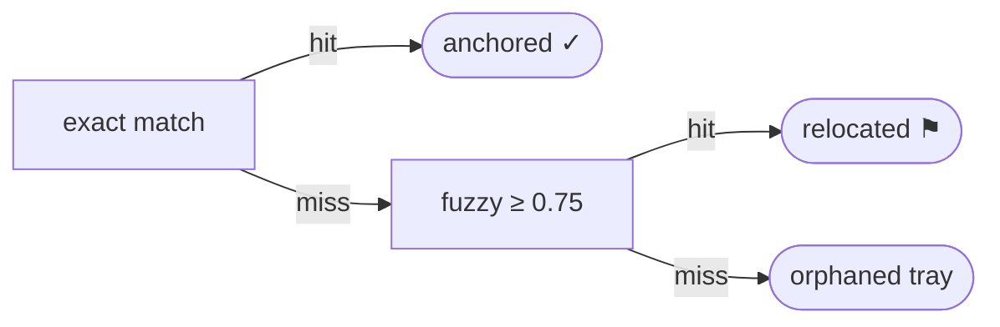
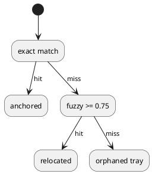

<Callout title="Version 5 is available" type="info">
  A newer version of this document was synced from GitHub 4 minutes ago. Comments below anchor to v4.
</Callout>

## Motivation

A review comment is only useful if it survives the document it reviews. Authors revise specs continuously while review is underway; a comment pinned to character offsets alone is destroyed by the first edit. We bind anchors to the rendered **plain-text projection** rather than the markdown source, so cosmetic markup changes never move a highlight.

## Anchor model

Each anchor follows the W3C Web Annotation selector shape — an exact quote, its surrounding context, and a position hint:

```json title="threads/512/anchors/v4"
{
  "exact": "similarity threshold of 0.75",
  "prefix": "fall back to fuzzy matching with a ",
  "suffix": ", tuned against the golden corpus",
  "start": 10412,
  "end": 10441,
  "projection_version": 1
}
```

| Property | Type | Purpose |
| --- | --- | --- |
| `exact` | string | The selected text, verbatim, from the projection |
| `prefix` / `suffix` | string | ~64 chars of context either side, for disambiguation |
| `start` / `end` | integer | Offset hints — never trusted on their own |
| `projection_version` | integer | Extraction algorithm version this anchor was created against |

## Re-anchoring algorithm

When a new version syncs, each thread re-anchors in three attempts:

1. **Exact match** of the quote with prefix/suffix context.
2. **Fuzzy match** (diff-match-patch, position-hinted) above a similarity threshold of 0.75 — flagged `relocated`.
3. Otherwise the thread is set aside as **orphaned** rather than guessed.



The same ladder, as PlantUML — every diagram fence renders through the same Kroki engine:



Kroki also covers GraphViz, D2, Excalidraw, and ~20 other engines — a whiteboard sketch, straight from a fence:

```excalidraw
{"type":"excalidraw","version":2,"source":"margin-spike","elements":[{"id":"r1","type":"rectangle","x":0,"y":0,"width":160,"height":60,"angle":0,"strokeColor":"#1e1e1e","backgroundColor":"transparent","fillStyle":"solid","strokeWidth":2,"strokeStyle":"solid","roughness":2,"opacity":100,"seed":1,"version":1,"versionNonce":1,"isDeleted":false,"groupIds":[],"frameId":null,"roundness":{"type":3},"boundElements":[],"updated":1,"link":null,"locked":false},{"id":"r2","type":"rectangle","x":240,"y":0,"width":160,"height":60,"angle":0,"strokeColor":"#1e1e1e","backgroundColor":"transparent","fillStyle":"solid","strokeWidth":2,"strokeStyle":"solid","roughness":2,"opacity":100,"seed":2,"version":1,"versionNonce":2,"isDeleted":false,"groupIds":[],"frameId":null,"roundness":{"type":3},"boundElements":[],"updated":1,"link":null,"locked":false},{"id":"a1","type":"arrow","x":170,"y":30,"width":60,"height":0,"angle":0,"strokeColor":"#1e1e1e","backgroundColor":"transparent","fillStyle":"solid","strokeWidth":2,"strokeStyle":"solid","roughness":2,"opacity":100,"seed":3,"version":1,"versionNonce":3,"isDeleted":false,"groupIds":[],"frameId":null,"roundness":{"type":2},"boundElements":[],"updated":1,"link":null,"locked":false,"points":[[0,0],[60,0]],"lastCommittedPoint":null,"startBinding":null,"endBinding":null,"startArrowhead":null,"endArrowhead":"arrow"}],"appState":{"viewBackgroundColor":"#ffffff"},"files":{}}
```

<Callout title="Why never guess" type="warn">
  A comment reattached to the wrong sentence is worse than an orphaned one — it silently changes what the reviewer said. The orphan tray keeps the original quotation and offers one-click re-attach.
</Callout>

## Orphaned threads

An orphaned thread is never discarded. It keeps its original quotation and waits in a tray at the foot of the margin, where the author can re-attach it to new text with a single selection.
