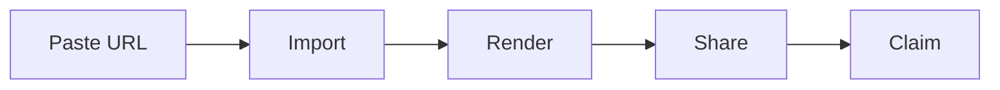

# RFC-042: Anchor re-sync protocol

This is the deterministic fixture document the M1 Playwright journey (#26)
pastes into the instant-demo box. It is served on loopback by
`web/e2e/serve-fixtures.mjs` — CI never depends on a live external URL — and
imported through the real demo pipeline: connector match, SSRF-guarded fetch
(via the test-only `FETCH_ALLOW_HOSTS` exemption), normalization, projection,
share issuance.

Do not restructure it casually: the journey asserts the title above, the prose
here, and that the mermaid fence below renders as a live cached-SVG image —
never as a plain code block.

## The loop under test

## Why re-sync matters

Comments must survive new versions of a document. When a source changes, the
import pipeline produces a new immutable version and every anchor re-binds
against the fresh projection — the substrate this fixture's own import already
carries.
