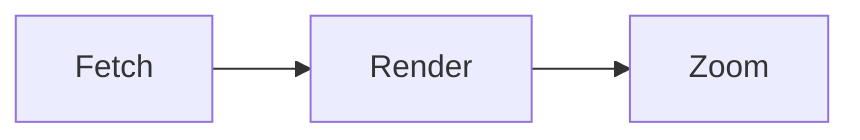

# RFC-200: Diagram rendering surfaces

A fixture with two fenced blocks the diagrams journey (#39) drives: a mermaid
fence that must render as a cached SVG image (never a plain code block), and an
unknown-language fence that must stay one contiguous plain code block (#53) —
Kroki's engine allowlist decides which is which, with no drift.

## Rendered diagram



## Plain code, never a diagram

```unknownlang
this-is-not-a-diagram engine=none
keep me as one contiguous pre block
```
