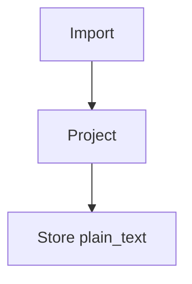

# Code fences

A regular fenced code block stays anchorable text (a reviewer can comment on a
line of code):

```ts
export function project(source: string) {
  return source.trim();
}
```

A fence whose language is a Kroki engine is a non-text block and collapses to a
diagram placeholder:



An unknown fence language is never a diagram and never crashes — it stays plain
text:

```wat
(module (func (export "answer") (result i32) i32.const 42))
```
